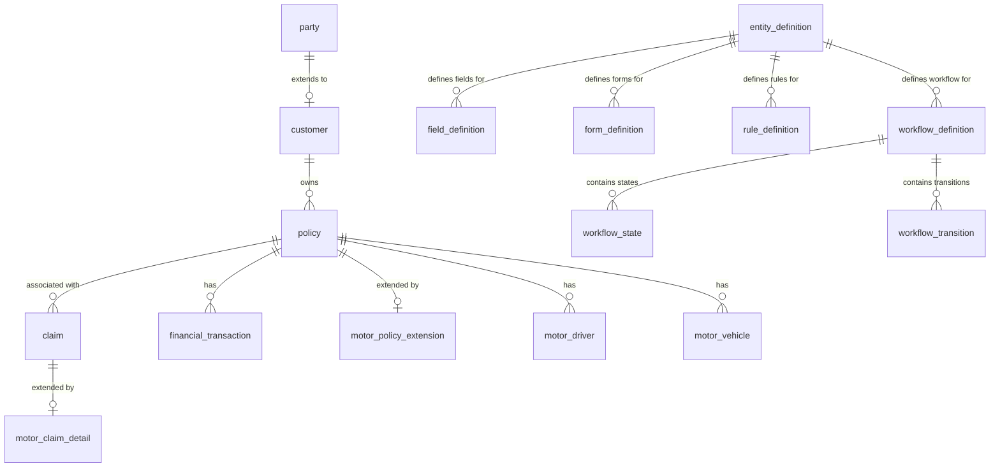

# Database Design

This document details the physical database design, table structures, and relationships for the Enterprise Insurance Platform. 

For a high-level conceptual overview of the data principles, migration patterns, and schema ownership rules, see the [Data Architecture](../architecture/data-architecture.md).

---

## 1. Database Architecture & Schema Separation

The platform utilizes a **PostgreSQL** database engine. PostgreSQL is selected for its robust support for relational structures, ACID compliance, and advanced JSONB query capabilities.

To support independent updates, logical isolation, and a configuration-driven runtime, the database is split into three distinct logical schemas:

1. **`core` Schema**: Relational models for core transaction entities. These represent stable primitives shared by all lines of business.
2. **`metadata` Schema**: Configurations and definitions for dynamic entities, custom fields, validation rules, and workflow state machines. This powers the configuration-driven domain models.
3. **`motor` Schema**: Relational extension tables for the Motor line-of-business (the MVP line).

### Entity Relationship Diagram



---

## 2. DDL Specification

The following SQL DDL statements create the physical schemas, tables, relationships, and performance indexes.

### 2.1 Schema Initialization
```sql
CREATE SCHEMA IF NOT EXISTS core;
CREATE SCHEMA IF NOT EXISTS metadata;
CREATE SCHEMA IF NOT EXISTS motor;
```

### 2.2 Core Schema (`core`)

#### `core.party`
Stores person or organization records.
```sql
CREATE TABLE core.party (
    party_id UUID PRIMARY KEY DEFAULT gen_random_uuid(),
    full_name VARCHAR(255) NOT NULL,
    primary_address JSONB NOT NULL DEFAULT '{}'::jsonb,
    contact_info JSONB NOT NULL DEFAULT '{}'::jsonb,
    created_at TIMESTAMP WITH TIME ZONE NOT NULL DEFAULT CURRENT_TIMESTAMP,
    updated_at TIMESTAMP WITH TIME ZONE NOT NULL DEFAULT CURRENT_TIMESTAMP
);
```

#### `core.customer`
Extends `party` with customer-specific flags, references, and core profile values.
```sql
CREATE TABLE core.customer (
    customer_id UUID PRIMARY KEY REFERENCES core.party(party_id) ON DELETE CASCADE,
    global_customer_id UUID UNIQUE NOT NULL DEFAULT gen_random_uuid(),
    customer_reference VARCHAR(50) UNIQUE NOT NULL,
    customer_type VARCHAR(20) NOT NULL CHECK (customer_type IN ('INDIVIDUAL', 'CORPORATE')),
    core_profile JSONB NOT NULL DEFAULT '{}'::jsonb,
    line_specific_data JSONB NOT NULL DEFAULT '{}'::jsonb,
    created_at TIMESTAMP WITH TIME ZONE NOT NULL DEFAULT CURRENT_TIMESTAMP,
    updated_at TIMESTAMP WITH TIME ZONE NOT NULL DEFAULT CURRENT_TIMESTAMP
);
```

#### `core.policy`
Base table for all policies. Extensible parameters are stored in the `line_specific_data` `JSONB` column.
```sql
CREATE TABLE core.policy (
    policy_id UUID PRIMARY KEY DEFAULT gen_random_uuid(),
    global_customer_id UUID NOT NULL REFERENCES core.customer(global_customer_id),
    line_of_business VARCHAR(50) NOT NULL,
    status VARCHAR(30) NOT NULL CHECK (status IN ('QUOTE', 'BOUND', 'ACTIVE', 'RENEWED', 'CANCELLED', 'EXPIRED')),
    premium_amount NUMERIC(15, 4) NOT NULL DEFAULT 0.0000,
    currency VARCHAR(3) NOT NULL DEFAULT 'SAR',
    effective_from TIMESTAMP WITH TIME ZONE NOT NULL,
    effective_to TIMESTAMP WITH TIME ZONE NOT NULL,
    line_specific_data JSONB NOT NULL DEFAULT '{}'::jsonb,
    created_at TIMESTAMP WITH TIME ZONE NOT NULL DEFAULT CURRENT_TIMESTAMP,
    updated_at TIMESTAMP WITH TIME ZONE NOT NULL DEFAULT CURRENT_TIMESTAMP
);
```

#### `core.claim`
Base claims tracking table.
```sql
CREATE TABLE core.claim (
    claim_id UUID PRIMARY KEY DEFAULT gen_random_uuid(),
    policy_id UUID NOT NULL REFERENCES core.policy(policy_id),
    status VARCHAR(30) NOT NULL CHECK (status IN ('REPORTED', 'INVESTIGATING', 'RESERVED', 'ADJUDICATED', 'PAID', 'CLOSED')),
    claim_amount NUMERIC(15, 4) NOT NULL DEFAULT 0.0000,
    claim_reference VARCHAR(50) UNIQUE NOT NULL,
    line_specific_data JSONB NOT NULL DEFAULT '{}'::jsonb,
    created_at TIMESTAMP WITH TIME ZONE NOT NULL DEFAULT CURRENT_TIMESTAMP,
    updated_at TIMESTAMP WITH TIME ZONE NOT NULL DEFAULT CURRENT_TIMESTAMP
);
```

#### `core.financial_transaction`
Logs double-entry ledger transactions mapping to billing events.
```sql
CREATE TABLE core.financial_transaction (
    transaction_id UUID PRIMARY KEY DEFAULT gen_random_uuid(),
    policy_id UUID NOT NULL REFERENCES core.policy(policy_id),
    transaction_type VARCHAR(30) NOT NULL CHECK (transaction_type IN ('PREMIUM', 'ENDORSEMENT', 'REFUND', 'COMMISSION', 'RECOVERY')),
    amount NUMERIC(15, 4) NOT NULL,
    currency VARCHAR(3) NOT NULL DEFAULT 'SAR',
    posted_at TIMESTAMP WITH TIME ZONE NOT NULL DEFAULT CURRENT_TIMESTAMP,
    created_at TIMESTAMP WITH TIME ZONE NOT NULL DEFAULT CURRENT_TIMESTAMP
);
```

#### `core.audit_log`
Tracks modification history for core business domains.
```sql
CREATE TABLE core.audit_log (
    log_id UUID PRIMARY KEY DEFAULT gen_random_uuid(),
    actor VARCHAR(100) NOT NULL,
    action VARCHAR(50) NOT NULL,
    entity_name VARCHAR(100) NOT NULL,
    entity_id UUID NOT NULL,
    previous_state JSONB,
    new_state JSONB,
    logged_at TIMESTAMP WITH TIME ZONE NOT NULL DEFAULT CURRENT_TIMESTAMP
);
```

---

### 2.3 Metadata Schema (`metadata`)

This schema holds configuration definitions which define and drive dynamic domain models, validations, and workflows.

#### `metadata.entity_definition`
Defines configuration-driven domains or sub-domains (e.g. `MotorPolicy`, `HealthMember`).
```sql
CREATE TABLE metadata.entity_definition (
    entity_code VARCHAR(100) PRIMARY KEY,
    display_name VARCHAR(150) NOT NULL,
    table_name VARCHAR(100) NOT NULL,
    created_at TIMESTAMP WITH TIME ZONE NOT NULL DEFAULT CURRENT_TIMESTAMP,
    updated_at TIMESTAMP WITH TIME ZONE NOT NULL DEFAULT CURRENT_TIMESTAMP
);
```

#### `metadata.field_definition`
Stores configuration metadata for fields within dynamic entities.
```sql
CREATE TABLE metadata.field_definition (
    field_code VARCHAR(100) NOT NULL,
    entity_code VARCHAR(100) NOT NULL REFERENCES metadata.entity_definition(entity_code) ON DELETE CASCADE,
    display_name VARCHAR(150) NOT NULL,
    field_type VARCHAR(30) NOT NULL CHECK (field_type IN ('TEXT', 'NUMBER', 'DATE', 'BOOLEAN', 'NESTED', 'SELECT')),
    is_required BOOLEAN NOT NULL DEFAULT FALSE,
    is_searchable BOOLEAN NOT NULL DEFAULT FALSE,
    validation_regex VARCHAR(255),
    default_value VARCHAR(255),
    created_at TIMESTAMP WITH TIME ZONE NOT NULL DEFAULT CURRENT_TIMESTAMP,
    updated_at TIMESTAMP WITH TIME ZONE NOT NULL DEFAULT CURRENT_TIMESTAMP,
    PRIMARY KEY (entity_code, field_code)
);
```

#### `metadata.form_definition`
Configures dynamic form layouts and field sequences rendered in the customer or agent portal.
```sql
CREATE TABLE metadata.form_definition (
    form_code VARCHAR(100) PRIMARY KEY,
    entity_code VARCHAR(100) NOT NULL REFERENCES metadata.entity_definition(entity_code) ON DELETE CASCADE,
    step_number INTEGER NOT NULL,
    display_name VARCHAR(150) NOT NULL,
    field_mappings JSONB NOT NULL DEFAULT '[]'::jsonb,
    created_at TIMESTAMP WITH TIME ZONE NOT NULL DEFAULT CURRENT_TIMESTAMP,
    updated_at TIMESTAMP WITH TIME ZONE NOT NULL DEFAULT CURRENT_TIMESTAMP
);
```

#### `metadata.rule_definition`
Evaluates validation, pricing, and business logic dynamically.
```sql
CREATE TABLE metadata.rule_definition (
    rule_code VARCHAR(100) PRIMARY KEY,
    entity_code VARCHAR(100) NOT NULL REFERENCES metadata.entity_definition(entity_code) ON DELETE CASCADE,
    rule_type VARCHAR(30) NOT NULL CHECK (rule_type IN ('VALIDATION', 'CALCULATION', 'UNDERWRITING')),
    expression TEXT NOT NULL, -- Spring Expression Language (SpEL) or Script code
    error_message VARCHAR(255),
    is_active BOOLEAN NOT NULL DEFAULT TRUE,
    created_at TIMESTAMP WITH TIME ZONE NOT NULL DEFAULT CURRENT_TIMESTAMP,
    updated_at TIMESTAMP WITH TIME ZONE NOT NULL DEFAULT CURRENT_TIMESTAMP
);
```

#### `metadata.workflow_definition`
Stores dynamic workflow definitions.
```sql
CREATE TABLE metadata.workflow_definition (
    workflow_key VARCHAR(100) PRIMARY KEY,
    entity_code VARCHAR(100) NOT NULL REFERENCES metadata.entity_definition(entity_code) ON DELETE CASCADE,
    description VARCHAR(255),
    is_active BOOLEAN NOT NULL DEFAULT TRUE,
    created_at TIMESTAMP WITH TIME ZONE NOT NULL DEFAULT CURRENT_TIMESTAMP,
    updated_at TIMESTAMP WITH TIME ZONE NOT NULL DEFAULT CURRENT_TIMESTAMP
);
```

#### `metadata.workflow_state`
Defines operational states for a given workflow.
```sql
CREATE TABLE metadata.workflow_state (
    state_code VARCHAR(50) NOT NULL,
    workflow_key VARCHAR(100) NOT NULL REFERENCES metadata.workflow_definition(workflow_key) ON DELETE CASCADE,
    display_name VARCHAR(150) NOT NULL,
    is_initial BOOLEAN NOT NULL DEFAULT FALSE,
    PRIMARY KEY (workflow_key, state_code)
);
```

#### `metadata.workflow_transition`
Defines valid transitions and their trigger events.
```sql
CREATE TABLE metadata.workflow_transition (
    transition_id UUID PRIMARY KEY DEFAULT gen_random_uuid(),
    workflow_key VARCHAR(100) NOT NULL REFERENCES metadata.workflow_definition(workflow_key) ON DELETE CASCADE,
    from_state VARCHAR(50) NOT NULL,
    to_state VARCHAR(50) NOT NULL,
    trigger_event VARCHAR(100) NOT NULL,
    required_permission VARCHAR(100),
    created_at TIMESTAMP WITH TIME ZONE NOT NULL DEFAULT CURRENT_TIMESTAMP,
    -- Composite foreign keys to state
    FOREIGN KEY (workflow_key, from_state) REFERENCES metadata.workflow_state(workflow_key, state_code),
    FOREIGN KEY (workflow_key, to_state) REFERENCES metadata.workflow_state(workflow_key, state_code)
);
```

---

### 2.4 Motor Schema (`motor`)

Holds structured tables specific to the Motor Insurance vertical.

#### `motor.motor_policy_extension`
Stores structured policy attributes for Motor contracts.
```sql
CREATE TABLE motor.motor_policy_extension (
    policy_id UUID PRIMARY KEY REFERENCES core.policy(policy_id) ON DELETE CASCADE,
    vin VARCHAR(17) NOT NULL,
    vehicle_make VARCHAR(100) NOT NULL,
    vehicle_model VARCHAR(100) NOT NULL,
    vehicle_year INTEGER NOT NULL,
    annual_mileage INTEGER NOT NULL,
    primary_use VARCHAR(30) NOT NULL CHECK (primary_use IN ('PERSONAL', 'COMMERCIAL')),
    anti_theft_device_installed BOOLEAN NOT NULL DEFAULT FALSE,
    created_at TIMESTAMP WITH TIME ZONE NOT NULL DEFAULT CURRENT_TIMESTAMP,
    updated_at TIMESTAMP WITH TIME ZONE NOT NULL DEFAULT CURRENT_TIMESTAMP
);
```

#### `motor.motor_driver`
Relates policy to drivers.
```sql
CREATE TABLE motor.motor_driver (
    driver_id UUID PRIMARY KEY DEFAULT gen_random_uuid(),
    policy_id UUID NOT NULL REFERENCES core.policy(policy_id) ON DELETE CASCADE,
    license_number VARCHAR(50) NOT NULL,
    date_of_birth DATE NOT NULL,
    driving_violations JSONB NOT NULL DEFAULT '[]'::jsonb,
    claims_history JSONB NOT NULL DEFAULT '[]'::jsonb,
    created_at TIMESTAMP WITH TIME ZONE NOT NULL DEFAULT CURRENT_TIMESTAMP,
    updated_at TIMESTAMP WITH TIME ZONE NOT NULL DEFAULT CURRENT_TIMESTAMP
);
```

#### `motor.motor_vehicle`
Tracks assets associated with the Motor Policy.
```sql
CREATE TABLE motor.motor_vehicle (
    vehicle_id UUID PRIMARY KEY DEFAULT gen_random_uuid(),
    policy_id UUID NOT NULL REFERENCES core.policy(policy_id) ON DELETE CASCADE,
    vin VARCHAR(17) NOT NULL,
    vehicle_make VARCHAR(100) NOT NULL,
    vehicle_model VARCHAR(100) NOT NULL,
    vehicle_year INTEGER NOT NULL,
    garaging_address JSONB NOT NULL DEFAULT '{}'::jsonb,
    created_at TIMESTAMP WITH TIME ZONE NOT NULL DEFAULT CURRENT_TIMESTAMP,
    updated_at TIMESTAMP WITH TIME ZONE NOT NULL DEFAULT CURRENT_TIMESTAMP
);
```

#### `motor.motor_claim_detail`
Stores line-specific details for automobile claims.
```sql
CREATE TABLE motor.motor_claim_detail (
    claim_id UUID PRIMARY KEY REFERENCES core.claim(claim_id) ON DELETE CASCADE,
    loss_location VARCHAR(255) NOT NULL,
    repair_shop_id VARCHAR(100),
    tow_truck_requested BOOLEAN NOT NULL DEFAULT FALSE,
    tow_truck_dispatched_at TIMESTAMP WITH TIME ZONE,
    appraisal_reference VARCHAR(100),
    created_at TIMESTAMP WITH TIME ZONE NOT NULL DEFAULT CURRENT_TIMESTAMP,
    updated_at TIMESTAMP WITH TIME ZONE NOT NULL DEFAULT CURRENT_TIMESTAMP
);
```

---

## 3. Configuration-Driven Mechanism

The engine relies on `metadata` tables to dynamically validate and store schemas for lines of business.

### How Dynamic Attributes Walk Through the Database
1. **Definition**: An administrator registers a new `EntityDefinition` (e.g., `HealthPolicy`) and associates several `FieldDefinition` parameters (e.g. `member_age`, `pre_existing_conditions`).
2. **Ingress**: When a `HealthPolicy` quote request arrives at the Gateway:
   - The validation engine queries `metadata.field_definition` and `metadata.rule_definition` dynamically.
   - It validates inputs against configured regexes and rules.
3. **Storage**: Approved values are nested inside the `line_specific_data` `JSONB` column on the [core.policy](file:///c:/Kashif/Development/insurance-core-design/knowledge-base/600-Database/index.md#corepolicy) table.

### Dynamic Payload Example: Health Insurance
A future Health Insurance extension stores its attributes in the `core.policy.line_specific_data` column like so:

```json
{
  "memberCount": 4,
  "class": "VIP",
  "deductibleOption": "Zero-Deductible",
  "insuredMembers": [
    {
      "nationalId": "1023456789",
      "dateOfBirth": "1988-12-01",
      "preExistingConditions": [
        "Hypertension"
      ]
    }
  ]
}
```

This JSON matches configuration-driven field definitions registered in the metadata schema, allowing full extensibility without altering SQL tables.

---

## 4. Database Indexing & Optimization

To maintain rapid responses in production, the database uses tailored SQL indexes:

### 4.1 B-Tree Indexes on Primary/Foreign Keys
All FK relationships require B-Tree indexes to prevent performance degradation on cascades and joins:
```sql
CREATE INDEX idx_policy_customer ON core.policy(global_customer_id);
CREATE INDEX idx_claim_policy ON core.claim(policy_id);
CREATE INDEX idx_transaction_policy ON core.financial_transaction(policy_id);
CREATE INDEX idx_motor_driver_policy ON motor.motor_driver(policy_id);
CREATE INDEX idx_motor_vehicle_policy ON motor.motor_vehicle(policy_id);
```

### 4.2 GIN Indexes on JSONB Columns
To query dynamic attributes inside the `JSONB` payload efficiently (e.g., retrieving policies by a specific vehicle year nested in JSONB), we create **Generalized Inverted Index (GIN)** structures:
```sql
-- GIN Index on Policy dynamic attributes
CREATE INDEX idx_policy_dynamic_data ON core.policy USING gin (line_specific_data);

-- GIN Index on Customer dynamic attributes
CREATE INDEX idx_customer_dynamic_data ON core.customer USING gin (line_specific_data);
```

The GIN index supports PostgreSQL containment operators (e.g. `@>`), meaning deep queries execute instantly:
```sql
SELECT policy_id 
FROM core.policy 
WHERE line_specific_data @> '{"vehicle": {"year": 2021}}';
```
