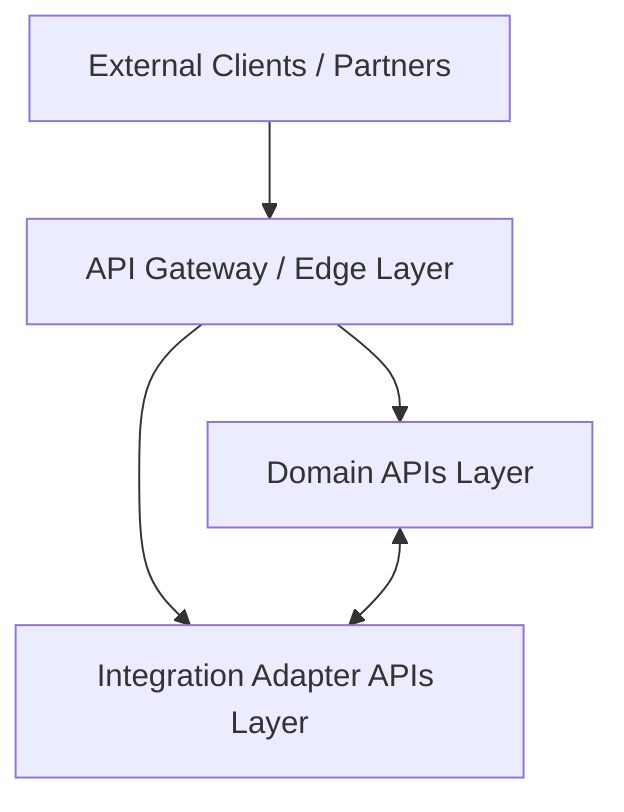

# API Architecture

This document outlines the system-level API architecture, boundary layers, and communication protocols for the Saudi Arabia MVP platform.

For concrete developer implementation guidelines, naming standards, status codes, versioning syntax, and JSON structures, refer to the [API Design Standards](../500-API/index.md).

## Purpose

The API architecture serves as the foundation for connecting internal capabilities and external partners, supporting policy administration, claims processing, billing, underwriting, and administrative workflows in compliance with Saudi Arabian regulatory requirements.

## API Layers and Topology

The platform APIs are structured into three distinct logical and physical layers to enforce security boundaries and separate responsibilities.

### 1. Edge / API Gateway
The API Gateway serves as the single secure entry point for all external traffic (client applications, agent portals, partner systems).

**Key Responsibilities:**
- **Request Routing:** Dynamic routing of traffic to downstream domain and integration services.
- **Security & Threat Mitigation:** SSL/TLS termination, API key validation, OAuth2 JWT inspection, and Web Application Firewall (WAF) integration.
- **Traffic Management:** Throttling and rate limiting (global and consumer-specific) to prevent denial-of-service attacks.
- **Observability:** Injection of correlation/trace IDs for distributed tracing, response time monitoring, and access logging.
- **Payload Transformation:** Cross-cutting request/response header mapping and payload adjustments.

### 2. Internal Domain APIs
Each domain microservice (or bounded context) exposes its own API surface containing business capabilities. These are internal-facing services that operate behind the gateway boundary.

**Core Domain Services:**
- **Policy API:** Quoting, policy issuance, endorsement, and renewal.
- **Claims API:** First Notice of Loss (FNOL), claim assessment, and adjudication workflows.
- **Billing API:** Payment scheduling, invoice generation, and transaction tracking.
- **Underwriting API:** Risk evaluation, rules validation, and automated decision-making.
- **Customer API:** Profiles, dynamic document directories, and consent management.

### 3. Integration Adapter APIs
These are specialized adapters that encapsulate external system integrations, decoupling the core domain services from third-party APIs. In the Saudi Arabia context, integration adapters interact with:
- **National Databases & Services:** ELM, Yakeen (identity validation), and Najm (accident report verification).
- **Payment Gateways:** Local payment systems (e.g., Mada, SADAD).
- **Document Services:** External PDF generation, electronic signature providers, and archiving engines.
- **Regulatory Reporting:** Integration points for compliance audits and mandatory regulatory feeds.

---

## Architectural Principles & Communication Patterns

The platform leverages two main communication patterns to ensure loose coupling, reliability, and low-latency performance:

### 1. Synchronous Request-Response (REST)
Used when immediate feedback is required for a user or system action.
- **Protocol:** HTTP/S.
- **Primary Scenarios:** Gateway ingress, policy quoting, portal data loading, and instant verification checks (e.g., fetching driver data via Yakeen).
- **Standards:** All REST APIs must adhere to standard REST patterns, return consistent envelopes, and be fully documented using OpenAPI 3.0. (See the [API Design Standards](../500-API/index.md)).

### 2. Asynchronous Event-Driven Messaging
Used for long-running workflows, background processing, and inter-service state propagation.
- **Broker:** Apache Kafka or equivalent enterprise event bus.
- **Primary Scenarios:** Document generation post-issuance, claims adjudication stages, notifying customers via SMS/email, and sending compliance audit records.
- **Decoupling:** Prevents cascading failures. If a service (e.g., notification) is temporarily unavailable, domain actions (e.g., policy creation) can still complete.

---

## Dynamic Metadata Extensibility

As specified in [ADR-003: Metadata-Driven Extensibility](architecture-decisions.md#adr-003-metadata-driven-extensibility), the system supports business-driven model modifications without backend changes.
- **UI Engine Integration:** Domain APIs work in tandem with a metadata service. The metadata service exposes schemas defining dynamic form layouts, fields, validation rules, and page sequences.
- **API Dynamic Payload Handling:** Core APIs leverage JSONB schemas ([ADR-004](architecture-decisions.md#adr-004-jsonb-for-dynamic-attribute-storage)) to ingest, validate, and store custom line-of-business parameters defined dynamically via configuration APIs.

For details on the specific metadata endpoints, see the [Metadata-Driven Extension APIs](../500-API/index.md#metadata-driven-extension-apis) section.
