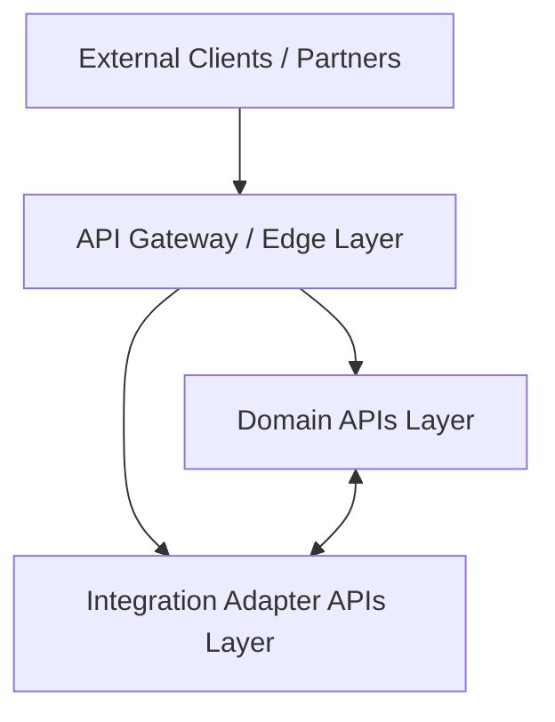

# API Architecture

This document outlines the system-level API architecture, boundary layers, communication protocols, and design standards for the Saudi Arabia MVP platform.

---

## Purpose

The API architecture serves as the foundation for connecting internal capabilities and external partners, supporting policy administration, claims processing, billing, underwriting, and administrative workflows in compliance with Saudi Arabian regulatory requirements.

---

## Core API Principles

1. **API-First Design**
   - Define and align on capability contracts with stakeholders before beginning backend service implementation.
2. **Contract-First Development**
   - Use OpenAPI specifications as the single source of truth for both service producers and consumers.
3. **Secure by Default**
   - Enforce authentication, role-based authorization, payload validation, and secure audit logging at every API endpoint boundary.
4. **Graceful Evolution**
   - Evolve contracts additively to avoid breaking changes. Retain backward compatibility wherever possible.

---

## API Layers and Topology

The platform APIs are structured into three distinct logical and physical layers to enforce security boundaries and separate responsibilities.



### 1. Edge / API Gateway
The API Gateway serves as the single secure entry point for all external traffic (client applications, agent portals, partner systems).

**Key Responsibilities:**
- **Request Routing:** Dynamic routing of traffic to downstream domain and integration services.
- **Security & Threat Mitigation:** SSL/TLS termination, API key validation, OAuth2 JWT inspection, and Web Application Firewall (WAF) integration.
- **Traffic Management:** Throttling and rate limiting (global and consumer-specific) to prevent denial-of-service attacks.
- **Observability:** Injection of correlation/trace IDs for distributed tracing, response time monitoring, and access logging.
- **Payload Transformation:** Cross-cutting request/response header mapping and payload adjustments.

### 2. Internal Domain APIs
Each domain microservice (or bounded context) exposes its own API surface containing business capabilities. These are internal-facing services that operate behind the gateway boundary.

**Core Domain Services:**
- **Policy API:** Quoting, policy issuance, endorsement, and renewal.
- **Claims API:** First Notice of Loss (FNOL), claim assessment, and adjudication workflows.
- **Billing API:** Payment scheduling, invoice generation, and transaction tracking.
- **Underwriting API:** Risk evaluation, rules validation, and automated decision-making.
- **Customer API:** Profiles, dynamic document directories, and consent management.

### 3. Integration Adapter APIs
These are specialized adapters that encapsulate external system integrations, decoupling the core domain services from third-party APIs. In the Saudi Arabia context, integration adapters interact with:
- **National Databases & Services:** ELM, Yakeen (identity validation), and Najm (accident report verification).
- **Payment Gateways:** Local payment systems (e.g., Mada, SADAD).
- **Document Services:** External PDF generation, electronic signature providers, and archiving engines.
- **Regulatory Reporting:** Integration points for compliance audits and mandatory regulatory feeds.

---

## Architectural Principles & Communication Patterns

The platform leverages two main communication patterns to ensure loose coupling, reliability, and low-latency performance:

### 1. Synchronous Request-Response (REST)
Used when immediate feedback is required for a user or system action.
- **Protocol:** HTTP/S.
- **Primary Scenarios:** Gateway ingress, policy quoting, portal data loading, and instant verification checks (e.g., fetching driver data via Yakeen).
- **Standards:** All REST APIs must adhere to standard REST patterns, return consistent envelopes, and be fully documented using OpenAPI 3.0.

### 2. Asynchronous Event-Driven Messaging
Used for long-running workflows, background processing, and inter-service state propagation.
- **Broker:** Apache Kafka or equivalent enterprise event bus.
- **Primary Scenarios:** Document generation post-issuance, claims adjudication stages, notifying customers via SMS/email, and sending compliance audit records.
- **Decoupling:** Prevents cascading failures. If a service (e.g., notification) is temporarily unavailable, domain actions (e.g., policy creation) can still complete.

---

## HTTP REST API Conventions

For synchronous request-response actions, the platform standard is REST over HTTP/S.

### 1. Endpoint Naming & Structure
- **Nouns in Plural Form:** Use plural nouns to designate resources. Do not use verbs in resource paths.
  - *Correct:* `GET /policies`, `POST /claims`
  - *Incorrect:* `GET /getPolicy`, `POST /submitClaim`
- **Hierarchical Paths:** Map sub-resources under their parent domain.
  - `GET /policies/{policyId}/documents`
- **Lower Kebab-Case:** Use lowercase kebab-case for paths and query parameters.
  - `GET /underwriting/rules`
  - `GET /policies?page-size=10`

### 2. Standard HTTP Methods
- `GET`: Retrieve a resource or a list. Must be safe and idempotent (no side effects).
- `POST`: Create a new resource, or trigger a non-idempotent action (e.g., initiating adjudication).
- `PUT`: Replace an existing resource entirely, or create if not present (idempotent).
- `PATCH`: Perform a partial update to a resource.
- `DELETE`: Remove a resource.

### 3. Response Status Codes
Services must return standard HTTP status codes indicating the result of the invocation:
- **200 OK**: Request completed successfully.
- **201 Created**: Resource created successfully (must include a `Location` header pointing to the new resource).
- **202 Accepted**: Request accepted for asynchronous processing (e.g., batch jobs, complex underwriting evaluations).
- **400 Bad Request**: Input validation failed, or payload is malformed.
- **401 Unauthorized**: No valid authentication token provided.
- **403 Forbidden**: Authenticated caller lacks permissions (roles/scopes) for the operation.
- **404 Not Found**: The requested resource does not exist.
- **409 Conflict**: State conflict (e.g., trying to endorse a cancelled policy).
- **500 Internal Server Error**: Unexpected server-side failure.

---

## Contract and Documentation Standards

- **OpenAPI Specification (OAS):** All REST APIs must be defined using OpenAPI 3.0 or 3.1.
- **Self-Documenting Specs:** Include descriptive summaries, parameter types, authentication requirements, rate-limiting headers, and detailed schemas.
- **Examples:** Provide complete, representative JSON payload examples for both successful responses and error states.

---

## Standard Error Response Payload

In the event of an error (4xx or 5xx status codes), services must return a standardized JSON envelope structure to simplify client-side handling.

```json
{
  "error": {
    "code": "VALIDATION_ERROR",
    "message": "The request payload is invalid",
    "details": [
      "policyNumber is required",
      "issueDate must be in the future"
    ]
  }
}
```

**Common Error Codes:**
- `VALIDATION_ERROR`: Input payload failed schema validations.
- `RESOURCE_NOT_FOUND`: Target resource was not found.
- `UNAUTHORIZED_ACCESS`: Missing or invalid security token.
- `INSUFFICIENT_PERMISSIONS`: Caller lacks role or scope access.
- `RESOURCE_CONFLICT`: Operation conflicts with current resource state.
- `INTERNAL_FAILURE`: An unhandled exception occurred on the server.

---

## Versioning Policy

To manage changes while maintaining stability for partner integrations:
- **URI Versioning:** Include the major version as a prefix in the URL path.
  - Format: `/v1/policies`
- **Breaking Changes:** Require incrementing the major version (e.g., `/v2/policies`). A change is breaking if it removes/renames fields, changes status codes, or alters payload structures.
- **Non-Breaking Changes:** (Adding fields, adding endpoints, optional query params) must be deployed under the same major version without breaking existing integrations.

---

## Security Expectations

- **Token-Based Authentication:** All API calls must include an OAuth2 bearer token in the `Authorization` header.
- **Fine-Grained Authorization:** Enforce Role-Based Access Control (RBAC) and verify specific OAuth scopes (e.g., `policy:read`, `claims:write`) per operation.
- **Input Sanitization:** Sanitize all incoming fields to protect against injection attacks (SQL, XSS, etc.).
- **Trace Context Propagation:** APIs must extract and propagate the standard trace header (`X-B3-TraceId` or standard W3C trace context) to ensure end-to-end observability.

---

## Dynamic Metadata Extensibility

As specified in [ADR-003: Metadata-Driven Extensibility](architecture-decisions.md#adr-003-metadata-driven-extensibility), the system supports business-driven model modifications without backend changes.
- **UI Engine Integration:** Domain APIs work in tandem with a metadata service. The metadata service exposes schemas defining dynamic form layouts, fields, validation rules, and page sequences.
- **API Dynamic Payload Handling:** Core APIs leverage JSONB schemas ([ADR-004](architecture-decisions.md#adr-004-jsonb-for-dynamic-attribute-storage)) to ingest, validate, and store custom line-of-business parameters defined dynamically via configuration APIs.

### Metadata-Driven Extension APIs

The platform leverages dynamic metadata endpoints to allow the user interface to render fields, validation rules, and custom workflow sequences on-the-fly:

- `GET /metadata/entities` - Lists all configurable core and extended entity definitions.
- `POST /metadata/entities` - Registers a new entity schema or dynamic attributes definition.
- `GET /metadata/entities/{entityCode}/fields` - Returns UI form rules, field types, and labels for a specific business line.
- `POST /metadata/forms` - Configures dynamic step-by-step layout definitions for portals.
- `GET /metadata/rules` - Evaluates or retrieves rule criteria metadata (e.g., premium discount calculations, basic underwriting bounds).
