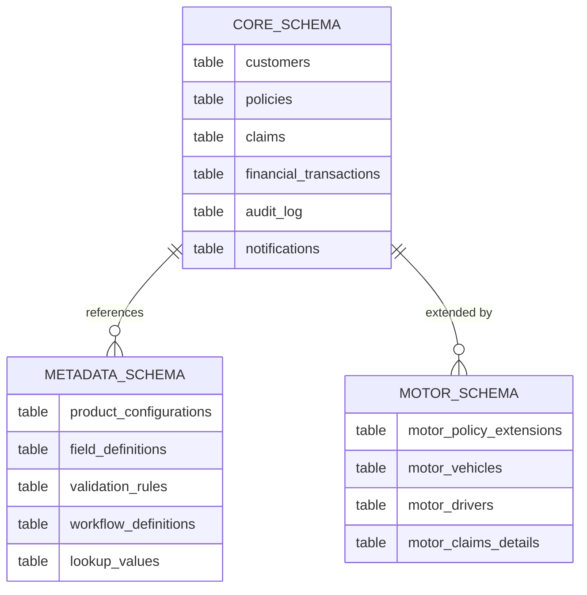

# Data Architecture

## Overview

The data architecture follows a **layered, schema-separated model** that keeps core shared data stable while allowing line-specific data and dynamic extensions to evolve independently.
Data ownership is aligned to domain boundaries — each service owns its tables and is the sole writer to them.

---

## Data Principles

| Principle | Detail |
|---|---|
| **Domain data ownership** | Each service owns its tables; no cross-service direct DB writes |
| **Stable core, flexible extensions** | Core entities are strongly typed; line-specific fields use JSONB or dedicated tables |
| **Configuration-driven fields** | UI-driven metadata allows adding fields without code changes |
| **Audit-first** | Every significant state change is recorded in `core.audit_log` |
| **Data residency** | All data stored in Saudi Arabia — no cross-border transfer of PII |
| **Encryption at rest** | PostgreSQL volumes encrypted; PII fields additionally encrypted at application level |

---

## Schema Architecture

The database is partitioned into three primary schemas:



### Schema Responsibilities

| Schema | Owner | Purpose |
|---|---|---|
| `core` | Platform team | Shared kernel entities used across all lines |
| `metadata` | Platform team | Configuration-driven field, product, and workflow definitions |
| `motor` | Motor line team | Motor-specific extension tables |
| `health` | Health line team (future) | Health-specific extension tables |
| `travel` | Travel line team (future) | Travel-specific extension tables |

---

## Core Domain Entities

### Customer

```sql
CREATE TABLE core.customers (
    id                      UUID PRIMARY KEY DEFAULT gen_random_uuid(),
    customer_number         VARCHAR(20) UNIQUE NOT NULL,

    -- Identity (encrypted at application level)
    national_id_encrypted   TEXT NOT NULL,       -- Saudi NIN or Iqama (AES-256-GCM)
    identity_type           VARCHAR(20) NOT NULL, -- CITIZEN, RESIDENT, COMPANY

    -- Names
    full_name_ar            VARCHAR(200) NOT NULL,
    full_name_en            VARCHAR(200),

    -- Contact
    email                   VARCHAR(255),
    mobile_number           VARCHAR(20),

    -- Metadata
    status                  VARCHAR(20) NOT NULL DEFAULT 'ACTIVE',
    dynamic_attributes      JSONB DEFAULT '{}',  -- Extensible metadata

    -- Audit
    created_at              TIMESTAMPTZ NOT NULL DEFAULT NOW(),
    updated_at              TIMESTAMPTZ NOT NULL DEFAULT NOW(),
    created_by              UUID NOT NULL,
    version                 BIGINT NOT NULL DEFAULT 0  -- Optimistic locking
);

CREATE INDEX idx_customers_number ON core.customers(customer_number);
CREATE INDEX idx_customers_gin    ON core.customers USING GIN(dynamic_attributes);
```

### Policy

```sql
CREATE TABLE core.policies (
    id                      UUID PRIMARY KEY DEFAULT gen_random_uuid(),
    policy_number           VARCHAR(30) UNIQUE NOT NULL,
    product_code            VARCHAR(50) NOT NULL,       -- e.g. MOTOR_COMP, MOTOR_TPL
    line_of_business        VARCHAR(30) NOT NULL,       -- MOTOR, HEALTH, TRAVEL

    customer_id             UUID NOT NULL REFERENCES core.customers(id),
    agent_id                UUID REFERENCES core.customers(id),

    -- Policy lifecycle
    status                  VARCHAR(30) NOT NULL,       -- DRAFT, ACTIVE, CANCELLED, EXPIRED
    effective_date          DATE NOT NULL,
    expiry_date             DATE NOT NULL,

    -- Financials
    annual_premium          NUMERIC(15,2) NOT NULL,
    currency                CHAR(3) NOT NULL DEFAULT 'SAR',
    tax_amount              NUMERIC(15,2) NOT NULL DEFAULT 0,

    -- Dynamic extensions
    line_specific_data      JSONB DEFAULT '{}',         -- Motor/Health/Travel specific fields
    dynamic_attributes      JSONB DEFAULT '{}',         -- Metadata-driven custom fields

    -- Audit
    issued_at               TIMESTAMPTZ,
    cancelled_at            TIMESTAMPTZ,
    cancellation_reason     TEXT,
    created_at              TIMESTAMPTZ NOT NULL DEFAULT NOW(),
    updated_at              TIMESTAMPTZ NOT NULL DEFAULT NOW(),
    created_by              UUID NOT NULL,
    version                 BIGINT NOT NULL DEFAULT 0
);

CREATE INDEX idx_policies_customer  ON core.policies(customer_id);
CREATE INDEX idx_policies_status    ON core.policies(status);
CREATE INDEX idx_policies_product   ON core.policies(product_code);
CREATE INDEX idx_policies_dates     ON core.policies(effective_date, expiry_date);
CREATE INDEX idx_policies_line_gin  ON core.policies USING GIN(line_specific_data);
CREATE INDEX idx_policies_dyn_gin   ON core.policies USING GIN(dynamic_attributes);
```

### Claim

```sql
CREATE TABLE core.claims (
    id                      UUID PRIMARY KEY DEFAULT gen_random_uuid(),
    claim_number            VARCHAR(30) UNIQUE NOT NULL,
    policy_id               UUID NOT NULL REFERENCES core.policies(id),

    -- Claim lifecycle
    status                  VARCHAR(30) NOT NULL DEFAULT 'REGISTERED',
    incident_date           DATE NOT NULL,
    registered_at           TIMESTAMPTZ NOT NULL DEFAULT NOW(),
    closed_at               TIMESTAMPTZ,

    -- Financial
    claimed_amount          NUMERIC(15,2),
    approved_amount         NUMERIC(15,2),
    currency                CHAR(3) NOT NULL DEFAULT 'SAR',

    -- Dynamic extensions
    line_specific_data      JSONB DEFAULT '{}',
    dynamic_attributes      JSONB DEFAULT '{}',

    -- Assignment
    handler_id              UUID,                       -- Claims handler user ID

    -- Audit
    created_at              TIMESTAMPTZ NOT NULL DEFAULT NOW(),
    updated_at              TIMESTAMPTZ NOT NULL DEFAULT NOW(),
    created_by              UUID NOT NULL,
    version                 BIGINT NOT NULL DEFAULT 0
);
```

### Financial Transaction

```sql
CREATE TABLE core.financial_transactions (
    id                      UUID PRIMARY KEY DEFAULT gen_random_uuid(),
    transaction_reference   VARCHAR(50) UNIQUE NOT NULL,
    transaction_type        VARCHAR(30) NOT NULL,   -- PREMIUM, REFUND, CLAIM_PAYMENT
    policy_id               UUID REFERENCES core.policies(id),
    claim_id                UUID REFERENCES core.claims(id),

    amount                  NUMERIC(15,2) NOT NULL,
    currency                CHAR(3) NOT NULL DEFAULT 'SAR',
    payment_method          VARCHAR(30),            -- MADA, SADAD, BANK_TRANSFER

    status                  VARCHAR(30) NOT NULL DEFAULT 'PENDING',
    gateway_reference       VARCHAR(100),           -- External payment gateway ref
    processed_at            TIMESTAMPTZ,

    created_at              TIMESTAMPTZ NOT NULL DEFAULT NOW(),
    created_by              UUID NOT NULL
);
```

---

## Metadata Schema (Configuration-Driven)

The metadata schema drives the dynamic form engine and product configuration system.

```sql
-- Product configuration
CREATE TABLE metadata.product_configurations (
    id              UUID PRIMARY KEY DEFAULT gen_random_uuid(),
    product_code    VARCHAR(50) UNIQUE NOT NULL,
    product_name_ar VARCHAR(200) NOT NULL,
    product_name_en VARCHAR(200) NOT NULL,
    line_of_business VARCHAR(30) NOT NULL,
    is_active       BOOLEAN NOT NULL DEFAULT TRUE,
    config          JSONB NOT NULL DEFAULT '{}',   -- Underwriting rules, limits, etc.
    created_at      TIMESTAMPTZ NOT NULL DEFAULT NOW(),
    updated_at      TIMESTAMPTZ NOT NULL DEFAULT NOW()
);

-- Dynamic field definitions (drives UI form rendering)
CREATE TABLE metadata.field_definitions (
    id              UUID PRIMARY KEY DEFAULT gen_random_uuid(),
    product_code    VARCHAR(50) NOT NULL,
    field_key       VARCHAR(100) NOT NULL,
    field_type      VARCHAR(30) NOT NULL,   -- TEXT, NUMBER, DATE, SELECT, BOOLEAN, PHONE
    label_ar        VARCHAR(200) NOT NULL,
    label_en        VARCHAR(200) NOT NULL,
    placeholder_ar  VARCHAR(200),
    placeholder_en  VARCHAR(200),
    is_required     BOOLEAN NOT NULL DEFAULT FALSE,
    display_order   INTEGER NOT NULL DEFAULT 0,
    section         VARCHAR(100),
    validation_rules JSONB DEFAULT '[]',   -- [{type: "MIN_LENGTH", value: 3}]
    lookup_key      VARCHAR(100),          -- References metadata.lookup_values
    is_active       BOOLEAN NOT NULL DEFAULT TRUE,
    UNIQUE(product_code, field_key)
);

-- Lookup values (dropdown/radio options)
CREATE TABLE metadata.lookup_values (
    id          UUID PRIMARY KEY DEFAULT gen_random_uuid(),
    lookup_key  VARCHAR(100) NOT NULL,
    value       VARCHAR(100) NOT NULL,
    label_ar    VARCHAR(200) NOT NULL,
    label_en    VARCHAR(200) NOT NULL,
    sort_order  INTEGER NOT NULL DEFAULT 0,
    is_active   BOOLEAN NOT NULL DEFAULT TRUE,
    UNIQUE(lookup_key, value)
);
```

---

## Motor Line Schema

```sql
CREATE TABLE motor.motor_vehicles (
    id                  UUID PRIMARY KEY DEFAULT gen_random_uuid(),
    policy_id           UUID NOT NULL REFERENCES core.policies(id),
    sequence_number     VARCHAR(20) NOT NULL,          -- Saudi vehicle sequence number
    plate_number        VARCHAR(20),
    plate_type          VARCHAR(20),                   -- PRIVATE, TRANSPORT, etc.
    make                VARCHAR(100),
    model               VARCHAR(100),
    model_year          INTEGER,
    chassis_number      VARCHAR(50),
    engine_capacity     INTEGER,
    vehicle_value       NUMERIC(15,2),
    vehicle_use         VARCHAR(30),                   -- PRIVATE, COMMERCIAL
    color               VARCHAR(50),
    dynamic_attributes  JSONB DEFAULT '{}'
);

CREATE TABLE motor.motor_drivers (
    id                  UUID PRIMARY KEY DEFAULT gen_random_uuid(),
    policy_id           UUID NOT NULL REFERENCES core.policies(id),
    driver_type         VARCHAR(20) NOT NULL,          -- MAIN, ADDITIONAL
    national_id_encrypted TEXT NOT NULL,
    full_name_ar        VARCHAR(200) NOT NULL,
    full_name_en        VARCHAR(200),
    date_of_birth_hijri VARCHAR(15),
    license_number      VARCHAR(30),
    license_issue_date  DATE,
    license_expiry_date DATE,
    years_of_experience INTEGER,
    dynamic_attributes  JSONB DEFAULT '{}'
);
```

---

## JSONB Dynamic Attributes

Dynamic attributes allow the business to capture additional information without schema changes.
Field definitions in `metadata.field_definitions` define what fields exist; the values are stored as JSONB in the owning entity row.

### Example: Motor Policy `line_specific_data`

```json
{
  "vehicle_use_type": "PRIVATE",
  "parking_location": "GARAGE",
  "annual_mileage": 25000,
  "deductible_percentage": 2.5,
  "najm_result": {
    "claims_count": 1,
    "last_claim_date": "2024-03-15",
    "risk_score": "LOW"
  }
}
```

### JSONB Query Examples

```sql
-- Find all comprehensive motor policies with low Najm risk
SELECT policy_number, annual_premium
FROM core.policies
WHERE product_code = 'MOTOR_COMP'
  AND line_specific_data->>'najm_result'->>'risk_score' = 'LOW';

-- Find policies with a specific dynamic attribute
SELECT policy_number
FROM core.policies
WHERE dynamic_attributes @> '{"renewal_reminder_sent": true}';

-- Index-assisted JSONB query (GIN index required)
CREATE INDEX idx_policies_line_gin ON core.policies USING GIN(line_specific_data);
```

---

## Data Migration Strategy

| Tool | Flyway 10.x |
|---|---|
| Migration location | `src/main/resources/db/migration/` |
| File naming | `V{version}__{description}.sql` (e.g. `V1__init_core_schema.sql`) |
| Schema separation | Core migrations in `core/` subfolder; motor in `motor/` subfolder |
| Baseline | `V0__baseline.sql` represents the initial state |
| Repair | `flyway repair` resolves failed migrations in non-production environments |

### Migration Ownership

| Schema | Owning Team | Migration Path |
|---|---|---|
| `core` | Platform team | `db/migration/core/` |
| `metadata` | Platform team | `db/migration/metadata/` |
| `motor` | Motor line team | `db/migration/motor/` |

**Rule:** No cross-schema migrations. Motor team may not modify `core` tables in their migration scripts.

---

## Data Governance

| Concern | Policy |
|---|---|
| PII fields | Encrypted at application level (NIN, IBAN, health data) |
| Data retention | Policy data: 10 years; Audit logs: 7 years (SAMA requirement) |
| Data residency | Saudi Arabia region only — no cross-border transfer |
| Access control | Database users scoped per service — no shared superuser access |
| Audit trail | All writes produce an audit_log entry |
| Backup | Daily encrypted backup; 30-day retention |
| Data classification | Tagged in field_definitions (`sensitivity` attribute: PUBLIC, INTERNAL, CONFIDENTIAL, PII) |
