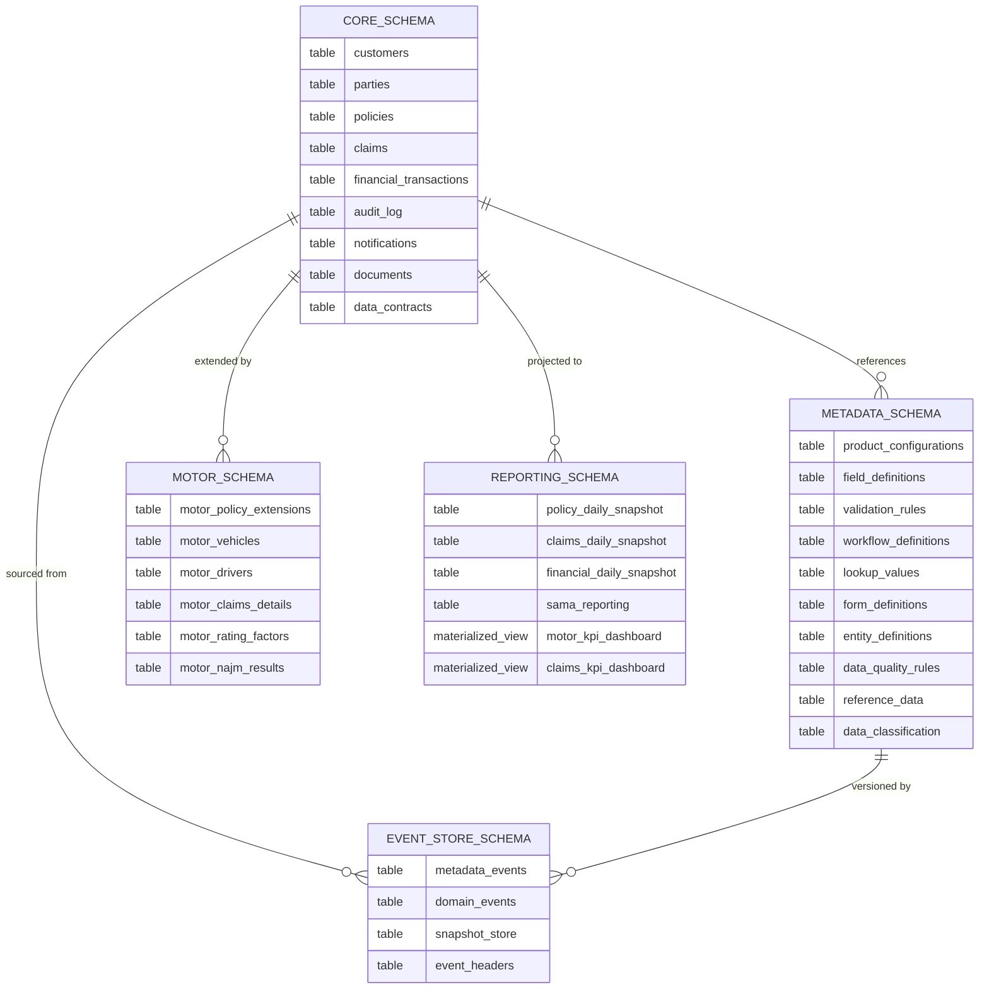
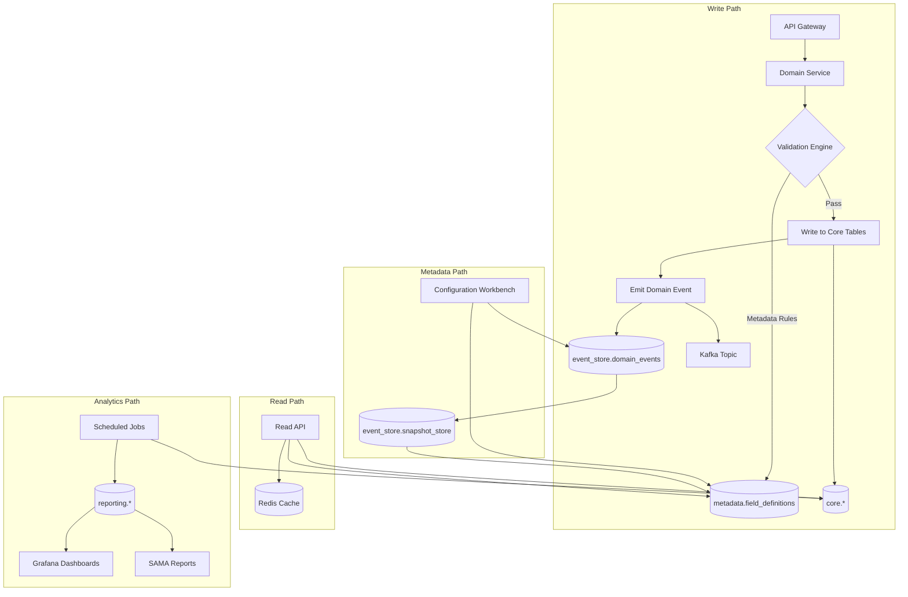

# Data Architecture

## Overview

The data architecture follows a **layered, schema-separated model** that keeps core shared data stable while allowing line-specific data and dynamic extensions to evolve independently.
Data ownership is aligned to domain boundaries — each service owns its tables and is the sole writer to them.

This document covers both the **conceptual data architecture** (principles, schema ownership, governance) and the **physical database design** (DDL, indexing, migration scripts).

---

## Data Principles

| Principle | Detail |
|---|---|
| **Domain data ownership** | Each service owns its tables; no cross-service direct DB writes |
| **Stable core, flexible extensions** | Core entities are strongly typed; line-specific fields use JSONB or dedicated tables |
| **Configuration-driven fields** | UI-driven metadata allows adding fields without code changes |
| **Event-sourced metadata** | All configuration changes are stored as immutable events — zero-downtime changes, full audit trail |
| **Audit-first** | Every significant state change is recorded in `core.audit_log` |
| **Data residency** | All data stored in Saudi Arabia — no cross-border transfer of PII |
| **Encryption at rest** | PostgreSQL volumes encrypted; PII fields additionally encrypted at application level |
| **Data as a Product** | Each domain exposes data products with defined schemas, SLAs, and ownership |
| **Data Quality by Design** | Quality rules defined in metadata, enforced at write time, monitored continuously |

---

## Schema Architecture

The database is partitioned into multiple schemas, each owned by a specific team:



### Schema Responsibilities

| Schema | Owner | Purpose |
|---|---|---|
| `core` | Platform team | Shared kernel entities used across all lines |
| `metadata` | Platform team | Configuration-driven field, product, and workflow definitions |
| `event_store` | Platform team | Immutable event log for metadata changes and domain events |
| `motor` | Motor line team | Motor-specific extension tables |
| `health` | Health line team (future) | Health-specific extension tables |
| `travel` | Travel line team (future) | Travel-specific extension tables |
| `reporting` | Data/Analytics team | Materialized views, reporting snapshots, KPI aggregations |
| `reference` | Platform team | Saudi-specific reference data (cities, codes, etc.) |

---

## Core Domain Entities

### Party (Base Entity)

```sql
CREATE TABLE core.parties (
    id                      UUID PRIMARY KEY DEFAULT gen_random_uuid(),
    party_type              VARCHAR(20) NOT NULL,       -- PERSON, ORGANIZATION
    status                  VARCHAR(20) NOT NULL DEFAULT 'ACTIVE',

    -- Audit
    created_at              TIMESTAMPTZ NOT NULL DEFAULT NOW(),
    updated_at              TIMESTAMPTZ NOT NULL DEFAULT NOW(),
    created_by              UUID NOT NULL,
    version                 BIGINT NOT NULL DEFAULT 0
);
```

### Customer

```sql
CREATE TABLE core.customers (
    id                      UUID PRIMARY KEY DEFAULT gen_random_uuid(),
    party_id                UUID NOT NULL REFERENCES core.parties(id),
    customer_number         VARCHAR(20) UNIQUE NOT NULL,

    -- Identity (encrypted at application level)
    national_id_encrypted   TEXT NOT NULL,       -- Saudi NIN or Iqama (AES-256-GCM)
    identity_type           VARCHAR(20) NOT NULL, -- CITIZEN, RESIDENT, COMPANY

    -- Names
    full_name_ar            VARCHAR(200) NOT NULL,
    full_name_en            VARCHAR(200),

    -- Contact
    email                   VARCHAR(255),
    mobile_number           VARCHAR(20),

    -- Saudi-specific fields
    nationality_code        CHAR(3),             -- ISO country code
    date_of_birth_hijri     VARCHAR(15),         -- Hijri date for Saudi identity
    date_of_birth_gregorian DATE,
    gender                  CHAR(1),             -- M, F
    occupation_code         VARCHAR(20),         -- SAMA occupation classification
    region_code             VARCHAR(10),         -- Saudi administrative region

    -- Metadata
    dynamic_attributes      JSONB DEFAULT '{}',  -- Extensible metadata
    data_classification     VARCHAR(20) NOT NULL DEFAULT 'CONFIDENTIAL',

    -- Tenant
    tenant_id               VARCHAR(50) NOT NULL,

    -- Audit
    created_at              TIMESTAMPTZ NOT NULL DEFAULT NOW(),
    updated_at              TIMESTAMPTZ NOT NULL DEFAULT NOW(),
    created_by              UUID NOT NULL,
    version                 BIGINT NOT NULL DEFAULT 0  -- Optimistic locking
);

CREATE INDEX idx_customers_number ON core.customers(customer_number);
CREATE INDEX idx_customers_tenant ON core.customers(tenant_id);
CREATE INDEX idx_customers_gin    ON core.customers USING GIN(dynamic_attributes);
CREATE INDEX idx_customers_national_id ON core.customers(national_id_encrypted);
```

### Policy

```sql
CREATE TABLE core.policies (
    id                      UUID PRIMARY KEY DEFAULT gen_random_uuid(),
    policy_number           VARCHAR(30) UNIQUE NOT NULL,
    product_code            VARCHAR(50) NOT NULL,       -- e.g. MOTOR_COMP, MOTOR_TPL
    line_of_business        VARCHAR(30) NOT NULL,       -- MOTOR, HEALTH, TRAVEL

    customer_id             UUID NOT NULL REFERENCES core.customers(id),
    agent_id                UUID REFERENCES core.customers(id),

    -- Policy lifecycle
    status                  VARCHAR(30) NOT NULL,       -- DRAFT, ACTIVE, CANCELLED, EXPIRED
    effective_date          DATE NOT NULL,
    expiry_date             DATE NOT NULL,

    -- Financials
    annual_premium          NUMERIC(15,2) NOT NULL,
    currency                CHAR(3) NOT NULL DEFAULT 'SAR',
    tax_amount              NUMERIC(15,2) NOT NULL DEFAULT 0,
    commission_amount       NUMERIC(15,2) DEFAULT 0,
    commission_rate         NUMERIC(5,2) DEFAULT 0,

    -- Dynamic extensions
    line_specific_data      JSONB DEFAULT '{}',         -- Motor/Health/Travel specific fields
    dynamic_attributes      JSONB DEFAULT '{}',         -- Metadata-driven custom fields

    -- Tenant
    tenant_id               VARCHAR(50) NOT NULL,

    -- Audit
    issued_at               TIMESTAMPTZ,
    cancelled_at            TIMESTAMPTZ,
    cancellation_reason     TEXT,
    created_at              TIMESTAMPTZ NOT NULL DEFAULT NOW(),
    updated_at              TIMESTAMPTZ NOT NULL DEFAULT NOW(),
    created_by              UUID NOT NULL,
    version                 BIGINT NOT NULL DEFAULT 0
);

CREATE INDEX idx_policies_customer  ON core.policies(customer_id);
CREATE INDEX idx_policies_tenant    ON core.policies(tenant_id);
CREATE INDEX idx_policies_status    ON core.policies(status);
CREATE INDEX idx_policies_product   ON core.policies(product_code);
CREATE INDEX idx_policies_dates     ON core.policies(effective_date, expiry_date);
CREATE INDEX idx_policies_line_gin  ON core.policies USING GIN(line_specific_data);
CREATE INDEX idx_policies_dyn_gin   ON core.policies USING GIN(dynamic_attributes);
```

### Claim

```sql
CREATE TABLE core.claims (
    id                      UUID PRIMARY KEY DEFAULT gen_random_uuid(),
    claim_number            VARCHAR(30) UNIQUE NOT NULL,
    policy_id               UUID NOT NULL REFERENCES core.policies(id),

    -- Claim lifecycle
    status                  VARCHAR(30) NOT NULL DEFAULT 'REGISTERED',
    incident_date           DATE NOT NULL,
    registered_at           TIMESTAMPTZ NOT NULL DEFAULT NOW(),
    closed_at               TIMESTAMPTZ,

    -- Financial
    claimed_amount          NUMERIC(15,2),
    approved_amount         NUMERIC(15,2),
    paid_amount             NUMERIC(15,2),
    currency                CHAR(3) NOT NULL DEFAULT 'SAR',
    excess_amount           NUMERIC(15,2) DEFAULT 0,

    -- Dynamic extensions
    line_specific_data      JSONB DEFAULT '{}',
    dynamic_attributes      JSONB DEFAULT '{}',

    -- Assignment
    handler_id              UUID,                       -- Claims handler user ID
    adjuster_id             UUID,                       -- External adjuster

    -- Fraud indicators
    fraud_score             NUMERIC(3,2),               -- 0.00 to 1.00
    fraud_review_required   BOOLEAN DEFAULT FALSE,

    -- Tenant
    tenant_id               VARCHAR(50) NOT NULL,

    -- Audit
    created_at              TIMESTAMPTZ NOT NULL DEFAULT NOW(),
    updated_at              TIMESTAMPTZ NOT NULL DEFAULT NOW(),
    created_by              UUID NOT NULL,
    version                 BIGINT NOT NULL DEFAULT 0
);

CREATE INDEX idx_claims_policy    ON core.claims(policy_id);
CREATE INDEX idx_claims_status    ON core.claims(status);
CREATE INDEX idx_claims_handler   ON core.claims(handler_id);
CREATE INDEX idx_claims_tenant    ON core.claims(tenant_id);
CREATE INDEX idx_claims_fraud     ON core.claims(fraud_review_required) WHERE fraud_review_required = TRUE;
```

### Financial Transaction

```sql
CREATE TABLE core.financial_transactions (
    id                      UUID PRIMARY KEY DEFAULT gen_random_uuid(),
    transaction_reference   VARCHAR(50) UNIQUE NOT NULL,
    transaction_type        VARCHAR(30) NOT NULL,   -- PREMIUM, REFUND, CLAIM_PAYMENT, COMMISSION
    policy_id               UUID REFERENCES core.policies(id),
    claim_id                UUID REFERENCES core.claims(id),

    amount                  NUMERIC(15,2) NOT NULL,
    currency                CHAR(3) NOT NULL DEFAULT 'SAR',
    tax_amount              NUMERIC(15,2) DEFAULT 0,
    payment_method          VARCHAR(30),            -- MADA, SADAD, BANK_TRANSFER, APPLE_PAY

    status                  VARCHAR(30) NOT NULL DEFAULT 'PENDING',
    gateway_reference       VARCHAR(100),           -- External payment gateway ref
    gateway_response        JSONB,                  -- Full gateway response for reconciliation
    processed_at            TIMESTAMPTZ,

    -- Reconciliation
    reconciled              BOOLEAN DEFAULT FALSE,
    reconciled_at           TIMESTAMPTZ,
    reconciliation_ref      VARCHAR(100),

    -- Tenant
    tenant_id               VARCHAR(50) NOT NULL,

    created_at              TIMESTAMPTZ NOT NULL DEFAULT NOW(),
    created_by              UUID NOT NULL
);

CREATE INDEX idx_fin_txn_policy   ON core.financial_transactions(policy_id);
CREATE INDEX idx_fin_txn_claim    ON core.financial_transactions(claim_id);
CREATE INDEX idx_fin_txn_status   ON core.financial_transactions(status);
CREATE INDEX idx_fin_txn_tenant   ON core.financial_transactions(tenant_id);
CREATE INDEX idx_fin_txn_recon    ON core.financial_transactions(reconciled) WHERE reconciled = FALSE;
```

### Document

```sql
CREATE TABLE core.documents (
    id                      UUID PRIMARY KEY DEFAULT gen_random_uuid(),
    document_reference      VARCHAR(50) UNIQUE NOT NULL,
    document_type           VARCHAR(30) NOT NULL,   -- POLICY_SCHEDULE, CLAIM_REPORT, INVOICE
    entity_type             VARCHAR(30) NOT NULL,   -- POLICY, CLAIM, CUSTOMER
    entity_id               UUID NOT NULL,

    file_name               VARCHAR(255) NOT NULL,
    file_size_bytes         BIGINT,
    mime_type               VARCHAR(100),
    storage_path            TEXT NOT NULL,          -- S3/minio path
    checksum               VARCHAR(64),            -- SHA-256

    status                  VARCHAR(20) NOT NULL DEFAULT 'PENDING',  -- PENDING, GENERATED, FAILED
    generated_at            TIMESTAMPTZ,
    expires_at              TIMESTAMPTZ,

    -- Tenant
    tenant_id               VARCHAR(50) NOT NULL,

    created_at              TIMESTAMPTZ NOT NULL DEFAULT NOW(),
    created_by              UUID NOT NULL
);

CREATE INDEX idx_documents_entity ON core.documents(entity_type, entity_id);
CREATE INDEX idx_documents_tenant ON core.documents(tenant_id);
```

### Data Contract

```sql
CREATE TABLE core.data_contracts (
    id                      UUID PRIMARY KEY DEFAULT gen_random_uuid(),
    contract_code           VARCHAR(50) UNIQUE NOT NULL,
    domain                  VARCHAR(50) NOT NULL,       -- Owning domain
    entity_name             VARCHAR(100) NOT NULL,      -- Entity this contract describes
    version                 VARCHAR(10) NOT NULL,       -- Semantic version
    status                  VARCHAR(20) NOT NULL DEFAULT 'DRAFT',  -- DRAFT, PUBLISHED, DEPRECATED

    schema_definition       JSONB NOT NULL,             -- Full schema definition
    sla                     JSONB DEFAULT '{}',         -- Availability, latency, freshness SLAs
    data_quality_rules      JSONB DEFAULT '[]',         -- Quality expectations
    consumers               JSONB DEFAULT '[]',         -- Known consumers

    -- Audit
    created_at              TIMESTAMPTZ NOT NULL DEFAULT NOW(),
    updated_at              TIMESTAMPTZ NOT NULL DEFAULT NOW(),
    created_by              UUID NOT NULL,
    UNIQUE(contract_code, version)
);

CREATE INDEX idx_data_contracts_domain ON core.data_contracts(domain);
```

---

## Metadata Schema (Configuration-Driven)

The metadata schema drives the dynamic form engine, product configuration system, and data quality framework.

### Product Configuration

```sql
CREATE TABLE metadata.product_configurations (
    id              UUID PRIMARY KEY DEFAULT gen_random_uuid(),
    product_code    VARCHAR(50) UNIQUE NOT NULL,
    product_name_ar VARCHAR(200) NOT NULL,
    product_name_en VARCHAR(200) NOT NULL,
    line_of_business VARCHAR(30) NOT NULL,
    is_active       BOOLEAN NOT NULL DEFAULT TRUE,
    config          JSONB NOT NULL DEFAULT '{}',   -- Underwriting rules, limits, etc.
    effective_from  DATE NOT NULL DEFAULT CURRENT_DATE,
    effective_to    DATE,
    version         INTEGER NOT NULL DEFAULT 1,
    created_at      TIMESTAMPTZ NOT NULL DEFAULT NOW(),
    updated_at      TIMESTAMPTZ NOT NULL DEFAULT NOW()
);
```

### Dynamic Field Definitions

```sql
CREATE TABLE metadata.field_definitions (
    id              UUID PRIMARY KEY DEFAULT gen_random_uuid(),
    product_code    VARCHAR(50) NOT NULL,
    field_key       VARCHAR(100) NOT NULL,
    field_type      VARCHAR(30) NOT NULL,   -- TEXT, NUMBER, DATE, SELECT, BOOLEAN, PHONE, EMAIL, NIN
    label_ar        VARCHAR(200) NOT NULL,
    label_en        VARCHAR(200) NOT NULL,
    placeholder_ar  VARCHAR(200),
    placeholder_en  VARCHAR(200),
    is_required     BOOLEAN NOT NULL DEFAULT FALSE,
    display_order   INTEGER NOT NULL DEFAULT 0,
    section         VARCHAR(100),
    section_order   INTEGER DEFAULT 0,
    validation_rules JSONB DEFAULT '[]',   -- [{type: "MIN_LENGTH", value: 3}]
    lookup_key      VARCHAR(100),          -- References metadata.lookup_values
    default_value   VARCHAR(500),
    sensitivity     VARCHAR(20) DEFAULT 'PUBLIC',  -- PUBLIC, INTERNAL, CONFIDENTIAL, PII
    is_active       BOOLEAN NOT NULL DEFAULT TRUE,
    UNIQUE(product_code, field_key)
);

CREATE INDEX idx_field_defs_product ON metadata.field_definitions(product_code);
```

### Entity Definitions

```sql
CREATE TABLE metadata.entity_definitions (
    id              UUID PRIMARY KEY DEFAULT gen_random_uuid(),
    entity_code     VARCHAR(50) UNIQUE NOT NULL,
    entity_name_ar  VARCHAR(200) NOT NULL,
    entity_name_en  VARCHAR(200) NOT NULL,
    table_name      VARCHAR(100),
    line_of_business VARCHAR(30),
    is_core         BOOLEAN NOT NULL DEFAULT FALSE,
    config          JSONB DEFAULT '{}',
    is_active       BOOLEAN NOT NULL DEFAULT TRUE,
    created_at      TIMESTAMPTZ NOT NULL DEFAULT NOW(),
    updated_at      TIMESTAMPTZ NOT NULL DEFAULT NOW()
);
```

### Form Definitions

```sql
CREATE TABLE metadata.form_definitions (
    id              UUID PRIMARY KEY DEFAULT gen_random_uuid(),
    form_code       VARCHAR(50) UNIQUE NOT NULL,
    form_name_ar    VARCHAR(200) NOT NULL,
    form_name_en    VARCHAR(200) NOT NULL,
    product_code    VARCHAR(50) NOT NULL,
    form_type       VARCHAR(30) NOT NULL,   -- QUOTE, CLAIM, ENDORSEMENT
    steps           JSONB NOT NULL DEFAULT '[]',  -- Ordered array of step definitions
    is_active       BOOLEAN NOT NULL DEFAULT TRUE,
    version         INTEGER NOT NULL DEFAULT 1,
    created_at      TIMESTAMPTZ NOT NULL DEFAULT NOW(),
    updated_at      TIMESTAMPTZ NOT NULL DEFAULT NOW()
);
```

### Lookup Values

```sql
CREATE TABLE metadata.lookup_values (
    id          UUID PRIMARY KEY DEFAULT gen_random_uuid(),
    lookup_key  VARCHAR(100) NOT NULL,
    value       VARCHAR(100) NOT NULL,
    label_ar    VARCHAR(200) NOT NULL,
    label_en    VARCHAR(200) NOT NULL,
    sort_order  INTEGER NOT NULL DEFAULT 0,
    is_active   BOOLEAN NOT NULL DEFAULT TRUE,
    parent_key  VARCHAR(100),              -- Hierarchical lookups
    parent_value VARCHAR(100),
    UNIQUE(lookup_key, value)
);

CREATE INDEX idx_lookup_key ON metadata.lookup_values(lookup_key);
```

### Data Quality Rules

```sql
CREATE TABLE metadata.data_quality_rules (
    id              UUID PRIMARY KEY DEFAULT gen_random_uuid(),
    rule_code       VARCHAR(50) UNIQUE NOT NULL,
    rule_name       VARCHAR(200) NOT NULL,
    rule_type       VARCHAR(30) NOT NULL,   -- COMPLETENESS, UNIQUENESS, CONSISTENCY, TIMELINESS, VALIDITY, ACCURACY
    entity_name     VARCHAR(100) NOT NULL,
    field_name      VARCHAR(100),
    severity        VARCHAR(20) NOT NULL DEFAULT 'WARNING',  -- ERROR, WARNING, INFO
    rule_definition JSONB NOT NULL,         -- Rule logic definition
    is_active       BOOLEAN NOT NULL DEFAULT TRUE,
    created_at      TIMESTAMPTZ NOT NULL DEFAULT NOW(),
    updated_at      TIMESTAMPTZ NOT NULL DEFAULT NOW()
);
```

### Data Classification

```sql
CREATE TABLE metadata.data_classification (
    id              UUID PRIMARY KEY DEFAULT gen_random_uuid(),
    classification_code VARCHAR(30) UNIQUE NOT NULL,  -- PUBLIC, INTERNAL, CONFIDENTIAL, PII, RESTRICTED
    label_ar        VARCHAR(100) NOT NULL,
    label_en        VARCHAR(100) NOT NULL,
    description     TEXT,
    encryption_required BOOLEAN NOT NULL DEFAULT FALSE,
    retention_years INTEGER,
    access_control  VARCHAR(50) NOT NULL DEFAULT 'RBAC',
    is_active       BOOLEAN NOT NULL DEFAULT TRUE
);
```

### Reference Data (Saudi-Specific)

```sql
CREATE TABLE metadata.reference_data (
    id              UUID PRIMARY KEY DEFAULT gen_random_uuid(),
    reference_type  VARCHAR(50) NOT NULL,   -- SAUDI_CITY, SAMA_CODE, OCCUPATION, PLATE_TYPE
    code            VARCHAR(50) NOT NULL,
    name_ar         VARCHAR(200) NOT NULL,
    name_en         VARCHAR(200),
    parent_code     VARCHAR(50),
    sort_order      INTEGER DEFAULT 0,
    is_active       BOOLEAN NOT NULL DEFAULT TRUE,
    UNIQUE(reference_type, code)
);

CREATE INDEX idx_ref_data_type ON metadata.reference_data(reference_type);
```

---

## Event Store Schema (Event-Sourced Metadata)

The event store implements the **event-sourced metadata** pattern from the vision. All configuration changes are stored as immutable events, enabling zero-downtime changes, full audit trail, and point-in-time reconstruction.

### Metadata Events

```sql
CREATE TABLE event_store.metadata_events (
    id                  UUID PRIMARY KEY DEFAULT gen_random_uuid(),
    event_type          VARCHAR(100) NOT NULL,   -- e.g. PRODUCT_CONFIGURED, FIELD_DEFINED, FORM_CREATED
    aggregate_type      VARCHAR(50) NOT NULL,    -- PRODUCT, FIELD, FORM, WORKFLOW
    aggregate_id        VARCHAR(100) NOT NULL,   -- The ID of the configuration entity
    version             INTEGER NOT NULL,        -- Monotonic version per aggregate

    -- Event payload
    data                JSONB NOT NULL,          -- The actual change data
    metadata            JSONB DEFAULT '{}',      -- Who, when, why

    -- Correlation
    correlation_id      VARCHAR(100),
    causation_id        UUID,                    -- ID of the event that caused this one

    -- Audit
    occurred_at         TIMESTAMPTZ NOT NULL DEFAULT NOW(),
    recorded_by         VARCHAR(100) NOT NULL,

    UNIQUE(aggregate_type, aggregate_id, version)
);

CREATE INDEX idx_metadata_events_aggregate ON event_store.metadata_events(aggregate_type, aggregate_id);
CREATE INDEX idx_metadata_events_type     ON event_store.metadata_events(event_type);
CREATE INDEX idx_metadata_events_time     ON event_store.metadata_events(occurred_at);
```

### Domain Events

```sql
CREATE TABLE event_store.domain_events (
    id                  UUID PRIMARY KEY DEFAULT gen_random_uuid(),
    event_type          VARCHAR(100) NOT NULL,   -- e.g. PolicyIssued, ClaimRegistered
    event_version       VARCHAR(10) NOT NULL DEFAULT '1.0',
    source_service      VARCHAR(50) NOT NULL,
    source_entity_type  VARCHAR(50),
    source_entity_id    VARCHAR(100),

    -- Payload
    data                JSONB NOT NULL,
    metadata            JSONB DEFAULT '{}',

    -- Tracing
    correlation_id      VARCHAR(100),
    causation_id        UUID,
    trace_id            VARCHAR(64),

    -- Publishing
    published           BOOLEAN DEFAULT FALSE,
    published_at        TIMESTAMPTZ,
    kafka_offset        BIGINT,

    occurred_at         TIMESTAMPTZ NOT NULL DEFAULT NOW()
);

CREATE INDEX idx_domain_events_type    ON event_store.domain_events(event_type);
CREATE INDEX idx_domain_events_source  ON event_store.domain_events(source_entity_type, source_entity_id);
CREATE INDEX idx_domain_events_time    ON event_store.domain_events(occurred_at);
CREATE INDEX idx_domain_events_unpub   ON event_store.domain_events(published) WHERE published = FALSE;
```

### Snapshot Store

```sql
CREATE TABLE event_store.snapshot_store (
    id                  UUID PRIMARY KEY DEFAULT gen_random_uuid(),
    aggregate_type      VARCHAR(50) NOT NULL,
    aggregate_id        VARCHAR(100) NOT NULL,
    version             INTEGER NOT NULL,
    state               JSONB NOT NULL,          -- Full materialized state at this version
    created_at          TIMESTAMPTZ NOT NULL DEFAULT NOW(),

    UNIQUE(aggregate_type, aggregate_id, version)
);

CREATE INDEX idx_snapshots_aggregate ON event_store.snapshot_store(aggregate_type, aggregate_id);
```

---

## Motor Line Schema

```sql
CREATE TABLE motor.motor_vehicles (
    id                  UUID PRIMARY KEY DEFAULT gen_random_uuid(),
    policy_id           UUID NOT NULL REFERENCES core.policies(id),
    sequence_number     VARCHAR(20) NOT NULL,          -- Saudi vehicle sequence number
    plate_number        VARCHAR(20),
    plate_type          VARCHAR(20),                   -- PRIVATE, TRANSPORT, etc.
    plate_color         VARCHAR(20),
    make                VARCHAR(100),
    model               VARCHAR(100),
    model_year          INTEGER,
    chassis_number      VARCHAR(50),
    engine_capacity     INTEGER,
    vehicle_value       NUMERIC(15,2),
    vehicle_use         VARCHAR(30),                   -- PRIVATE, COMMERCIAL
    color               VARCHAR(50),
    parking_location    VARCHAR(30),                   -- GARAGE, STREET, LOT
    annual_mileage      INTEGER,
    registration_expiry DATE,
    dynamic_attributes  JSONB DEFAULT '{}'
);

CREATE INDEX idx_motor_vehicles_policy ON motor.motor_vehicles(policy_id);
CREATE INDEX idx_motor_vehicles_seq    ON motor.motor_vehicles(sequence_number);

CREATE TABLE motor.motor_drivers (
    id                  UUID PRIMARY KEY DEFAULT gen_random_uuid(),
    policy_id           UUID NOT NULL REFERENCES core.policies(id),
    driver_type         VARCHAR(20) NOT NULL,          -- MAIN, ADDITIONAL
    national_id_encrypted TEXT NOT NULL,
    full_name_ar        VARCHAR(200) NOT NULL,
    full_name_en        VARCHAR(200),
    date_of_birth_hijri VARCHAR(15),
    date_of_birth       DATE,
    gender              CHAR(1),
    license_number      VARCHAR(30),
    license_type        VARCHAR(20),
    license_issue_date  DATE,
    license_expiry_date DATE,
    years_of_experience INTEGER,
    no_claims_discount  NUMERIC(5,2) DEFAULT 0,
    violations_count    INTEGER DEFAULT 0,
    claims_count        INTEGER DEFAULT 0,
    dynamic_attributes  JSONB DEFAULT '{}'
);

CREATE INDEX idx_motor_drivers_policy ON motor.motor_drivers(policy_id);

CREATE TABLE motor.motor_claims_details (
    id                  UUID PRIMARY KEY DEFAULT gen_random_uuid(),
    claim_id            UUID NOT NULL REFERENCES core.claims(id),
    accident_type       VARCHAR(30),                   -- COLLISION, THEFT, FIRE, VANDALISM
    accident_cause      VARCHAR(100),
    loss_location       TEXT,
    loss_latitude       NUMERIC(10,7),
    loss_longitude      NUMERIC(10,7),
    police_report_number VARCHAR(50),
    police_report_date  DATE,
    at_fault            BOOLEAN,
    third_party_national_id TEXT,
    third_party_vehicle  VARCHAR(100),
    repair_shop_id      VARCHAR(50),
    repair_cost_estimate NUMERIC(15,2),
    tow_truck_required  BOOLEAN DEFAULT FALSE,
    tow_truck_dispatched_at TIMESTAMPTZ,
    appraisal_reference VARCHAR(100),
    salvage_value       NUMERIC(15,2),
    dynamic_attributes  JSONB DEFAULT '{}'
);

CREATE INDEX idx_motor_claims_claim ON motor.motor_claims_details(claim_id);

CREATE TABLE motor.motor_rating_factors (
    id                  UUID PRIMARY KEY DEFAULT gen_random_uuid(),
    factor_code         VARCHAR(50) UNIQUE NOT NULL,
    factor_name_ar      VARCHAR(200) NOT NULL,
    factor_name_en      VARCHAR(200) NOT NULL,
    factor_type         VARCHAR(30) NOT NULL,   -- MULTIPLIER, ADDITIVE, BASE_RATE
    applicable_to       VARCHAR(30) NOT NULL,   -- VEHICLE, DRIVER, POLICY
    conditions          JSONB DEFAULT '{}',     -- When this factor applies
    values              JSONB NOT NULL,         -- Factor values by criteria
    effective_from      DATE NOT NULL,
    effective_to        DATE,
    is_active           BOOLEAN NOT NULL DEFAULT TRUE,
    created_at          TIMESTAMPTZ NOT NULL DEFAULT NOW(),
    updated_at          TIMESTAMPTZ NOT NULL DEFAULT NOW()
);

CREATE TABLE motor.motor_najm_results (
    id                  UUID PRIMARY KEY DEFAULT gen_random_uuid(),
    policy_id           UUID NOT NULL REFERENCES core.policies(id),
    request_type        VARCHAR(20) NOT NULL,   -- VEHICLE, DRIVER
    request_identifier  VARCHAR(50) NOT NULL,   -- Sequence number or NIN
    response_data       JSONB NOT NULL,
    claims_count        INTEGER DEFAULT 0,
    risk_score          VARCHAR(20),            -- LOW, MEDIUM, HIGH
    retrieved_at        TIMESTAMPTZ NOT NULL DEFAULT NOW(),
    expires_at          TIMESTAMPTZ
);

CREATE INDEX idx_motor_najm_policy ON motor.motor_najm_results(policy_id);
```

---

## Reporting Schema

```sql
CREATE TABLE reporting.policy_daily_snapshot (
    snapshot_date       DATE NOT NULL,
    tenant_id           VARCHAR(50) NOT NULL,
    line_of_business    VARCHAR(30) NOT NULL,
    product_code        VARCHAR(50),
    total_policies      INTEGER NOT NULL DEFAULT 0,
    active_policies     INTEGER NOT NULL DEFAULT 0,
    new_issued          INTEGER NOT NULL DEFAULT 0,
    cancelled           INTEGER NOT NULL DEFAULT 0,
    expired             INTEGER NOT NULL DEFAULT 0,
    total_premium       NUMERIC(15,2) NOT NULL DEFAULT 0,
    average_premium     NUMERIC(15,2),
    created_at          TIMESTAMPTZ NOT NULL DEFAULT NOW(),
    PRIMARY KEY (snapshot_date, tenant_id, line_of_business, product_code)
);

CREATE TABLE reporting.claims_daily_snapshot (
    snapshot_date       DATE NOT NULL,
    tenant_id           VARCHAR(50) NOT NULL,
    line_of_business    VARCHAR(30) NOT NULL,
    total_claims        INTEGER NOT NULL DEFAULT 0,
    open_claims         INTEGER NOT NULL DEFAULT 0,
    new_registered      INTEGER NOT NULL DEFAULT 0,
    closed_claims       INTEGER NOT NULL DEFAULT 0,
    total_claimed       NUMERIC(15,2) NOT NULL DEFAULT 0,
    total_approved      NUMERIC(15,2) NOT NULL DEFAULT 0,
    total_paid          NUMERIC(15,2) NOT NULL DEFAULT 0,
    average_settlement_days NUMERIC(10,2),
    created_at          TIMESTAMPTZ NOT NULL DEFAULT NOW(),
    PRIMARY KEY (snapshot_date, tenant_id, line_of_business)
);

CREATE TABLE reporting.financial_daily_snapshot (
    snapshot_date       DATE NOT NULL,
    tenant_id           VARCHAR(50) NOT NULL,
    transaction_type    VARCHAR(30) NOT NULL,
    payment_method      VARCHAR(30),
    total_transactions  INTEGER NOT NULL DEFAULT 0,
    total_amount        NUMERIC(15,2) NOT NULL DEFAULT 0,
    successful_count    INTEGER NOT NULL DEFAULT 0,
    failed_count        INTEGER NOT NULL DEFAULT 0,
    created_at          TIMESTAMPTZ NOT NULL DEFAULT NOW(),
    PRIMARY KEY (snapshot_date, tenant_id, transaction_type, payment_method)
);

CREATE TABLE reporting.sama_reporting (
    id                  UUID PRIMARY KEY DEFAULT gen_random_uuid(),
    report_type         VARCHAR(50) NOT NULL,   -- MOTOR_POLICY_REGISTER, CLAIMS_REGISTER
    report_period       VARCHAR(20) NOT NULL,   -- 2026-Q1, 2026-01
    status              VARCHAR(20) NOT NULL DEFAULT 'PENDING',  -- PENDING, GENERATED, SUBMITTED, ACKNOWLEDGED
    data                JSONB NOT NULL,
    file_reference      VARCHAR(100),
    submitted_at        TIMESTAMPTZ,
    acknowledged_at     TIMESTAMPTZ,
    error_message       TEXT,
    created_at          TIMESTAMPTZ NOT NULL DEFAULT NOW(),
    UNIQUE(report_type, report_period)
);

-- Materialized Views for KPI Dashboards
CREATE MATERIALIZED VIEW reporting.motor_kpi_dashboard AS
SELECT
    DATE_TRUNC('day', p.created_at) AS day,
    p.tenant_id,
    p.product_code,
    COUNT(*) AS policies_issued,
    SUM(p.annual_premium) AS total_premium,
    AVG(p.annual_premium) AS avg_premium,
    COUNT(CASE WHEN p.status = 'ACTIVE' THEN 1 END) AS active_policies,
    COUNT(CASE WHEN p.status = 'CANCELLED' THEN 1 END) AS cancelled_policies
FROM core.policies p
WHERE p.line_of_business = 'MOTOR'
GROUP BY DATE_TRUNC('day', p.created_at), p.tenant_id, p.product_code
WITH DATA;

CREATE INDEX idx_motor_kpi_day ON reporting.motor_kpi_dashboard(day);

CREATE MATERIALIZED VIEW reporting.claims_kpi_dashboard AS
SELECT
    DATE_TRUNC('day', c.registered_at) AS day,
    c.tenant_id,
    COUNT(*) AS claims_registered,
    COUNT(CASE WHEN c.status = 'CLOSED' THEN 1 END) AS claims_closed,
    AVG(CASE WHEN c.closed_at IS NOT NULL THEN EXTRACT(EPOCH FROM (c.closed_at - c.registered_at))/86400 END) AS avg_settlement_days,
    SUM(c.approved_amount) AS total_approved
FROM core.claims c
GROUP BY DATE_TRUNC('day', c.registered_at), c.tenant_id
WITH DATA;

CREATE INDEX idx_claims_kpi_day ON reporting.claims_kpi_dashboard(day);
```

---

## JSONB Dynamic Attributes

Dynamic attributes allow the business to capture additional information without schema changes.
Field definitions in `metadata.field_definitions` define what fields exist; the values are stored as JSONB in the owning entity row.

### Example: Motor Policy `line_specific_data`

```json
{
  "vehicle_use_type": "PRIVATE",
  "parking_location": "GARAGE",
  "annual_mileage": 25000,
  "deductible_percentage": 2.5,
  "najm_result": {
    "claims_count": 1,
    "last_claim_date": "2024-03-15",
    "risk_score": "LOW"
  },
  "yakeen_verification": {
    "verified": true,
    "reference": "YAK-2024-89123",
    "verified_at": "2024-06-15T10:30:00Z"
  }
}
```

### JSONB Query Examples

```sql
-- Find all comprehensive motor policies with low Najm risk
SELECT policy_number, annual_premium
FROM core.policies
WHERE product_code = 'MOTOR_COMP'
  AND line_specific_data @> '{"najm_result": {"risk_score": "LOW"}}';

-- Find policies with a specific dynamic attribute
SELECT policy_number
FROM core.policies
WHERE dynamic_attributes @> '{"renewal_reminder_sent": true}';

-- Index-assisted JSONB query (GIN index required)
CREATE INDEX idx_policies_line_gin ON core.policies USING GIN(line_specific_data);
```

---

## Data Migration Strategy

| Tool | Flyway 10.x |
|---|---|
| Migration location | `src/main/resources/db/migration/` |
| File naming | `V{version}__{description}.sql` (e.g. `V1__init_core_schema.sql`) |
| Schema separation | Core migrations in `core/` subfolder; motor in `motor/` subfolder |
| Baseline | `V0__baseline.sql` represents the initial state |
| Repair | `flyway repair` resolves failed migrations in non-production environments |

### Migration Ownership

| Schema | Owning Team | Migration Path |
|---|---|---|
| `core` | Platform team | `db/migration/core/` |
| `metadata` | Platform team | `db/migration/metadata/` |
| `event_store` | Platform team | `db/migration/event_store/` |
| `motor` | Motor line team | `db/migration/motor/` |
| `reporting` | Data/Analytics team | `db/migration/reporting/` |

**Rule:** No cross-schema migrations. Motor team may not modify `core` tables in their migration scripts.

---

## Data Governance

| Concern | Policy |
|---|---|
| PII fields | Encrypted at application level (NIN, IBAN, health data) |
| Data retention | Policy data: 10 years; Audit logs: 7 years (SAMA requirement) |
| Data residency | Saudi Arabia region only — no cross-border transfer |
| Access control | Database users scoped per service — no shared superuser access |
| Audit trail | All writes produce an audit_log entry |
| Backup | Daily encrypted backup; 30-day retention |
| Data classification | Tagged in `metadata.data_classification` table; sensitivity per field in `metadata.field_definitions` |
| Data quality | Rules defined in `metadata.data_quality_rules`; monitored via scheduled jobs |
| Data contracts | Published in `core.data_contracts`; versioned and tracked |

### Data Retention Schedule

| Data Category | Retention Period | Action After Period |
|---|---|---|
| Policy records | 10 years after expiry | Anonymize PII, retain aggregate data |
| Claims records | 10 years after closure | Anonymize PII, retain aggregate data |
| Financial transactions | 15 years (SAMA requirement) | Archive to cold storage |
| Audit logs | 7 years | Purge |
| Customer data | Duration of relationship + 5 years | Anonymize |
| Session/logs | 90 days | Purge |
| Metadata events | Indefinite (immutable event store) | No purge |

---

## Multi-Tenant Data Isolation

The platform supports both single-tenant and multi-tenant deployments:

| Isolation Model | Approach | Use Case |
|---|---|---|
| **Schema-per-tenant** | Each tenant gets its own PostgreSQL schema | Self-hosted, large insurers |
| **Row-level security (RLS)** | `tenant_id` column + RLS policies | Cloud SaaS, mid-size insurers |
| **Database-per-tenant** | Separate database instances | Enterprise, regulatory requirement |

### Row-Level Security Implementation (Default for SaaS)

```sql
-- Enable RLS on all core tables
ALTER TABLE core.customers ENABLE ROW LEVEL SECURITY;
ALTER TABLE core.policies ENABLE ROW LEVEL SECURITY;
ALTER TABLE core.claims ENABLE ROW LEVEL SECURITY;
ALTER TABLE core.financial_transactions ENABLE ROW LEVEL SECURITY;

-- Create policy that filters by tenant_id
CREATE POLICY tenant_isolation_policy ON core.customers
    USING (tenant_id = current_setting('app.tenant_id')::VARCHAR);

CREATE POLICY tenant_isolation_policy ON core.policies
    USING (tenant_id = current_setting('app.tenant_id')::VARCHAR);

CREATE POLICY tenant_isolation_policy ON core.claims
    USING (tenant_id = current_setting('app.tenant_id')::VARCHAR);

-- Set tenant context at connection/request level
-- SET app.tenant_id = 'tenant-001';
```

---

## Database Indexing & Optimization

To maintain rapid responses in production, the database uses tailored SQL indexes:

### B-Tree Indexes on Primary/Foreign Keys
All FK relationships require B-Tree indexes to prevent performance degradation on cascades and joins:
```sql
CREATE INDEX idx_policy_customer ON core.policies(customer_id);
CREATE INDEX idx_claim_policy ON core.claims(policy_id);
CREATE INDEX idx_transaction_policy ON core.financial_transactions(policy_id);
CREATE INDEX idx_motor_driver_policy ON motor.motor_drivers(policy_id);
CREATE INDEX idx_motor_vehicle_policy ON motor.motor_vehicles(policy_id);
```

### GIN Indexes on JSONB Columns
To query dynamic attributes inside the `JSONB` payload efficiently, we create **Generalized Inverted Index (GIN)** structures:
```sql
-- GIN Index on Policy dynamic attributes
CREATE INDEX idx_policy_dynamic_data ON core.policies USING GIN (line_specific_data);

-- GIN Index on Customer dynamic attributes
CREATE INDEX idx_customer_dynamic_data ON core.customers USING GIN (dynamic_attributes);
```

The GIN index supports PostgreSQL containment operators (e.g. `@>`), meaning deep queries execute instantly:
```sql
SELECT policy_id 
FROM core.policies 
WHERE line_specific_data @> '{"vehicle": {"year": 2021}}';
```

### Partial Indexes for Common Filters

```sql
-- Active policies only (common query pattern)
CREATE INDEX idx_policies_active ON core.policies(status) WHERE status = 'ACTIVE';

-- Unreconciled transactions
CREATE INDEX idx_txn_unreconciled ON core.financial_transactions(reconciled) WHERE reconciled = FALSE;

-- Fraud review queue
CREATE INDEX idx_claims_fraud_review ON core.claims(fraud_review_required) WHERE fraud_review_required = TRUE;
```

---

## Configuration-Driven Mechanism

The engine relies on `metadata` tables to dynamically validate and store schemas for lines of business.

### How Dynamic Attributes Walk Through the Database
1. **Definition**: An administrator registers a new `EntityDefinition` (e.g., `HealthPolicy`) and associates several `FieldDefinition` parameters (e.g. `member_age`, `pre_existing_conditions`).
2. **Ingress**: When a `HealthPolicy` quote request arrives at the Gateway:
   - The validation engine queries `metadata.field_definition` and `metadata.validation_rules` dynamically.
   - It validates inputs against configured regexes and rules.
3. **Storage**: Approved values are nested inside the `line_specific_data` `JSONB` column on the `core.policy` table.
4. **Event Recording**: The configuration change is recorded as an immutable event in `event_store.metadata_events`.

### Dynamic Payload Example: Health Insurance
A future Health Insurance extension stores its attributes in the `core.policy.line_specific_data` column like so:

```json
{
  "memberCount": 4,
  "class": "VIP",
  "deductibleOption": "Zero-Deductible",
  "insuredMembers": [
    {
      "nationalId": "1023456789",
      "dateOfBirth": "1988-12-01",
      "preExistingConditions": [
        "Hypertension"
      ]
    }
  ]
}
```

This JSON matches configuration-driven field definitions registered in the metadata schema, allowing full extensibility without altering SQL tables.

---

## Data Quality Framework

Data quality is enforced at multiple levels:

| Level | Mechanism | Tooling |
|---|---|---|
| **Schema validation** | NOT NULL, UNIQUE, FK constraints | PostgreSQL DDL |
| **Application validation** | Bean Validation (@Valid), custom validators | Spring Boot |
| **Metadata-driven validation** | Rules in `metadata.validation_rules` | Dynamic validation engine |
| **Scheduled quality checks** | Cron jobs that run DQ rules and alert on failures | Spring @Scheduled + AlertManager |
| **Data quality dashboards** | Grafana dashboards showing DQ metrics | Prometheus + Grafana |

### Quality Check Schedule

| Check | Frequency | Rule Type | Action on Failure |
|---|---|---|---|
| Completeness of required fields | Hourly | COMPLETENESS | Alert, report |
| Uniqueness of policy numbers | Daily | UNIQUENESS | Alert, investigate |
| Referential integrity | Daily | CONSISTENCY | Alert, repair |
| Freshness of Najm results | Hourly | TIMELINESS | Re-fetch |
| Premium calculation accuracy | Per transaction | VALIDITY | Reject transaction |

---

## Data Product Catalog

Each domain exposes data products with defined contracts:

| Data Product | Domain | Schema | Freshness SLA | Consumers |
|---|---|---|---|---|
| Customer Profile | Core | `core.customers` | Real-time | Policy, Claims, Billing, Portal |
| Policy Lifecycle | Core | `core.policies` | Real-time | Claims, Billing, Reporting |
| Claims Lifecycle | Core | `core.claims` | Real-time | Billing, Reporting, Fraud Detection |
| Motor Vehicle Data | Motor | `motor.motor_vehicles` | Real-time | Rating, Underwriting |
| Motor Rating Factors | Motor | `motor.motor_rating_factors` | Near-real-time (5 min) | Rating Engine |
| Policy Daily KPIs | Reporting | `reporting.policy_daily_snapshot` | Daily | Business Dashboard |
| SAMA Reports | Reporting | `reporting.sama_reporting` | Monthly | Regulatory Compliance |

---

## Data Flow Architecture



---

## Document Maintenance

| Aspect | Detail |
|---|---|
| Last Updated | 2026-07-06 |
| Owner | Enterprise Architecture Team |
| Review Cycle | Quarterly, or after significant data model changes |
| Approval | Architecture Review Board |
| Related Documents | [Domain Architecture](domain-architecture.md), [Integration Architecture](integration-architecture.md), [Architecture Decisions](architecture-decisions.md) |

