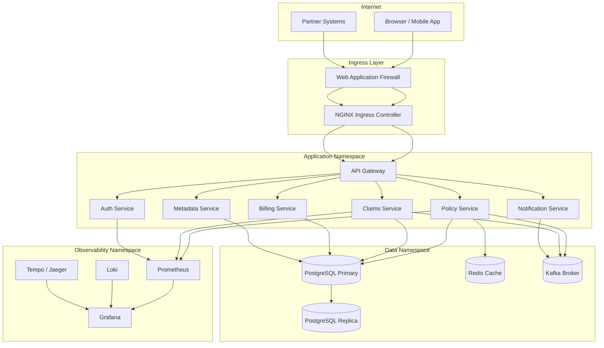

# Deployment Architecture

## Overview

The Enterprise Insurance Platform is deployed as a containerised, cloud-native system targeting the Saudi Arabia market.
All services are packaged as Docker images, orchestrated by Kubernetes, and promoted through a CI/CD pipeline that supports
development, staging, and production environments.

---

## Environment Topology

| Environment | Purpose | Data | Promotion Trigger |
|---|---|---|---|
| `dev` | Local development, unit/integration testing | Synthetic / seeded | On every merge to `develop` |
| `staging` | UAT, performance testing, integration with sandbox APIs | Anonymised production clone | Manual approval after CI passes |
| `production` | Live Saudi Arabia operations | Real customer data | Manual release gate + change board |

---

## Container Strategy

Each platform service follows a standardised container specification:

```
FROM eclipse-temurin:21-jre-alpine

# Non-root user for security compliance
RUN addgroup -S appgroup && adduser -S appuser -G appgroup
USER appuser

COPY --chown=appuser:appgroup app.jar /app/app.jar

EXPOSE 8080

ENTRYPOINT ["java", \
  "-XX:MaxRAMPercentage=75", \
  "-Dspring.profiles.active=${SPRING_PROFILE}", \
  "-jar", "/app/app.jar"]
```

### Image Conventions

| Convention | Value |
|---|---|
| Base image | `eclipse-temurin:21-jre-alpine` |
| Non-root user | Required — `appuser` |
| Port | `8080` (HTTP), `8443` (HTTPS terminated at ingress) |
| Config injection | Environment variables via Kubernetes `ConfigMap` and `Secret` |
| Secrets | Kubernetes `Secret` objects — never baked into the image |

---

## Kubernetes Architecture



### Namespace Separation

| Namespace | Contents |
|---|---|
| `insurance-app` | All Spring Boot microservices |
| `insurance-data` | PostgreSQL, Redis, Kafka |
| `insurance-obs` | Prometheus, Loki, Tempo, Grafana |
| `insurance-ingress` | NGINX Ingress, WAF |
| `insurance-identity` | Keycloak (OIDC/OAuth2 provider) |

---

## Service Deployment Spec (Standard)

Every application service is deployed with the following Kubernetes resources:

### Deployment

```yaml
apiVersion: apps/v1
kind: Deployment
metadata:
  name: policy-service
  namespace: insurance-app
spec:
  replicas: 2
  strategy:
    type: RollingUpdate
    rollingUpdate:
      maxUnavailable: 0
      maxSurge: 1
  selector:
    matchLabels:
      app: policy-service
  template:
    metadata:
      labels:
        app: policy-service
    spec:
      serviceAccountName: policy-service-sa
      securityContext:
        runAsNonRoot: true
        runAsUser: 1000
      containers:
        - name: policy-service
          image: ghcr.io/offer-core/policy-service:${VERSION}
          ports:
            - containerPort: 8080
          envFrom:
            - configMapRef:
                name: policy-service-config
            - secretRef:
                name: policy-service-secrets
          readinessProbe:
            httpGet:
              path: /actuator/health/readiness
              port: 8080
            initialDelaySeconds: 20
            periodSeconds: 10
          livenessProbe:
            httpGet:
              path: /actuator/health/liveness
              port: 8080
            initialDelaySeconds: 30
            periodSeconds: 15
          resources:
            requests:
              memory: "512Mi"
              cpu: "250m"
            limits:
              memory: "1Gi"
              cpu: "1000m"
```

### Horizontal Pod Autoscaler

```yaml
apiVersion: autoscaling/v2
kind: HorizontalPodAutoscaler
metadata:
  name: policy-service-hpa
  namespace: insurance-app
spec:
  scaleTargetRef:
    apiVersion: apps/v1
    kind: Deployment
    name: policy-service
  minReplicas: 2
  maxReplicas: 10
  metrics:
    - type: Resource
      resource:
        name: cpu
        target:
          type: Utilization
          averageUtilization: 70
```

---

## CI/CD Pipeline

```mermaid
flowchart LR
    PR[Pull Request] --> Build[Maven Build & Tests]
    Build --> Lint[Code Quality Gate]
    Lint --> Docker[Docker Image Build]
    Docker --> Scan[Trivy Security Scan]
    Scan --> Push[Push to GHCR Registry]
    Push --> DeployDev[Deploy to Dev]
    DeployDev --> SmokeTest[Smoke Tests]
    SmokeTest --> Gate{Manual Approval}
    Gate -- Approved --> DeployStaging[Deploy to Staging]
    DeployStaging --> IntTest[Integration + UAT Tests]
    IntTest --> ReleaseGate{Release Board}
    ReleaseGate -- Approved --> DeployProd[Deploy to Production]
    DeployProd --> Monitor[Monitor Health Dashboards]
```



### Pipeline Stages

| Stage | Tool | Gate |
|---|---|---|
| Code build | GitHub Actions / Maven | All tests pass |
| Code quality | SonarQube | Coverage ≥ 80%, no critical issues |
| Image build | Docker Buildx | Successful build |
| Security scan | Trivy | No CRITICAL CVEs |
| Image registry | GHCR (`ghcr.io/offer-core/`) | Authenticated push |
| Dev deployment | `kubectl apply` / Helm | Smoke test passes |
| Staging deployment | Helm upgrade + ArgoCD | UAT sign-off |
| Production deployment | Helm upgrade + ArgoCD | Change board approval |

---

## Environment-Specific Configuration

All environment configuration is injected via Kubernetes `ConfigMap` and `Secret` objects. Services read config using Spring Boot's environment variable binding.

```
# ConfigMap keys (non-sensitive)
SPRING_DATASOURCE_URL=jdbc:postgresql://postgres:5432/insurance
SPRING_KAFKA_BOOTSTRAP_SERVERS=kafka:9092
APP_KEYCLOAK_ISSUER_URI=https://auth.insurance.com.sa/realms/insurance

# Secret keys (sensitive — stored in Kubernetes Secrets, never in source code)
SPRING_DATASOURCE_PASSWORD=<injected>
APP_YAKEEN_API_KEY=<injected>
APP_NAJM_API_KEY=<injected>
APP_JWT_SECRET=<injected>
```

### Spring Profile Activation

| Environment | `SPRING_PROFILE` |
|---|---|
| Local development | `local` |
| Dev cluster | `dev` |
| Staging | `staging` |
| Production | `prod` |

---

## PostgreSQL High Availability

| Component | Configuration |
|---|---|
| Primary | `PostgreSQL 16` — read/write |
| Replica | Streaming replication — read-only queries |
| Connection pooling | `PgBouncer` in transaction mode |
| Backup | Daily `pg_dump` to encrypted S3-compatible storage |
| Point-in-time recovery | WAL archiving enabled |
| Failover | Manual promotion (Patroni optional for HA) |

---

## Secret Management

| Concern | Solution |
|---|---|
| Kubernetes Secrets | Base64-encoded, stored in etcd (encrypted at rest) |
| External secrets | HashiCorp Vault or AWS Secrets Manager via External Secrets Operator |
| Rotation | Secrets rotated on every deployment cycle |
| API keys | Stored as Kubernetes secrets — never in Git or container images |
| TLS certificates | cert-manager + Let's Encrypt (or private CA for Saudi regulatory environments) |

---

## Deployment Checklist (Pre-Production)

- [ ] All environment variables present in `ConfigMap` and `Secret`
- [ ] Readiness and liveness probes respond correctly
- [ ] Database migrations (Flyway) run successfully before pods start
- [ ] Resource limits set for all containers
- [ ] HPA configured with appropriate thresholds
- [ ] Ingress TLS certificate valid
- [ ] Trivy scan passes with no CRITICAL CVEs
- [ ] Smoke tests pass in staging
- [ ] Rollback procedure documented and tested
- [ ] Change board approval obtained
