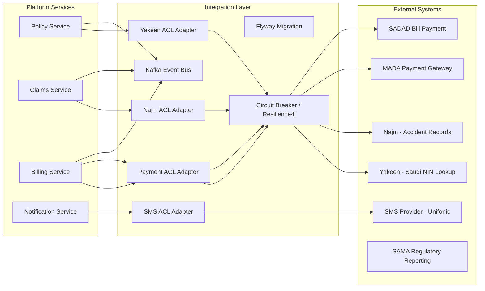

# Integration Architecture

## Overview

The platform integrates with Saudi Arabia national systems, payment providers, and internal service boundaries using a standardised set of integration patterns.
All integrations are wrapped in anti-corruption layers (ACL) that translate between external API schemas and internal domain models, ensuring the core platform is never directly coupled to third-party contracts.

---

## Integration Patterns



---

## National System Integrations

### 1. Yakeen — National Identity Verification

Yakeen is the Saudi government system for verifying citizen and resident identity (NIN/Iqama).

**Integration Type:** REST (SOAP wrapper in older versions)
**Trigger:** Policy application — verify customer identity before quote binding

```java
// Internal port (domain interface)
public interface IdentityVerificationPort {
    IdentityVerificationResult verify(IdentityVerificationRequest request);
}

// External adapter
@Component
public class YakeenIdentityAdapter implements IdentityVerificationPort {

    private final YakeenApiClient client;
    private final YakeenRequestMapper mapper;

    @Override
    @CircuitBreaker(name = "yakeen", fallbackMethod = "verificationFallback")
    @Retry(name = "yakeen")
    @TimeLimiter(name = "yakeen")
    public IdentityVerificationResult verify(IdentityVerificationRequest request) {
        YakeenRequest yakeenRequest = mapper.toExternal(request);
        YakeenResponse response = client.getCitizenInfo(yakeenRequest);
        return mapper.toDomain(response);
    }

    private IdentityVerificationResult verificationFallback(
            IdentityVerificationRequest request, Exception ex) {
        log.warn("Yakeen unavailable — deferring verification for NIN: {}",
                 MaskUtil.maskNin(request.getNationalId()));
        return IdentityVerificationResult.deferred(request.getNationalId());
    }
}
```

**Request/Response Contract:**

```java
// Internal domain model — never exposes Yakeen schema to core
public record IdentityVerificationRequest(
    String nationalId,         // Saudi NIN or Iqama
    String dateOfBirth,        // Hijri format: 1400-01-01
    IdentityType identityType  // CITIZEN, RESIDENT
) {}

public record IdentityVerificationResult(
    boolean verified,
    String fullNameAr,
    String fullNameEn,
    String dateOfBirth,
    VerificationStatus status,  // VERIFIED, DEFERRED, FAILED
    String referenceNumber
) {}
```

---

### 2. Najm — Accident and Claims History

Najm provides access to vehicle accident history for Saudi motor insurance underwriting.

**Integration Type:** REST API
**Trigger:** Motor policy underwriting — fetch vehicle/driver loss history

```java
public interface AccidentHistoryPort {
    AccidentHistoryResult getVehicleHistory(String vehicleSequenceNumber);
    AccidentHistoryResult getDriverHistory(String nationalId);
}

@Component
public class NajmAccidentAdapter implements AccidentHistoryPort {

    @Override
    @CircuitBreaker(name = "najm", fallbackMethod = "historyFallback")
    @Retry(name = "najm")
    public AccidentHistoryResult getVehicleHistory(String vehicleSequenceNumber) {
        NajmVehicleResponse response = najmClient.getVehicleAccidents(vehicleSequenceNumber);
        return najmMapper.toDomain(response);
    }

    private AccidentHistoryResult historyFallback(String vsn, Exception ex) {
        log.warn("Najm unavailable for VSN: {} — using manual underwriting flag", vsn);
        return AccidentHistoryResult.requiresManualReview(vsn);
    }
}
```

---

### 3. Payment Gateways

#### MADA (Card Payments)

**Integration Type:** REST (PCI-DSS compliant tokenised flow)
**Trigger:** Policy premium payment, claim settlement

```java
public interface PaymentGatewayPort {
    PaymentInitiationResult initiate(PaymentRequest request);
    PaymentStatusResult checkStatus(String paymentReference);
    RefundResult refund(RefundRequest request);
}

public record PaymentRequest(
    BigDecimal amount,
    String currency,          // SAR
    String policyReference,
    String customerReference,
    PaymentMethod method,     // MADA, SADAD, APPLE_PAY
    String returnUrl,
    String cancelUrl
) {}
```

#### SADAD (Bill Payment Integration)

SADAD is the Saudi national bill payment system. Policies generate SADAD bill numbers for customer payment at banks or mobile apps.

```java
public record SadadBillRequest(
    String billReference,      // Policy number
    BigDecimal amount,
    String dueDate,            // ISO-8601
    String billerCode,         // SAMA-assigned biller code
    String customerName
) {}
```

---

## Event-Driven Integration (Internal)

Services communicate asynchronously via Kafka domain events. Each event is a typed record representing a business fact.

### Event Catalogue

| Event | Producer | Consumer(s) | Trigger |
|---|---|---|---|
| `PolicyIssued` | Policy Service | Billing, Notification, Audit | Policy binding confirmed |
| `PolicyCancelled` | Policy Service | Billing, Notification | Cancellation approved |
| `ClaimRegistered` | Claims Service | Notification, Audit | New claim filed |
| `ClaimClosed` | Claims Service | Billing, Notification | Claim settled |
| `PaymentReceived` | Billing Service | Policy, Notification | Payment confirmed |
| `IdentityVerified` | Policy Service | Audit | Yakeen verification result |

### Event Schema Example

```java
// All events implement DomainEvent
public record PolicyIssuedEvent(
    String eventId,
    String policyId,
    String policyNumber,
    String productCode,
    String customerId,
    BigDecimal annualPremium,
    String currency,
    LocalDate effectiveDate,
    LocalDate expiryDate,
    Instant occurredAt
) implements DomainEvent {}
```

### Kafka Topic Configuration

```yaml
# application.yml — Kafka producer config
spring:
  kafka:
    bootstrap-servers: ${KAFKA_BOOTSTRAP_SERVERS}
    producer:
      key-serializer: org.apache.kafka.common.serialization.StringSerializer
      value-serializer: org.springframework.kafka.support.serializer.JsonSerializer
      acks: all
      retries: 3
      properties:
        enable.idempotence: true
    topics:
      policy-events: insurance.policy.events
      claims-events: insurance.claims.events
      billing-events: insurance.billing.events
```

---

## Resilience Patterns

All external integrations apply the following Resilience4j patterns:

```yaml
# application.yml — Resilience4j config
resilience4j:
  circuitbreaker:
    instances:
      yakeen:
        slidingWindowSize: 10
        failureRateThreshold: 50
        waitDurationInOpenState: 30s
        permittedNumberOfCallsInHalfOpenState: 3
      najm:
        slidingWindowSize: 10
        failureRateThreshold: 50
        waitDurationInOpenState: 60s
      mada-payment:
        slidingWindowSize: 10
        failureRateThreshold: 30
        waitDurationInOpenState: 30s

  retry:
    instances:
      yakeen:
        maxAttempts: 3
        waitDuration: 1s
        exponentialBackoffMultiplier: 2
      najm:
        maxAttempts: 3
        waitDuration: 2s

  timelimiter:
    instances:
      yakeen:
        timeoutDuration: 5s
      najm:
        timeoutDuration: 8s
      mada-payment:
        timeoutDuration: 30s
```

---

## Notification Integration

| Channel | Provider | Use Case |
|---|---|---|
| SMS | Unifonic | OTP, policy issuance confirmations, claim updates |
| Email | AWS SES / SMTP relay | Policy documents, renewal reminders |
| Push notification | Firebase FCM | Mobile app event notifications |
| WhatsApp | Twilio (optional) | Document sharing, status updates |

```java
public interface NotificationPort {
    void send(NotificationRequest request);
}

public record NotificationRequest(
    String recipientId,
    String mobileNumber,
    String email,
    NotificationChannel channel,   // SMS, EMAIL, PUSH
    String templateKey,            // "POLICY_ISSUED", "CLAIM_REGISTERED"
    Map<String, String> params,    // Template variable substitution
    String locale                  // "ar", "en"
) {}
```

---

## Regulatory Reporting (SAMA)

Motor insurance data is reported to SAMA (Saudi Arabia Monetary Authority) at defined intervals:

| Report | Frequency | Format |
|---|---|---|
| Motor policy register | Monthly | SAMA-specified XML/CSV |
| Claims register | Monthly | SAMA-specified XML/CSV |
| Financial solvency | Quarterly | SAMA portal upload |
| Fraud incident report | Ad-hoc | SAMA secure portal |

Reporting is handled by a dedicated scheduled job in the Policy and Claims services using Spring `@Scheduled` tasks, generating extracts from the database and transmitting via SAMA's secure file transfer endpoint.

---

## Integration Governance

| Concern | Practice |
|---|---|
| Contract versioning | External API contracts versioned and stored in `integrations/` directory |
| Schema validation | All external responses validated against internal schema before mapping |
| Error logging | All integration failures logged with correlation ID, masked sensitive data |
| Secrets | All API keys injected via Kubernetes Secrets — never hardcoded |
| Timeout policy | All HTTP clients have explicit connect (5s) and read (30s) timeouts |
| Retry policy | Idempotent reads retry up to 3 times; mutations retry only on network errors |
