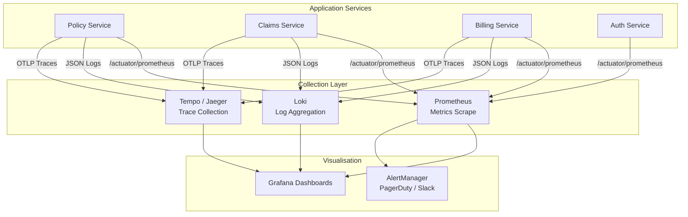

# Operations and Observability

## Overview

The platform uses a **three-pillar observability model**: structured logs, metrics, and distributed traces.
All services expose standard Spring Boot Actuator endpoints and emit telemetry that is collected by a centralised observability stack (Prometheus + Loki + Tempo + Grafana).

---

## Observability Stack



---

## Structured Logging

All services use **Logback + Logstash encoder** to emit JSON-structured logs. Every log line includes a `correlationId` propagated through the request via MDC.

### Log Format

```json
{
  "timestamp": "2026-07-05T20:15:00.123Z",
  "level": "INFO",
  "logger": "com.insurance.policy.PolicyService",
  "message": "Policy approved successfully",
  "correlationId": "req-a1b2c3d4",
  "userId": "uuid-user-id",
  "policyId": "POL-2026-00123",
  "productCode": "MOTOR_COMP",
  "duration_ms": 142,
  "service": "policy-service",
  "environment": "production"
}
```

### MDC Correlation Filter

```java
@Component
@Order(Ordered.HIGHEST_PRECEDENCE)
public class CorrelationIdFilter extends OncePerRequestFilter {

    private static final String CORRELATION_HEADER = "X-Correlation-Id";

    @Override
    protected void doFilterInternal(HttpServletRequest request,
                                    HttpServletResponse response,
                                    FilterChain chain) throws ServletException, IOException {
        String correlationId = Optional.ofNullable(request.getHeader(CORRELATION_HEADER))
                .orElse(UUID.randomUUID().toString());
        MDC.put("correlationId", correlationId);
        response.setHeader(CORRELATION_HEADER, correlationId);
        try {
            chain.doFilter(request, response);
        } finally {
            MDC.clear();
        }
    }
}
```

### Logback Configuration

```xml
<!-- logback-spring.xml -->
<configuration>
  <appender name="JSON_STDOUT" class="ch.qos.logback.core.ConsoleAppender">
    <encoder class="net.logstash.logback.encoder.LogstashEncoder">
      <includeMdcKeyName>correlationId</includeMdcKeyName>
      <includeMdcKeyName>userId</includeMdcKeyName>
      <customFields>{"service":"policy-service","environment":"${SPRING_PROFILES_ACTIVE}"}</customFields>
    </encoder>
  </appender>

  <root level="INFO">
    <appender-ref ref="JSON_STDOUT"/>
  </root>
</configuration>
```

---

## Metrics

### Spring Boot Actuator + Micrometer

All services expose a `/actuator/prometheus` endpoint scraped by Prometheus every 15 seconds.

```yaml
# application.yml
management:
  endpoints:
    web:
      exposure:
        include: health, info, prometheus, metrics
  endpoint:
    health:
      show-details: when-authorized
      probes:
        enabled: true
  metrics:
    tags:
      service: ${spring.application.name}
      environment: ${spring.profiles.active}
    distribution:
      percentiles-histogram:
        http.server.requests: true
      percentiles:
        http.server.requests: [0.50, 0.95, 0.99]
```

### Custom Business Metrics

```java
@Component
public class PolicyMetrics {

    private final Counter policiesIssuedCounter;
    private final Counter policiesRejectedCounter;
    private final Timer policyApprovalTimer;

    public PolicyMetrics(MeterRegistry registry) {
        this.policiesIssuedCounter = Counter.builder("insurance.policy.issued")
            .description("Total policies issued")
            .tag("product", "unknown")
            .register(registry);
        this.policiesRejectedCounter = Counter.builder("insurance.policy.rejected")
            .description("Total policies rejected by underwriting")
            .register(registry);
        this.policyApprovalTimer = Timer.builder("insurance.policy.approval.duration")
            .description("Time from submission to approval")
            .publishPercentiles(0.50, 0.95, 0.99)
            .register(registry);
    }

    public void recordPolicyIssued(String productCode) {
        policiesIssuedCounter.toBuilder()
            .tag("product", productCode)
            .register(registry)
            .increment();
    }
}
```

### Key Metrics Catalogue

| Metric | Type | Description | Alert Threshold |
|---|---|---|---|
| `insurance.policy.issued_total` | Counter | Total policies issued | N/A |
| `insurance.policy.rejected_total` | Counter | Policies rejected by underwriting | N/A |
| `insurance.claim.registered_total` | Counter | Total claims registered | N/A |
| `insurance.payment.failed_total` | Counter | Failed payment attempts | > 10 in 5 min |
| `insurance.yakeen.error_total` | Counter | Yakeen integration errors | > 5 in 5 min |
| `insurance.najm.error_total` | Counter | Najm integration errors | > 5 in 5 min |
| `http.server.requests.p95` | Timer | 95th percentile API response time | > 2000ms |
| `http.server.requests.p99` | Timer | 99th percentile API response time | > 5000ms |
| `spring.data.repository.invocations` | Timer | Database query duration | > 1000ms |
| `resilience4j.circuitbreaker.state` | Gauge | Circuit breaker open/closed state | OPEN state |

---

## Distributed Tracing

All services use **OpenTelemetry** instrumented via Spring Boot's Micrometer Tracing auto-configuration.

```yaml
# application.yml
management:
  tracing:
    sampling:
      probability: 1.0   # 100% in dev/staging; reduce to 0.1 in production
  otlp:
    tracing:
      endpoint: http://tempo:4318/v1/traces
```

Every inbound HTTP request receives a `traceparent` header (W3C Trace Context) that is propagated to all downstream services and Kafka consumers, enabling full distributed trace reconstruction in Grafana.

### Trace Propagation to Kafka

```java
@KafkaListener(topics = "insurance.policy.events")
public void handlePolicyEvent(PolicyIssuedEvent event, 
                               @Header(KafkaHeaders.RECEIVED_TOPIC) String topic) {
    // Spring Kafka auto-propagates trace context from message headers
    log.info("Processing PolicyIssuedEvent for policy: {}", event.policyId());
    // Processing logic
}
```

---

## Health Checks

All services expose standardised Kubernetes-compatible health probes:

| Endpoint | Purpose | Response |
|---|---|---|
| `/actuator/health/liveness` | K8s liveness — is the JVM alive? | `{"status": "UP"}` |
| `/actuator/health/readiness` | K8s readiness — is the service ready to serve traffic? | Includes DB, Kafka, Redis checks |
| `/actuator/health` | Full health details (authenticated only) | All component statuses |

### Custom Health Indicator Example

```java
@Component
public class YakeenHealthIndicator implements HealthIndicator {

    private final YakeenApiClient client;

    @Override
    public Health health() {
        try {
            boolean alive = client.ping();
            return alive 
                ? Health.up().withDetail("yakeen", "reachable").build()
                : Health.down().withDetail("yakeen", "unreachable").build();
        } catch (Exception ex) {
            return Health.down(ex).withDetail("yakeen", "error").build();
        }
    }
}
```

---

## Alerting

### AlertManager Rules

```yaml
# prometheus-alerts.yml
groups:
  - name: insurance-platform
    rules:
      - alert: HighAPILatency
        expr: http_server_requests_seconds{quantile="0.95"} > 2
        for: 5m
        labels:
          severity: warning
        annotations:
          summary: "High API latency on {{ $labels.service }}"

      - alert: CircuitBreakerOpen
        expr: resilience4j_circuitbreaker_state{state="open"} == 1
        for: 1m
        labels:
          severity: critical
        annotations:
          summary: "Circuit breaker OPEN for {{ $labels.name }}"

      - alert: PaymentFailureSpike
        expr: increase(insurance_payment_failed_total[5m]) > 10
        for: 2m
        labels:
          severity: critical
        annotations:
          summary: "Payment failure spike detected"

      - alert: DatabaseSlowQuery
        expr: spring_data_repository_invocations_seconds{quantile="0.99"} > 1
        for: 5m
        labels:
          severity: warning
        annotations:
          summary: "Slow database queries on {{ $labels.service }}"
```

### Alert Routing

| Severity | Channel | Response Time |
|---|---|---|
| `critical` | PagerDuty + Slack `#alerts-critical` | Immediate (24/7) |
| `warning` | Slack `#alerts-warning` | Within 30 minutes |
| `info` | Slack `#alerts-info` | Business hours |

---

## Grafana Dashboards

| Dashboard | Audience | Key Panels |
|---|---|---|
| **Platform Overview** | All teams | Request rate, error rate, latency p95/p99 |
| **Policy KPIs** | Business | Policies issued/day, rejection rate, product breakdown |
| **Claims KPIs** | Business | Claims registered, average settlement time, open claims |
| **Integration Health** | Engineering | Yakeen/Najm circuit breaker status, payment success rate |
| **Infrastructure** | Ops | CPU, memory, pod count, JVM heap |
| **Security Events** | Security | Auth failures, rate limit hits, suspicious patterns |

---

## Operational Runbooks

### Runbook: Policy Service Degraded

1. Check circuit breaker state on Grafana → Integration Health dashboard
2. If Yakeen circuit open: alert `#integrations` channel, manual underwriting fallback
3. Check DB connection pool exhaustion: `insurance_db_pool_active` metric
4. Restart pod if JVM heap is above 90%: `kubectl rollout restart deployment/policy-service -n insurance-app`
5. Escalate to on-call architect if issue persists after 15 minutes

### Runbook: Payment Failure Spike

1. Check MADA/SADAD gateway status pages
2. Review `insurance.payment.failed_total` by payment method in Grafana
3. If gateway-side: raise incident with payment provider, notify business team
4. If platform-side: check Billing Service logs for correlation ID, escalate to engineering
5. Manual reconciliation may be required: run `billing-reconcile` script from `scripts/`

### Runbook: Database Connection Exhaustion

1. Check `pg_stat_activity` on PostgreSQL
2. Identify long-running queries: `SELECT pid, now() - pg_stat_activity.query_start AS duration, query FROM pg_stat_activity WHERE state != 'idle' ORDER BY duration DESC LIMIT 20;`
3. Terminate blocking queries if safe: `SELECT pg_terminate_backend(pid) WHERE ...`
4. Review PgBouncer pool settings if throughput is insufficient
5. Scale read replicas if read load is the bottleneck
