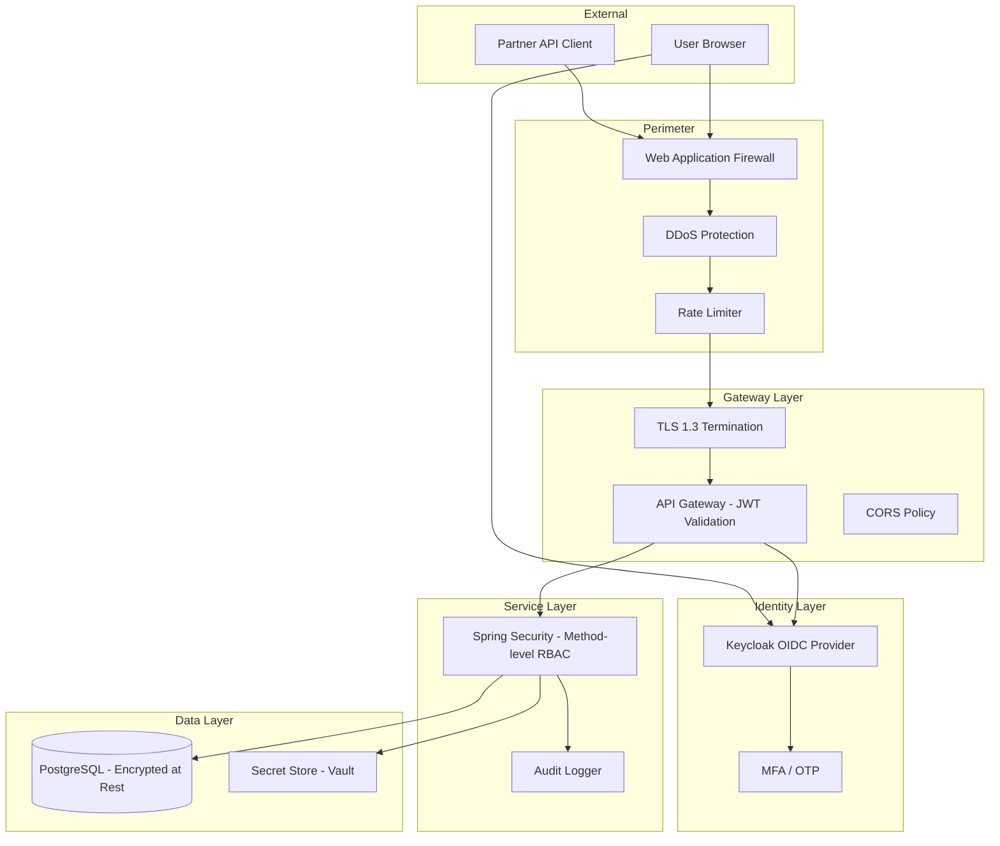

# Security Architecture

## Overview

The platform security architecture implements a **defence-in-depth** model aligned with Saudi Arabia insurance regulatory requirements (SAMA Cybersecurity Framework). Authentication is centralised through an OIDC-compliant identity provider (Keycloak), and authorisation is enforced at both the API Gateway and service layers using JWT claims and role-based rules.

---

## Security Layers



---

## Authentication Design

### Identity Provider: Keycloak

| Property | Value |
|---|---|
| Protocol | OpenID Connect 1.0 / OAuth 2.1 |
| Flow (Browser) | Authorization Code + PKCE |
| Flow (M2M) | Client Credentials |
| Token format | JWT (RS256 signed) |
| Access token TTL | 15 minutes |
| Refresh token TTL | 8 hours (sliding) |
| MFA | TOTP (Google Authenticator / Saudi OTP) |
| Session management | Keycloak session + frontend silent refresh |

### Keycloak Realm Configuration

```
Realm: insurance-platform
  ├── Clients
  │   ├── insurance-web (public, PKCE, redirect: https://app.insurance.com.sa/*)
  │   ├── policy-service (confidential, client credentials)
  │   ├── claims-service (confidential, client credentials)
  │   └── billing-service (confidential, client credentials)
  ├── Roles
  │   ├── ROLE_SUPER_ADMIN
  │   ├── ROLE_UNDERWRITER
  │   ├── ROLE_CLAIMS_HANDLER
  │   ├── ROLE_AGENT
  │   ├── ROLE_CUSTOMER
  │   └── ROLE_READONLY_AUDITOR
  └── Identity Providers
      └── Saudi National SSO (future - Absher integration)
```

### JWT Claims Structure

```json
{
  "sub": "uuid-user-id",
  "iss": "https://auth.insurance.com.sa/realms/insurance",
  "aud": "insurance-web",
  "exp": 1751720400,
  "iat": 1751719500,
  "realm_access": {
    "roles": ["ROLE_UNDERWRITER"]
  },
  "resource_access": {
    "policy-service": {
      "roles": ["policy:write", "policy:read"]
    }
  },
  "preferred_username": "ahmed.ali@company.com.sa",
  "locale": "ar",
  "tenant_id": "tenant-001"
}
```

### Tenant Resolution Flow

Every request must resolve to a valid tenant. The tenant is resolved in the following order:

1. **Primary**: From the `tenant_id` claim in the JWT (most secure, tamper-proof).
2. **Fallback**: From the `X-Tenant-ID` header (used for service-to-service and legacy clients).
3. **Block**: If no tenant is resolved, the request is rejected with a `400 Bad Request`.

```java
@Component
public class TenantInterceptor implements HandlerInterceptor {
    @Override
    public boolean preHandle(HttpServletRequest request, HttpServletResponse response, Object handler) {
        String tenantId = null;
        Authentication auth = SecurityContextHolder.getContext().getAuthentication();
        if (auth != null && auth.getPrincipal() instanceof Jwt) {
            tenantId = ((Jwt) auth.getPrincipal()).getClaimAsString("tenant_id");
        }
        if (tenantId == null || tenantId.isBlank()) {
            tenantId = request.getHeader("X-Tenant-ID");
        }
        if (tenantId == null || tenantId.isBlank()) {
            response.setStatus(HttpServletResponse.SC_BAD_REQUEST);
            response.getWriter().write("{\"error\":\"Missing tenant context\"}");
            return false;
        }
        TenantContextHolder.setCurrentTenant(tenantId);
        return true;
    }
}
```

---

## Session & Logout Management

### Logout Flow (Angular SPA)

1. **Client-side**: Clear token state in Angular.
2. **IdP logout**: Redirect to Keycloak's logout endpoint:

```
GET https://auth.insurance.com.sa/realms/insurance/protocol/openid-connect/logout?id_token_hint={id_token}
```

3. **Cookie revocation**: The refresh token cookie (HttpOnly) is invalidated.

### Session Termination Policies

| Policy | Value |
|---|---|
| User-initiated logout | Immediate session termination |
| Idle timeout | 30 minutes of inactivity |
| Absolute timeout | 8 hours (refresh token expiry) |
| Admin revocation | Admin can revoke user sessions via Keycloak admin console |

---

## Authorisation Model

### Role Definitions

| Role | Description | Key Permissions |
|---|---|---|
| `ROLE_SUPER_ADMIN` | Full platform administration | All operations, metadata management, user management |
| `ROLE_UNDERWRITER` | Policy underwriting and issuance | Create/approve policies, view quotes, manage endorsements |
| `ROLE_CLAIMS_HANDLER` | Claims processing | Create/update/close claims, assign adjusters |
| `ROLE_AGENT` | Broker/agent access | Create quotes, submit applications, view own portfolio |
| `ROLE_CUSTOMER` | Customer self-service | View own policies and claims, submit documents |
| `ROLE_READONLY_AUDITOR` | Read-only compliance audit | Read all data, no mutations |

### Spring Security Configuration

```java
@Configuration
@EnableMethodSecurity
public class SecurityConfig {

    @Bean
    public SecurityFilterChain filterChain(HttpSecurity http) throws Exception {
        http
            .csrf(AbstractHttpConfigurer::disable)
            .sessionManagement(s -> s.sessionCreationPolicy(STATELESS))
            .authorizeHttpRequests(auth -> auth
                .requestMatchers("/actuator/health/**").permitAll()
                .requestMatchers("/api/v1/auth/**").permitAll()
                .anyRequest().authenticated()
            )
            .oauth2ResourceServer(oauth2 -> oauth2
                .jwt(jwt -> jwt.jwtAuthenticationConverter(jwtConverter()))
            );
        return http.build();
    }

    @Bean
    public JwtAuthenticationConverter jwtAuthenticationConverter() {
        JwtGrantedAuthoritiesConverter converter = new JwtGrantedAuthoritiesConverter();
        converter.setAuthoritiesClaimName("realm_access.roles");
        converter.setAuthorityPrefix("ROLE_");
        JwtAuthenticationConverter jwtConverter = new JwtAuthenticationConverter();
        jwtConverter.setJwtGrantedAuthoritiesConverter(converter);
        return jwtConverter;
    }
}
```

### Method-Level Security Example

```java
@Service
public class PolicyService {

    @PreAuthorize("hasRole('UNDERWRITER') or hasRole('SUPER_ADMIN')")
    public PolicyResponse approvePolicy(String policyId, ApprovalRequest request) { ... }

    @PreAuthorize("hasRole('AGENT') or hasRole('UNDERWRITER') or hasRole('SUPER_ADMIN')")
    public QuoteResponse createQuote(QuoteRequest request) { ... }

    @PreAuthorize("hasRole('CUSTOMER') and #customerId == authentication.name")
    public List<PolicySummary> getCustomerPolicies(String customerId) { ... }
}
```

---

## Transport Security

| Layer | Configuration |
|---|---|
| External HTTPS | TLS 1.3 only, strong cipher suites |
| Internal service-to-service | mTLS via service mesh (Istio optional) or HTTPS with service account tokens |
| Database connections | TLS-encrypted PostgreSQL connections |
| Kafka | SASL/SSL authenticated connections |

---

## Rate Limiting & DDoS Protection

Rate limiting is enforced at the API Gateway layer:

| Endpoint Category | Rate Limit | Enforcement |
|---|---|---|
| Public endpoints (`/api/v1/auth/**`) | 20 requests per minute per IP | API Gateway |
| Authenticated user endpoints | 100 requests per minute per user | API Gateway |
| Admin endpoints | 500 requests per minute | API Gateway |
| Operational endpoints (`/actuator/health/**`) | 10 requests per minute per IP | Kubernetes Readiness Probe |
| Login attempts | 5 failed attempts = 5-minute lockout | Keycloak |

### DDoS Protection

- **WAF**: AWS WAF or Cloudflare rules block SQL injection, XSS, and known attack patterns.
- **Global Rate Limiting**: 10,000 requests per second per region at the CDN/Edge layer.
- **Auto-Scaling**: Kubernetes HPA scales pods horizontally during traffic spikes.

---

## Data Security

### Encryption at Rest

| Data | Encryption |
|---|---|
| PostgreSQL data files | AES-256 via cloud provider volume encryption |
| Backups | AES-256 encrypted before upload |
| Kubernetes Secrets | etcd encrypted at rest |
| Application-level PII | Field-level encryption for NIN, IBAN, and health data |

### PII Field Handling

Sensitive personal data is encrypted at the application level before persistence:

```java
@Entity
public class Customer {

    @Column(name = "national_id_encrypted")
    @Convert(converter = EncryptedStringConverter.class)  // AES-256-GCM
    private String nationalId;  // Saudi NIN — encrypted

    @Column(name = "iban_encrypted")
    @Convert(converter = EncryptedStringConverter.class)
    private String iban;  // IBAN — encrypted

    // Non-sensitive fields stored in plaintext
    private String fullNameAr;
    private String fullNameEn;
    private String email;
}
```

---

## Secrets Management

All secrets (database passwords, API keys, JWT signing keys) are managed centrally:

| Tool | Use |
|---|---|
| HashiCorp Vault | Store and rotate secrets, dynamic database credentials |
| Kubernetes External Secrets | Sync Vault secrets to K8s secrets for pod consumption |
| Git | No secrets in source code — verified by pre-commit hooks |

### Secret Rotation Policy

| Secret | Rotation Period | Automation |
|---|---|---|
| Database passwords | 30 days | Vault automatic rotation |
| JWT signing keys | 90 days | Manual rotation via Keycloak |
| API keys (integrations) | 90 days | Manual, with notification |
| TLS certificates | 90 days | Cert-manager automatic renewal |

---

## Audit Logging

All security-sensitive operations are written to the `core.audit_log` table and optionally streamed to a SIEM:

```java
@Aspect
@Component
public class AuditAspect {

    @AfterReturning("@annotation(Auditable)")
    public void logAuditEvent(JoinPoint jp, Object result) {
        AuditEvent event = AuditEvent.builder()
            .userId(SecurityContextHolder.getContext().getAuthentication().getName())
            .action(jp.getSignature().getName())
            .entityType(extractEntityType(jp))
            .entityId(extractEntityId(jp.getArgs()))
            .timestamp(Instant.now())
            .correlationId(MDC.get("correlationId"))
            .build();
        auditRepository.save(event);
    }
}
```

**Audited operations include:**
- Login, logout, failed authentication
- Policy creation, approval, cancellation
- Claims creation, assignment, closure
- Financial transaction creation
- Role assignment / user management
- Administrative configuration changes

---

## SAMA Cybersecurity Framework Alignment

| SAMA Control | Platform Implementation |
|---|---|
| IAM — strong authentication | OIDC + MFA mandatory for all users |
| Data classification | PII fields tagged, encrypted, access-logged |
| Audit trail | Immutable audit log with 7-year retention |
| Vulnerability management | Trivy scans on every build, monthly pen tests |
| Incident response | Alerting on auth failures, automated lockout after 5 attempts |
| Secure SDLC | SonarQube code quality gate, OWASP dependency check |
| Data residency | All data stored in Saudi Arabia region |

---

## Deployment-Specific Security Configurations

The platform supports two deployment models with distinct security setups:

| Aspect | Cloud SaaS (Managed by Us) | Self-Hosted (Client-Managed) |
|---|---|---|
| Identity Provider | Managed Keycloak instance | Client's own Keycloak or Active Directory |
| JWT Issuer URI | `https://auth.saas.insurance.sa/realms/insurance` | Client-defined (e.g., `https://auth.client-insurer.sa/...`) |
| Certificate Management | Platform team manages signing keys | Client manages their own certificates |
| Audit Log Storage | Centralized SaaS database | Client's on-premises database |
| Network Security | VPC, WAF, DDoS protection | Client's internal security controls |

### Self-Hosted Security Configuration

```yaml
# application-selfhosted.yml
spring:
  security:
    oauth2:
      resourceserver:
        jwt:
          issuer-uri: ${SELF_HOSTED_ISSUER:https://auth.client-insurance.sa/realms/insurance-platform}
          jwk-set-uri: ${SELF_HOSTED_JWKS:https://auth.client-insurance.sa/realms/insurance-platform/protocol/openid-connect/certs}
```

---

## Security Checklist (Per Service)

- [ ] JWT validation enabled on all endpoints except health probes
- [ ] `@PreAuthorize` annotations on all mutating operations
- [ ] No secrets in source code or Dockerfiles
- [ ] TLS enabled on all database and broker connections
- [ ] Audit annotations on all sensitive operations
- [ ] Rate limiting applied at the API Gateway
- [ ] CORS restricted to known origins
- [ ] Security scan passes before deployment

---

## Document Maintenance

| Aspect | Detail |
|---|---|
| Last Updated | 2026-07-06 |
| Owner | Enterprise Architecture Team |
| Review Cycle | Quarterly, or after significant security events |
| Approval | Security Review Board |
