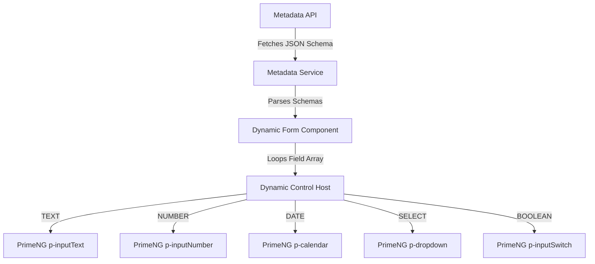

# UI Architecture & Dynamic Form Rendering Engine

This document outlines the frontend layout structure, module divisions, and details the technical implementation of the **Configuration-Driven Dynamic Form Rendering Engine** using Angular, PrimeNG, and TailwindCSS.

For visual styling instructions and localization setup, see the [UI Styling Standards](../700-UI/index.md).

---

## 1. Frontend Modular Architecture

The Angular application is organized around core features, routing modules, and a shared platform framework layer.

```text
/src/app
  ├── core                      # Cross-cutting platform framework
  │    ├── services             # API clients, authentication guards
  │    └── interceptors         # Trace ID injection, JWT headers
  ├── shared                    # Reusable components and layout shells
  │    └── components
  │         └── dynamic-form    # The metadata-driven form engine
  └── modules                   # Portal feature slices
       ├── policy               # Policy lifecycle modules
       ├── claims               # Claims wizard modules
       └── admin                # Metadata and workflow configuration console
```

---

## 2. Dynamic Form Rendering Engine

The dynamic form engine eliminates the need to hard-code forms for every line of business. When onboarding new lines (like Health or Travel), the form engine dynamically constructs UI controls from database configurations fetched via the metadata API:

`GET /metadata/entities/{entityCode}/fields` and `GET /metadata/forms`.



### 2.1 Schema Mapping: Database to PrimeNG
The dynamic control host maps `metadata.field_definition.field_type` values to standard PrimeNG components styled with Tailwind:

| Metadata Field Type | PrimeNG Target Component | Tailwind Custom Layout Styles |
| :--- | :--- | :--- |
| **TEXT** | `<input pInputText>` | `w-full bg-slate-900 border-slate-800 focus:border-brand` |
| **NUMBER** | `<p-inputNumber>` | `w-full text-white bg-transparent` |
| **DATE** | `<p-calendar>` | `w-full` (with Arabic/English locale configurations) |
| **BOOLEAN** | `<p-inputSwitch>` | `transition duration-200` |
| **SELECT** | `<p-dropdown>` | `w-full text-slate-100 bg-slate-900 border-slate-800` |

---

## 3. Form Initialization & Reactive Binding

The renderer dynamically constructs an Angular `FormGroup` by iterating over the list of field definitions.

### Reference Component Implementation:
```typescript
import { Component, Input, OnInit } from '@angular/core';
import { FormGroup, FormControl, Validators } from '@angular/forms';

export interface FieldDefinition {
  fieldCode: string;
  displayName: string;
  fieldType: 'TEXT' | 'NUMBER' | 'DATE' | 'BOOLEAN' | 'SELECT';
  required: boolean;
  validationRegex?: string;
  defaultValue?: any;
}

@Component({
  selector: 'app-dynamic-form',
  templateUrl: './dynamic-form.component.html'
})
export class DynamicFormComponent implements OnInit {
  @Input() fields: FieldDefinition[] = [];
  formGroup!: FormGroup;

  ngOnInit() {
    this.formGroup = this.createFormGroup(this.fields);
  }

  private createFormGroup(fields: FieldDefinition[]): FormGroup {
    const group: { [key: string]: FormControl } = {};

    fields.forEach(field => {
      const validations = [];
      
      if (field.required) {
        validations.push(Validators.required);
      }
      if (field.validationRegex) {
        validations.push(Validators.pattern(field.validationRegex));
      }

      group[field.fieldCode] = new FormControl(
        field.defaultValue || '', 
        validations
      );
    });

    return new FormGroup(group);
  }
}
```

### Template Layout Implementation:
```html
<form [formGroup]="formGroup" class="grid grid-cols-1 md:grid-cols-2 gap-6">
  <div *ngFor="let field of fields" class="flex flex-col gap-2">
    <label class="text-sm font-semibold text-slate-300">{{ field.displayName }}</label>
    
    <!-- Render based on Type -->
    <ng-container [ngSwitch]="field.fieldType">
      
      <!-- 1. Text Inputs -->
      <input *ngSwitchCase="'TEXT'"
             pInputText
             [formControlName]="field.fieldCode"
             class="w-full bg-slate-900 border-slate-800 focus:border-brand rounded-lg p-3 text-white">

      <!-- 2. Number Inputs -->
      <p-inputNumber *ngSwitchCase="'NUMBER'"
                     [formControlName]="field.fieldCode"
                     styleClass="w-full"
                     inputStyleClass="w-full bg-slate-900 border-slate-800 rounded-lg p-3 text-white">
      </p-inputNumber>

      <!-- 3. Calendars -->
      <p-calendar *ngSwitchCase="'DATE'"
                  [formControlName]="field.fieldCode"
                  styleClass="w-full"
                  inputStyleClass="w-full bg-slate-900 border-slate-800 rounded-lg p-3 text-white">
      </p-calendar>

      <!-- 4. Dropdowns -->
      <p-dropdown *ngSwitchCase="'SELECT'"
                  [formControlName]="field.fieldCode"
                  [options]="[]" 
                  styleClass="w-full bg-slate-900 border-slate-800 rounded-lg text-white">
      </p-dropdown>

      <!-- 5. Switch (Boolean) -->
      <div *ngSwitchCase="'BOOLEAN'" class="flex items-center h-12">
        <p-inputSwitch [formControlName]="field.fieldCode"></p-inputSwitch>
      </div>

    </ng-container>
  </div>
</form>
```

---

## 4. Wizard Flow & Step Management

Multi-step onboarding journeys (such as policy registration) utilize the dynamic step mappings in the database (`metadata.form_definition`) and bind them to PrimeNG's **`p-steps`** wizard component.

### Step Navigation Policies:
- **Draft Persistence:** Every time a user clicks "Next", the form state is validated, saved locally (`localStorage`), and synced back asynchronously to the platform database (`core.policy.line_specific_data`) to prevent data loss.
- **RTL Transition Animations:** Sliding transitions between steps must animate horizontally based on direction:
  - LTR: Slide in from the right.
  - RTL: Slide in from the left.
- **Validation Blocks:** Users cannot navigate forward if the controls mapped to the current step contain any validation errors.
