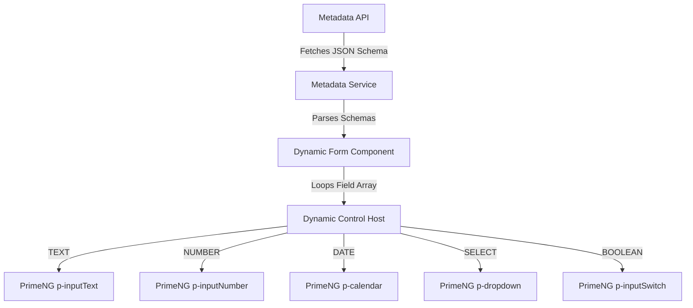

# UI Architecture & Dynamic Form Rendering Engine

This document outlines the frontend layout structure, module divisions, styling standards, localization architecture, and the technical implementation of the **Configuration-Driven Dynamic Form Rendering Engine** using Angular, PrimeNG, and TailwindCSS.

---

## 1. Frontend Modular Architecture

The Angular application is organized around core features, routing modules, and a shared platform framework layer.

```text
/src/app
  ├── core                      # Cross-cutting platform framework
  │    ├── services             # API clients, authentication guards
  │    └── interceptors         # Trace ID injection, JWT headers
  ├── shared                    # Reusable components and layout shells
  │    └── components
  │         └── dynamic-form    # The metadata-driven form engine
  └── modules                   # Portal feature slices
       ├── policy               # Policy lifecycle modules
       ├── claims               # Claims wizard modules
       └── admin                # Metadata and workflow configuration console
```

---

## 2. PrimeNG + TailwindCSS Integration

To combine PrimeNG's rich pre-built component suite with Tailwind's rapid styling utilities, we utilize the **unstyled mode** with PrimeNG's **Tailwind Preset** or configure class overrides.

### 2.1 Configuration Checklist
1. Enable PrimeNG theme config inside `angular.json` and styles root.
2. In `tailwind.config.js`, configure Tailwind to scan both project files and PrimeNG source components to purge unused classes.

#### `tailwind.config.js` snippet:
```javascript
module.exports = {
  content: [
    "./src/**/*.{html,ts}",
    "./node_modules/primeng/**/*.{html,js,ts}" // Scan PrimeNG components
  ],
  theme: {
    extend: {
      colors: {
        brand: {
          light: '#34d399',  // Radiant emerald green
          DEFAULT: '#059669',// Corporate dark green (Saudi vibe)
          dark: '#064e3b'    // Deep forest green
        },
        slate: {
          850: '#1e293b',
          950: '#0f172a'     // Corporate dark slate for background
        }
      },
      boxShadow: {
        'glass': '0 8px 32px 0 rgba(0, 0, 0, 0.37)'
      }
    }
  },
  plugins: []
}
```

### 2.2 Component Styling Standard
- Avoid writing raw custom CSS rules inside components.
- Use PrimeNG components and style them dynamically using Tailwind classes through the `styleClass` property.

```html
<!-- Example of styled PrimeNG Button inside a Card wrapper -->
<p-card styleClass="shadow-glass bg-slate-900 border border-slate-800 rounded-2xl p-6">
  <h2 class="text-xl font-bold text-white mb-4">Motor Quote Review</h2>
  <p-button label="Approve Underwriting" 
            styleClass="w-full bg-brand hover:bg-brand-light text-white font-semibold py-3 rounded-lg transition duration-250 ease-in-out">
  </p-button>
</p-card>
```

---

## 3. Localization & RTL (Arabic/English)

The platform must support dual LTR (English) and RTL (Arabic) rendering dynamically.

### 3.1 Dynamic Layout Direction
- The application root must bind the HTML `dir` and `lang` attributes dynamically to the active language.
- Standard libraries: `@ngx-translate/core`.

```typescript
import { Component, OnInit, Renderer2 } from '@angular/core';
import { TranslateService } from '@ngx-translate/core';

@Component({
  selector: 'app-root',
  template: `<router-outlet></router-outlet>`
})
export class AppComponent implements OnInit {
  constructor(private translate: TranslateService, private renderer: Renderer2) {}

  ngOnInit() {
    this.translate.addLangs(['en', 'ar']);
    this.translate.setDefaultLang('ar'); // Default for Saudi Arabia operations

    this.translate.onLangChange.subscribe((event) => {
      const dir = event.lang === 'ar' ? 'rtl' : 'ltr';
      this.renderer.setAttribute(document.documentElement, 'dir', dir);
      this.renderer.setAttribute(document.documentElement, 'lang', event.lang);
    });
  }
}
```

### 3.2 RTL Layout Conventions
- **Spacings:** Use logical Tailwind spacing utilities (e.g. `ps-4` for padding-start, `pe-4` for padding-end) rather than `pl-4` / `pr-4` to handle directional shifts automatically.
- **Alignments:** Use `text-start` and `text-end` instead of `text-left` and `text-right`.

---

## 4. Premium Design System & Micro-Animations

To achieve a modern, premium aesthetic:
- **Glassmorphism**: Combine dark slate backgrounds (`bg-slate-950`), semi-transparent panels (`bg-slate-900/80 backdrop-blur-md`), and thin borders (`border border-slate-800`).
- **Typography**: Import **Outfit** (English) and **Cairo** (Arabic) from Google Fonts for a clean, premium typography curve.
- **Skeletons**: Use PrimeNG's `p-skeleton` component to maintain active layout shapes during dynamic API loads.
- **Micro-Animations**: Animate all interactive transitions (hover states, form step switches) using Tailwind's transition utilities:

```html
<!-- Interactive Form Field Wrapper -->
<div class="group relative rounded-xl border border-slate-850 bg-slate-900/50 p-4 transition-all duration-300 hover:border-brand">
  <label class="text-xs font-semibold text-slate-400 group-hover:text-brand transition-colors duration-300">
    Saudi National ID
  </label>
  <input type="text" 
         class="w-full bg-transparent text-white outline-none pt-1" 
         placeholder="1000000000">
</div>
```

---

## 5. Dynamic Form Rendering Engine

The dynamic form engine eliminates the need to hard-code forms for every line of business. When onboarding new lines (like Health or Travel), the form engine dynamically constructs UI controls from database configurations fetched via the metadata API:

`GET /metadata/entities/{entityCode}/fields` and `GET /metadata/forms`.



### 5.1 Schema Mapping: Database to PrimeNG
The dynamic control host maps `metadata.field_definition.field_type` values to standard PrimeNG components styled with Tailwind:

| Metadata Field Type | PrimeNG Target Component | Tailwind Custom Layout Styles |
| :--- | :--- | :--- |
| **TEXT** | `<input pInputText>` | `w-full bg-slate-900 border-slate-800 focus:border-brand` |
| **NUMBER** | `<p-inputNumber>` | `w-full text-white bg-transparent` |
| **DATE** | `<p-calendar>` | `w-full` (with Arabic/English locale configurations) |
| **BOOLEAN** | `<p-inputSwitch>` | `transition duration-200` |
| **SELECT** | `<p-dropdown>` | `w-full text-slate-100 bg-slate-900 border-slate-800` |

---

## 6. Form Initialization & Reactive Binding

The renderer dynamically constructs an Angular `FormGroup` by iterating over the list of field definitions.

### Reference Component Implementation:
```typescript
import { Component, Input, OnInit } from '@angular/core';
import { FormGroup, FormControl, Validators } from '@angular/forms';

export interface FieldDefinition {
  fieldCode: string;
  displayName: string;
  fieldType: 'TEXT' | 'NUMBER' | 'DATE' | 'BOOLEAN' | 'SELECT';
  required: boolean;
  validationRegex?: string;
  defaultValue?: any;
}

@Component({
  selector: 'app-dynamic-form',
  templateUrl: './dynamic-form.component.html'
})
export class DynamicFormComponent implements OnInit {
  @Input() fields: FieldDefinition[] = [];
  formGroup!: FormGroup;

  ngOnInit() {
    this.formGroup = this.createFormGroup(this.fields);
  }

  private createFormGroup(fields: FieldDefinition[]): FormGroup {
    const group: { [key: string]: FormControl } = {};

    fields.forEach(field => {
      const validations = [];
      
      if (field.required) {
        validations.push(Validators.required);
      }
      if (field.validationRegex) {
        validations.push(Validators.pattern(field.validationRegex));
      }

      group[field.fieldCode] = new FormControl(
        field.defaultValue || '', 
        validations
      );
    });

    return new FormGroup(group);
  }
}
```

### Template Layout Implementation:
```html
<form [formGroup]="formGroup" class="grid grid-cols-1 md:grid-cols-2 gap-6">
  <div *ngFor="let field of fields" class="flex flex-col gap-2">
    <label class="text-sm font-semibold text-slate-300">{{ field.displayName }}</label>
    
    <!-- Render based on Type -->
    <ng-container [ngSwitch]="field.fieldType">
      
      <!-- 1. Text Inputs -->
      <input *ngSwitchCase="'TEXT'"
             pInputText
             [formControlName]="field.fieldCode"
             class="w-full bg-slate-900 border-slate-800 focus:border-brand rounded-lg p-3 text-white">

      <!-- 2. Number Inputs -->
      <p-inputNumber *ngSwitchCase="'NUMBER'"
                     [formControlName]="field.fieldCode"
                     styleClass="w-full"
                     inputStyleClass="w-full bg-slate-900 border-slate-800 rounded-lg p-3 text-white">
      </p-inputNumber>

      <!-- 3. Calendars -->
      <p-calendar *ngSwitchCase="'DATE'"
                  [formControlName]="field.fieldCode"
                  styleClass="w-full"
                  inputStyleClass="w-full bg-slate-900 border-slate-800 rounded-lg p-3 text-white">
      </p-calendar>

      <!-- 4. Dropdowns -->
      <p-dropdown *ngSwitchCase="'SELECT'"
                  [formControlName]="field.fieldCode"
                  [options]="[]" 
                  styleClass="w-full bg-slate-900 border-slate-800 rounded-lg text-white">
      </p-dropdown>

      <!-- 5. Switch (Boolean) -->
      <div *ngSwitchCase="'BOOLEAN'" class="flex items-center h-12">
        <p-inputSwitch [formControlName]="field.fieldCode"></p-inputSwitch>
      </div>

    </ng-container>
  </div>
</form>
```

---

## 7. Wizard Flow & Step Management

Multi-step onboarding journeys (such as policy registration) utilize the dynamic step mappings in the database (`metadata.form_definition`) and bind them to PrimeNG's **`p-steps`** wizard component.

### Step Navigation Policies:
- **Draft Persistence:** Every time a user clicks "Next", the form state is validated, saved locally (`localStorage`), and synced back asynchronously to the platform database (`core.policy.line_specific_data`) to prevent data loss.
- **RTL Transition Animations:** Sliding transitions between steps must animate horizontally based on direction:
  - LTR: Slide in from the right.
  - RTL: Slide in from the left.
- **Validation Blocks:** Users cannot navigate forward if the controls mapped to the current step contain any validation errors.
