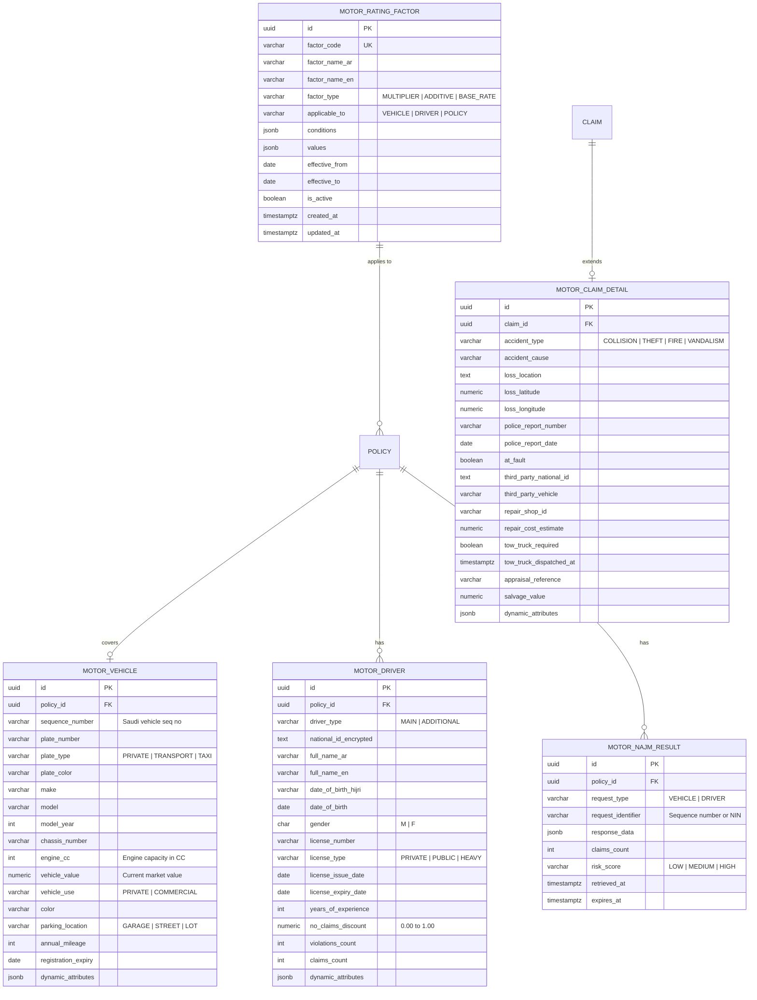

# Data Models — Detailed Specification

## Overview

This document provides the complete, developer-ready data model specification for the Enterprise Insurance Platform. It covers all core entities, Motor-specific extensions, field-level details, relationships, ER diagrams, and JSONB schemas.

---

## 1. Entity-Relationship Diagram (Core)

```mermaid
erDiagram
    PARTY ||--o| CUSTOMER : "is a"
    CUSTOMER ||--o{ POLICY : "owns"
    POLICY ||--o{ CLAIM : "has"
    POLICY ||--o{ FINANCIAL_TRANSACTION : "generates"
    CLAIM ||--o{ FINANCIAL_TRANSACTION : "generates"
    POLICY ||--o{ DOCUMENT : "attached to"
    CLAIM ||--o{ DOCUMENT : "attached to"
    CUSTOMER ||--o{ DOCUMENT : "attached to"

    PARTY {
        uuid id PK
        varchar party_type "PERSON | ORGANIZATION"
        varchar status "ACTIVE | INACTIVE | MERGED"
        timestamptz created_at
        timestamptz updated_at
        uuid created_by
        bigint version
    }

    CUSTOMER {
        uuid id PK
        uuid party_id FK
        varchar customer_number UK
        text national_id_encrypted "AES-256-GCM"
        varchar identity_type "CITIZEN | RESIDENT | COMPANY"
        varchar full_name_ar
        varchar full_name_en
        varchar email
        varchar mobile_number
        char nationality_code "ISO 3166-1 alpha-3"
        varchar date_of_birth_hijri
        date date_of_birth_gregorian
        char gender "M | F"
        varchar occupation_code "SAMA classification"
        varchar region_code "Saudi admin region"
        jsonb dynamic_attributes
        varchar data_classification
        varchar tenant_id
        timestamptz created_at
        timestamptz updated_at
        uuid created_by
        bigint version
    }

    POLICY {
        uuid id PK
        varchar policy_number UK
        varchar product_code "MOTOR_COMP | MOTOR_TPL"
        varchar line_of_business "MOTOR | HEALTH | TRAVEL"
        uuid customer_id FK
        uuid agent_id FK
        varchar status "DRAFT | ACTIVE | CANCELLED | EXPIRED"
        date effective_date
        date expiry_date
        numeric annual_premium
        char currency "SAR"
        numeric tax_amount
        numeric commission_amount
        numeric commission_rate
        jsonb line_specific_data
        jsonb dynamic_attributes
        varchar tenant_id
        timestamptz issued_at
        timestamptz cancelled_at
        text cancellation_reason
        timestamptz created_at
        timestamptz updated_at
        uuid created_by
        bigint version
    }

    CLAIM {
        uuid id PK
        varchar claim_number UK
        uuid policy_id FK
        varchar status "REGISTERED | INVESTIGATING | ADJUDICATED | PAID | CLOSED"
        date incident_date
        timestamptz registered_at
        timestamptz closed_at
        numeric claimed_amount
        numeric approved_amount
        numeric paid_amount
        char currency "SAR"
        numeric excess_amount
        jsonb line_specific_data
        jsonb dynamic_attributes
        uuid handler_id
        uuid adjuster_id
        numeric fraud_score "0.00 to 1.00"
        boolean fraud_review_required
        varchar tenant_id
        timestamptz created_at
        timestamptz updated_at
        uuid created_by
        bigint version
    }

    FINANCIAL_TRANSACTION {
        uuid id PK
        varchar transaction_reference UK
        varchar transaction_type "PREMIUM | REFUND | CLAIM_PAYMENT | COMMISSION"
        uuid policy_id FK
        uuid claim_id FK
        numeric amount
        char currency "SAR"
        numeric tax_amount
        varchar payment_method "MADA | SADAD | BANK_TRANSFER | APPLE_PAY"
        varchar status "PENDING | COMPLETED | FAILED | REFUNDED"
        varchar gateway_reference
        jsonb gateway_response
        timestamptz processed_at
        boolean reconciled
        timestamptz reconciled_at
        varchar reconciliation_ref
        varchar tenant_id
        timestamptz created_at
        uuid created_by
    }

    DOCUMENT {
        uuid id PK
        varchar document_reference UK
        varchar document_type "POLICY_SCHEDULE | CLAIM_REPORT | INVOICE"
        varchar entity_type "POLICY | CLAIM | CUSTOMER"
        uuid entity_id
        varchar file_name
        bigint file_size_bytes
        varchar mime_type
        text storage_path
        varchar checksum "SHA-256"
        varchar status "PENDING | GENERATED | FAILED"
        timestamptz generated_at
        timestamptz expires_at
        varchar tenant_id
        timestamptz created_at
        uuid created_by
    }
```



---

## 2. Motor-Specific Entity-Relationship Diagram



---

## 3. Field-Level Specifications

### 3.1 Customer Table — Complete Field Reference

| Column | Type | Constraints | Description | Example |
|--------|------|-------------|-------------|---------|
| `id` | `UUID` | PK, DEFAULT `gen_random_uuid()` | Primary identifier | `a1b2c3d4-...` |
| `party_id` | `UUID` | FK → `core.parties(id)`, NOT NULL | Links to base party record | |
| `customer_number` | `VARCHAR(20)` | UNIQUE, NOT NULL | Business-facing customer ID | `CUST-2026-00001` |
| `national_id_encrypted` | `TEXT` | NOT NULL | Saudi NIN/Iqama (AES-256-GCM encrypted) | (encrypted) |
| `identity_type` | `VARCHAR(20)` | NOT NULL | Type of identity document | `CITIZEN` |
| `full_name_ar` | `VARCHAR(200)` | NOT NULL | Full name in Arabic | `أحمد بن محمد الحربي` |
| `full_name_en` | `VARCHAR(200)` | NULLABLE | Full name in English | `Ahmed Mohammed Al-Harbi` |
| `email` | `VARCHAR(255)` | NULLABLE | Primary email address | `ahmed@example.com` |
| `mobile_number` | `VARCHAR(20)` | NULLABLE | Saudi mobile number | `+966501234567` |
| `nationality_code` | `CHAR(3)` | NULLABLE | ISO 3166-1 alpha-3 | `SAU` |
| `date_of_birth_hijri` | `VARCHAR(15)` | NULLABLE | Hijri date of birth | `1410-02-15` |
| `date_of_birth_gregorian` | `DATE` | NULLABLE | Gregorian date of birth | `1990-05-15` |
| `gender` | `CHAR(1)` | NULLABLE | Gender | `M` |
| `occupation_code` | `VARCHAR(20)` | NULLABLE | SAMA occupation classification | `ENG_001` |
| `region_code` | `VARCHAR(10)` | NULLABLE | Saudi administrative region | `RIYADH` |
| `dynamic_attributes` | `JSONB` | DEFAULT `'{}'` | Extensible metadata fields | `{"preferred_language": "ar"}` |
| `data_classification` | `VARCHAR(20)` | NOT NULL, DEFAULT `'CONFIDENTIAL'` | Sensitivity level | `PII` |
| `tenant_id` | `VARCHAR(50)` | NOT NULL | Multi-tenant identifier | `tenant-001` |
| `created_at` | `TIMESTAMPTZ` | NOT NULL, DEFAULT `NOW()` | Record creation timestamp | |
| `updated_at` | `TIMESTAMPTZ` | NOT NULL, DEFAULT `NOW()` | Last update timestamp | |
| `created_by` | `UUID` | NOT NULL | User who created the record | |
| `version` | `BIGINT` | NOT NULL, DEFAULT `0` | Optimistic locking version | |

### 3.2 Policy Table — Complete Field Reference

| Column | Type | Constraints | Description | Example |
|--------|------|-------------|-------------|---------|
| `id` | `UUID` | PK, DEFAULT `gen_random_uuid()` | Primary identifier | |
| `policy_number` | `VARCHAR(30)` | UNIQUE, NOT NULL | Business-facing policy number | `POL-MTR-2026-00001` |
| `product_code` | `VARCHAR(50)` | NOT NULL | Product identifier | `MOTOR_COMP` |
| `line_of_business` | `VARCHAR(30)` | NOT NULL | Line of business | `MOTOR` |
| `customer_id` | `UUID` | FK → `core.customers(id)`, NOT NULL | Policy owner | |
| `agent_id` | `UUID` | FK → `core.customers(id)`, NULLABLE | Originating agent/broker | |
| `status` | `VARCHAR(30)` | NOT NULL | Policy lifecycle status | `ACTIVE` |
| `effective_date` | `DATE` | NOT NULL | Coverage start date | `2026-01-01` |
| `expiry_date` | `DATE` | NOT NULL | Coverage end date | `2026-12-31` |
| `annual_premium` | `NUMERIC(15,2)` | NOT NULL | Total annual premium | `2500.00` |
| `currency` | `CHAR(3)` | NOT NULL, DEFAULT `'SAR'` | Currency code | `SAR` |
| `tax_amount` | `NUMERIC(15,2)` | NOT NULL, DEFAULT `0` | VAT/tax amount | `375.00` |
| `commission_amount` | `NUMERIC(15,2)` | DEFAULT `0` | Agent commission | `250.00` |
| `commission_rate` | `NUMERIC(5,2)` | DEFAULT `0` | Commission percentage | `10.00` |
| `line_specific_data` | `JSONB` | DEFAULT `'{}'` | Line-specific fields | See §4 |
| `dynamic_attributes` | `JSONB` | DEFAULT `'{}'` | Metadata-driven custom fields | |
| `tenant_id` | `VARCHAR(50)` | NOT NULL | Multi-tenant identifier | `tenant-001` |
| `issued_at` | `TIMESTAMPTZ` | NULLABLE | When policy was issued | |
| `cancelled_at` | `TIMESTAMPTZ` | NULLABLE | When policy was cancelled | |
| `cancellation_reason` | `TEXT` | NULLABLE | Reason for cancellation | |
| `created_at` | `TIMESTAMPTZ` | NOT NULL, DEFAULT `NOW()` | | |
| `updated_at` | `TIMESTAMPTZ` | NOT NULL, DEFAULT `NOW()` | | |
| `created_by` | `UUID` | NOT NULL | | |
| `version` | `BIGINT` | NOT NULL, DEFAULT `0` | Optimistic locking | |

### 3.3 Claim Table — Complete Field Reference

| Column | Type | Constraints | Description | Example |
|--------|------|-------------|-------------|---------|
| `id` | `UUID` | PK | | |
| `claim_number` | `VARCHAR(30)` | UNIQUE, NOT NULL | Business-facing claim number | `CLM-MTR-2026-00001` |
| `policy_id` | `UUID` | FK → `core.policies(id)`, NOT NULL | Related policy | |
| `status` | `VARCHAR(30)` | NOT NULL, DEFAULT `'REGISTERED'` | Claim lifecycle status | `INVESTIGATING` |
| `incident_date` | `DATE` | NOT NULL | Date of incident | `2026-03-15` |
| `registered_at` | `TIMESTAMPTZ` | NOT NULL, DEFAULT `NOW()` | When claim was filed | |
| `closed_at` | `TIMESTAMPTZ` | NULLABLE | When claim was closed | |
| `claimed_amount` | `NUMERIC(15,2)` | NULLABLE | Amount claimed by customer | `15000.00` |
| `approved_amount` | `NUMERIC(15,2)` | NULLABLE | Amount approved after assessment | `12000.00` |
| `paid_amount` | `NUMERIC(15,2)` | NULLABLE | Amount actually paid | `12000.00` |
| `currency` | `CHAR(3)` | NOT NULL, DEFAULT `'SAR'` | | `SAR` |
| `excess_amount` | `NUMERIC(15,2)` | DEFAULT `0` | Deductible/excess | `500.00` |
| `line_specific_data` | `JSONB` | DEFAULT `'{}'` | Line-specific fields | See §4 |
| `dynamic_attributes` | `JSONB` | DEFAULT `'{}'` | Metadata-driven fields | |
| `handler_id` | `UUID` | NULLABLE | Assigned claims handler | |
| `adjuster_id` | `UUID` | NULLABLE | External adjuster | |
| `fraud_score` | `NUMERIC(3,2)` | NULLABLE | 0.00 to 1.00 | `0.15` |
| `fraud_review_required` | `BOOLEAN` | DEFAULT `FALSE` | Flag for manual review | |
| `tenant_id` | `VARCHAR(50)` | NOT NULL | | |
| `created_at` | `TIMESTAMPTZ` | NOT NULL | | |
| `updated_at` | `TIMESTAMPTZ` | NOT NULL | | |
| `created_by` | `UUID` | NOT NULL | | |
| `version` | `BIGINT` | NOT NULL, DEFAULT `0` | | |

---

## 4. JSONB Schemas for Line-Specific Data

### 4.1 Motor Policy `line_specific_data` Schema

```json
{
  "type": "object",
  "required": ["vehicle", "drivers"],
  "properties": {
    "vehicle": {
      "type": "object",
      "required": ["sequence_number", "make", "model", "model_year", "vehicle_value", "vehicle_use"],
      "properties": {
        "sequence_number": { "type": "string", "pattern": "^[0-9]{10}$", "description": "Saudi vehicle sequence number" },
        "plate_number": { "type": "string", "description": "Vehicle plate number" },
        "plate_type": { "type": "string", "enum": ["PRIVATE", "TRANSPORT", "TAXI", "PUBLIC"] },
        "plate_color": { "type": "string", "description": "Plate color code" },
        "make": { "type": "string", "description": "Vehicle manufacturer" },
        "model": { "type": "string", "description": "Vehicle model" },
        "model_year": { "type": "integer", "minimum": 1990, "maximum": 2030 },
        "chassis_number": { "type": "string" },
        "engine_cc": { "type": "integer", "description": "Engine capacity in CC" },
        "vehicle_value": { "type": "number", "minimum": 0, "description": "Current market value in SAR" },
        "color": { "type": "string" },
        "parking_location": { "type": "string", "enum": ["GARAGE", "STREET", "LOT"] },
        "annual_mileage": { "type": "integer", "minimum": 0 },
        "registration_expiry": { "type": "string", "format": "date" },
        "modifications": {
          "type": "array",
          "items": {
            "type": "object",
            "properties": {
              "modification_type": { "type": "string" },
              "modification_value": { "type": "number" },
              "approved": { "type": "boolean" }
            }
          }
        }
      }
    },
    "drivers": {
      "type": "array",
      "minItems": 1,
      "items": {
        "type": "object",
        "required": ["driver_type", "national_id", "full_name_ar", "license_number"],
        "properties": {
          "driver_type": { "type": "string", "enum": ["MAIN", "ADDITIONAL"] },
          "national_id": { "type": "string", "description": "Encrypted NIN/Iqama" },
          "full_name_ar": { "type": "string" },
          "full_name_en": { "type": "string" },
          "date_of_birth": { "type": "string", "format": "date" },
          "gender": { "type": "string", "enum": ["M", "F"] },
          "license_number": { "type": "string" },
          "license_type": { "type": "string", "enum": ["PRIVATE", "PUBLIC", "HEAVY"] },
          "license_issue_date": { "type": "string", "format": "date" },
          "license_expiry_date": { "type": "string", "format": "date" },
          "years_of_experience": { "type": "integer", "minimum": 0 },
          "no_claims_discount": { "type": "number", "minimum": 0, "maximum": 1 },
          "violations_count": { "type": "integer", "minimum": 0 },
          "claims_count": { "type": "integer", "minimum": 0 }
        }
      }
    },
    "deductibles": {
      "type": "object",
      "properties": {
        "comprehensive_deductible": { "type": "number", "description": "Deductible for comprehensive coverage" },
        "tpl_deductible": { "type": "number", "description": "Deductible for third-party liability" },
        "windscreen_deductible": { "type": "number" }
      }
    },
    "najm_result": {
      "type": "object",
      "properties": {
        "claims_count": { "type": "integer" },
        "last_claim_date": { "type": "string", "format": "date" },
        "risk_score": { "type": "string", "enum": ["LOW", "MEDIUM", "HIGH"] },
        "retrieved_at": { "type": "string", "format": "date-time" }
      }
    },
    "yakeen_verification": {
      "type": "object",
      "properties": {
        "verified": { "type": "boolean" },
        "reference": { "type": "string" },
        "verified_at": { "type": "string", "format": "date-time" }
      }
    },
    "coverage_details": {
      "type": "object",
      "properties": {
        "coverage_type": { "type": "string", "enum": ["COMPREHENSIVE", "THIRD_PARTY", "TPL_PLUS"] },
        "add_on_coverages": {
          "type": "array",
          "items": {
            "type": "string",
            "enum": ["ROADSIDE_ASSIST", "COURTESY_CAR", "GEOGRAPHIC_EXTENSION", "PERSONAL_ACCIDENT", "WINDSHIELD"]
          }
        },
        "geographic_limit": { "type": "string", "enum": ["KSA_ONLY", "GCC", "INTERNATIONAL"] }
      }
    }
  }
}
```

### 4.2 Motor Claim `line_specific_data` Schema

```json
{
  "type": "object",
  "properties": {
    "accident_details": {
      "type": "object",
      "properties": {
        "accident_type": { "type": "string", "enum": ["COLLISION", "THEFT", "FIRE", "VANDALISM", "NATURAL_DISASTER"] },
        "accident_cause": { "type": "string" },
        "loss_location": { "type": "string" },
        "loss_latitude": { "type": "number" },
        "loss_longitude": { "type": "number" },
        "police_report_number": { "type": "string" },
        "police_report_date": { "type": "string", "format": "date" },
        "at_fault": { "type": "boolean" },
        "weather_conditions": { "type": "string", "enum": ["CLEAR", "RAIN", "FOG", "SANDSTORM"] },
        "road_conditions": { "type": "string", "enum": ["DRY", "WET", "ICY", "UNDER_CONSTRUCTION"] }
      }
    },
    "third_party": {
      "type": "object",
      "properties": {
        "national_id": { "type": "string" },
        "vehicle_details": { "type": "string" },
        "insurance_company": { "type": "string" },
        "policy_number": { "type": "string" },
        "liability_percentage": { "type": "number", "minimum": 0, "maximum": 100 }
      }
    },
    "repair": {
      "type": "object",
      "properties": {
        "repair_shop_id": { "type": "string" },
        "repair_shop_name": { "type": "string" },
        "repair_cost_estimate": { "type": "number" },
        "repair_authorized_at": { "type": "string", "format": "date-time" },
        "repair_completed_at": { "type": "string", "format": "date-time" },
        "repair_status": { "type": "string", "enum": ["PENDING", "AUTHORIZED", "IN_PROGRESS", "COMPLETED"] }
      }
    },
    "towing": {
      "type": "object",
      "properties": {
        "tow_truck_required": { "type": "boolean" },
        "tow_truck_dispatched_at": { "type": "string", "format": "date-time" },
        "tow_truck_arrived_at": { "type": "string", "format": "date-time" },
        "drop_off_location": { "type": "string" },
        "towing_cost": { "type": "number" }
      }
    },
    "appraisal": {
      "type": "object",
      "properties": {
        "appraisal_reference": { "type": "string" },
        "appraiser_name": { "type": "string" },
        "appraisal_date": { "type": "string", "format": "date" },
        "salvage_value": { "type": "number" },
        "total_loss": { "type": "boolean" },
        "damage_assessment": { "type": "string" }
      }
    }
  }
}
```

---

## 5. Complete Indexing Strategy

### 5.1 Core Table Indexes

```sql
-- ============================================
-- CUSTOMER INDEXES
-- ============================================
CREATE INDEX idx_customers_number ON core.customers(customer_number);
CREATE INDEX idx_customers_tenant ON core.customers(tenant_id);
CREATE INDEX idx_customers_gin ON core.customers USING GIN(dynamic_attributes);
CREATE INDEX idx_customers_national_id ON core.customers(national_id_encrypted);
CREATE INDEX idx_customers_identity ON core.customers(identity_type);
CREATE INDEX idx_customers_region ON core.customers(region_code);
CREATE INDEX idx_customers_created ON core.customers(created_at);

-- ============================================
-- POLICY INDEXES
-- ============================================
CREATE INDEX idx_policies_customer ON core.policies(customer_id);
CREATE INDEX idx_policies_tenant ON core.policies(tenant_id);
CREATE INDEX idx_policies_status ON core.policies(status);
CREATE INDEX idx_policies_product ON core.policies(product_code);
CREATE INDEX idx_policies_dates ON core.policies(effective_date, expiry_date);
CREATE INDEX idx_policies_line_gin ON core.policies USING GIN(line_specific_data);
CREATE INDEX idx_policies_dyn_gin ON core.policies USING GIN(dynamic_attributes);
CREATE INDEX idx_policies_active ON core.policies(status) WHERE status = 'ACTIVE';
CREATE INDEX idx_policies_agent ON core.policies(agent_id);
CREATE INDEX idx_policies_issued ON core.policies(issued_at);

-- ============================================
-- CLAIM INDEXES
-- ============================================
CREATE INDEX idx_claims_policy ON core.claims(policy_id);
CREATE INDEX idx_claims_status ON core.claims(status);
CREATE INDEX idx_claims_handler ON core.claims(handler_id);
CREATE INDEX idx_claims_tenant ON core.claims(tenant_id);
CREATE INDEX idx_claims_fraud ON core.claims(fraud_review_required) WHERE fraud_review_required = TRUE;
CREATE INDEX idx_claims_incident ON core.claims(incident_date);
CREATE INDEX idx_claims_registered ON core.claims(registered_at);

-- ============================================
-- FINANCIAL TRANSACTION INDEXES
-- ============================================
CREATE INDEX idx_fin_txn_policy ON core.financial_transactions(policy_id);
CREATE INDEX idx_fin_txn_claim ON core.financial_transactions(claim_id);
CREATE INDEX idx_fin_txn_status ON core.financial_transactions(status);
CREATE INDEX idx_fin_txn_tenant ON core.financial_transactions(tenant_id);
CREATE INDEX idx_fin_txn_recon ON core.financial_transactions(reconciled) WHERE reconciled = FALSE;
CREATE INDEX idx_fin_txn_type ON core.financial_transactions(transaction_type);
CREATE INDEX idx_fin_txn_processed ON core.financial_transactions(processed_at);

-- ============================================
-- DOCUMENT INDEXES
-- ============================================
CREATE INDEX idx_documents_entity ON core.documents(entity_type, entity_id);
CREATE INDEX idx_documents_tenant ON core.documents(tenant_id);
CREATE INDEX idx_documents_type ON core.documents(document_type);
```

### 5.2 Motor Table Indexes

```sql
-- ============================================
-- MOTOR VEHICLE INDEXES
-- ============================================
CREATE INDEX idx_motor_vehicles_policy ON motor.motor_vehicles(policy_id);
CREATE INDEX idx_motor_vehicles_seq ON motor.motor_vehicles(sequence_number);
CREATE INDEX idx_motor_vehicles_plate ON motor.motor_vehicles(plate_number);
CREATE INDEX idx_motor_vehicles_make ON motor.motor_vehicles(make, model);
CREATE INDEX idx_motor_vehicles_vin ON motor.motor_vehicles(chassis_number);

-- ============================================
-- MOTOR DRIVER INDEXES
-- ============================================
CREATE INDEX idx_motor_drivers_policy ON motor.motor_drivers(policy_id);
CREATE INDEX idx_motor_drivers_license ON motor.motor_drivers(license_number);
CREATE INDEX idx_motor_drivers_national_id ON motor.motor_drivers(national_id_encrypted);

-- ============================================
-- MOTOR CLAIM DETAILS INDEXES
-- ============================================
CREATE INDEX idx_motor_claims_claim ON motor.motor_claims_details(claim_id);
CREATE INDEX idx_motor_claims_type ON motor.motor_claims_details(accident_type);
CREATE INDEX idx_motor_claims_police ON motor.motor_claims_details(police_report_number);

-- ============================================
-- MOTOR RATING FACTOR INDEXES
-- ============================================
CREATE INDEX idx_motor_rating_code ON motor.motor_rating_factors(factor_code);
CREATE INDEX idx_motor_rating_active ON motor.motor_rating_factors(is_active) WHERE is_active = TRUE;
CREATE INDEX idx_motor_rating_type ON motor.motor_rating_factors(factor_type);

-- ============================================
-- MOTOR NAJM RESULT INDEXES
-- ============================================
CREATE INDEX idx_motor_najm_policy ON motor.motor_najm_results(policy_id);
CREATE INDEX idx_motor_najm_identifier ON motor.motor_najm_results(request_identifier);
CREATE INDEX idx_motor_najm_expires ON motor.motor_najm_results(expires_at);
```

---

## 6. Data Type Mapping

| Domain Type | PostgreSQL Type | Java Type | Notes |
|-------------|----------------|-----------|-------|
| Identifier | `UUID` | `java.util.UUID` | Generated via `gen_random_uuid()` |
| Business key | `VARCHAR(30-50)` | `String` | Human-readable, unique |
| Amount/Money | `NUMERIC(15,2)` | `java.math.BigDecimal` | 15 total digits, 2 decimal places |
| Percentage | `NUMERIC(5,2)` | `BigDecimal` | 0.00 to 100.00 |
| Score | `NUMERIC(3,2)` | `BigDecimal` | 0.00 to 1.00 |
| Date | `DATE` | `java.time.LocalDate` | No time component |
| Timestamp | `TIMESTAMPTZ` | `java.time.Instant` | With timezone |
| Encrypted text | `TEXT` | `String` | AES-256-GCM ciphertext |
| JSON | `JSONB` | `com.fasterxml.jackson.databind.JsonNode` | Binary JSON |
| Flag | `BOOLEAN` | `boolean` | |
| Code/Enum | `VARCHAR(20-30)` | `String` or Java `enum` | Stored as string for flexibility |
| Large text | `TEXT` | `String` | Unlimited length |
| Geographic | `NUMERIC(10,7)` | `BigDecimal` | Lat/Lng precision |

---

## 7. Audit Log Table

```sql
CREATE TABLE core.audit_log (
    id              UUID PRIMARY KEY DEFAULT gen_random_uuid(),
    event_type      VARCHAR(50) NOT NULL,       -- LOGIN, POLICY_CREATED, CLAIM_UPDATED, etc.
    entity_type     VARCHAR(30) NOT NULL,       -- POLICY, CLAIM, CUSTOMER, USER
    entity_id       UUID NOT NULL,
    action          VARCHAR(50) NOT NULL,       -- CREATE, UPDATE, DELETE, APPROVE, CANCEL
    previous_state  JSONB,                      -- Snapshot before change
    new_state       JSONB,                      -- Snapshot after change
    changed_by      UUID NOT NULL,              -- User who performed the action
    changed_by_role VARCHAR(30),                -- Role at time of action
    ip_address      VARCHAR(45),                -- Client IP
    user_agent      TEXT,                       -- Browser/Client info
    correlation_id  VARCHAR(100),               -- Trace correlation
    tenant_id       VARCHAR(50) NOT NULL,
    occurred_at     TIMESTAMPTZ NOT NULL DEFAULT NOW(),
    
    -- Retention
    retention_until DATE NOT NULL               -- Computed: occurred_at + 7 years
);

CREATE INDEX idx_audit_entity ON core.audit_log(entity_type, entity_id);
CREATE INDEX idx_audit_event ON core.audit_log(event_type);
CREATE INDEX idx_audit_user ON core.audit_log(changed_by);
CREATE INDEX idx_audit_time ON core.audit_log(occurred_at);
CREATE INDEX idx_audit_tenant ON core.audit_log(tenant_id);
CREATE INDEX idx_audit_retention ON core.audit_log(retention_until);
```

---

## 8. Sample Data Queries

### 8.1 Get Policy with Full Motor Details

```sql
SELECT
    p.policy_number,
    p.status,
    p.annual_premium,
    p.effective_date,
    p.expiry_date,
    c.full_name_ar AS customer_name,
    c.national_id_encrypted,
    mv.sequence_number,
    mv.plate_number,
    mv.make,
    mv.model,
    mv.model_year,
    mv.vehicle_value,
    md.full_name_ar AS main_driver_name,
    md.license_number,
    md.no_claims_discount,
    md.years_of_experience
FROM core.policies p
JOIN core.customers c ON c.id = p.customer_id
LEFT JOIN motor.motor_vehicles mv ON mv.policy_id = p.id
LEFT JOIN motor.motor_drivers md ON md.policy_id = p.id AND md.driver_type = 'MAIN'
WHERE p.policy_number = 'POL-MTR-2026-00001';
```

### 8.2 Get Claim with Motor Details

```sql
SELECT
    cl.claim_number,
    cl.status,
    cl.claimed_amount,
    cl.approved_amount,
    cl.incident_date,
    p.policy_number,
    c.full_name_ar AS customer_name,
    mcd.accident_type,
    mcd.accident_cause,
    mcd.loss_location,
    mcd.police_report_number,
    mcd.at_fault,
    mcd.repair_cost_estimate,
    mcd.salvage_value
FROM core.claims cl
JOIN core.policies p ON p.id = cl.policy_id
JOIN core.customers c ON c.id = p.customer_id
LEFT JOIN motor.motor_claims_details mcd ON mcd.claim_id = cl.id
WHERE cl.claim_number = 'CLM-MTR-2026-00001';
```

### 8.3 Premium Calculation Breakdown

```sql
SELECT
    p.policy_number,
    p.annual_premium AS calculated_premium,
    p.tax_amount,
    p.annual_premium - p.tax_amount AS base_premium,
    mv.vehicle_value,
    mv.vehicle_use,
    md.no_claims_discount,
    md.years_of_experience,
    md.violations_count,
    md.claims_count,
    mrf.factor_code,
    mrf.factor_type,
    mrf.values
FROM core.policies p
JOIN motor.motor_vehicles mv ON mv.policy_id = p.id
JOIN motor.motor_drivers md ON md.policy_id = p.id AND md.driver_type = 'MAIN'
LEFT JOIN motor.motor_rating_factors mrf ON mrf.is_active = TRUE
WHERE p.policy_number = 'POL-MTR-2026-00001';
```

### 8.4 Fraud Review Queue

```sql
SELECT
    cl.claim_number,
    cl.claimed_amount,
    cl.fraud_score,
    cl.incident_date,
    p.policy_number,
    c.full_name_ar AS customer_name,
    mcd.accident_type,
    mcd.police_report_number
FROM core.claims cl
JOIN core.policies p ON p.id = cl.policy_id
JOIN core.customers c ON c.id = p.customer_id
LEFT JOIN motor.motor_claims_details mcd ON mcd.claim_id = cl.id
WHERE cl.fraud_review_required = TRUE
  AND cl.status != 'CLOSED'
ORDER BY cl.fraud_score DESC, cl.registered_at ASC;
```

### 8.5 Policy Renewal Reminder (30 days before expiry)

```sql
SELECT
    p.policy_number,
    p.expiry_date,
    c.full_name_ar,
    c.mobile_number,
    c.email,
    mv.make || ' ' || mv.model || ' (' || mv.model_year || ')' AS vehicle_description
FROM core.policies p
JOIN core.customers c ON c.id = p.customer_id
LEFT JOIN motor.motor_vehicles mv ON mv.policy_id = p.id
WHERE p.status = 'ACTIVE'
  AND p.expiry_date BETWEEN CURRENT_DATE AND CURRENT_DATE + INTERVAL '30 days'
  AND p.tenant_id = 'tenant-001';
```

---

## 9. Data Validation Rules

### 9.1 Policy Validation

| Field | Rule | Error Code |
|-------|------|------------|
| `effective_date` | Must be today or in the future | `POL_EFF_DATE_PAST` |
| `expiry_date` | Must be after `effective_date` | `POL_EXP_BEFORE_EFF` |
| `annual_premium` | Must be > 0 | `POL_PREMIUM_ZERO` |
| `product_code` | Must exist in `metadata.product_configurations` | `POL_INVALID_PRODUCT` |
| `customer_id` | Customer must have status `ACTIVE` | `POL_CUSTOMER_INACTIVE` |
| `line_specific_data` | Must validate against JSON Schema for the product | `POL_INVALID_LINE_DATA` |

### 9.2 Claim Validation

| Field | Rule | Error Code |
|-------|------|------------|
| `incident_date` | Must not be in the future | `CLM_INCIDENT_FUTURE` |
| `incident_date` | Must be within policy effective period | `CLM_INCIDENT_OUTSIDE_POLICY` |
| `claimed_amount` | Must be > 0 | `CLM_AMOUNT_ZERO` |
| `policy_id` | Policy must have status `ACTIVE` at incident date | `CLM_POLICY_NOT_ACTIVE` |
| `police_report_number` | Required for accident types: COLLISION, THEFT, FIRE | `CLM_POLICE_REPORT_REQUIRED` |

### 9.3 Customer Validation

| Field | Rule | Error Code |
|-------|------|------------|
| `national_id_encrypted` | Must match Saudi NIN format (10 digits) before encryption | `CUST_INVALID_NIN` |
| `mobile_number` | Must be valid Saudi mobile (+9665xxxxxxxx) | `CUST_INVALID_MOBILE` |
| `email` | Must be valid email format | `CUST_INVALID_EMAIL` |
| `date_of_birth_gregorian` | Must be at least 18 years ago for policy ownership | `CUST_UNDERAGE` |

---

## 10. Flyway Migration Scripts

### V1__init_core_schema.sql

```sql
-- ============================================
-- Core Schema: Shared kernel entities
-- Owner: Platform Team
-- ============================================

CREATE SCHEMA IF NOT EXISTS core;

-- PARTIES
CREATE TABLE core.parties (
    id              UUID PRIMARY KEY DEFAULT gen_random_uuid(),
    party_type      VARCHAR(20) NOT NULL,
    status          VARCHAR(20) NOT NULL DEFAULT 'ACTIVE',
    created_at      TIMESTAMPTZ NOT NULL DEFAULT NOW(),
    updated_at      TIMESTAMPTZ NOT NULL DEFAULT NOW(),
    created_by      UUID NOT NULL,
    version         BIGINT NOT NULL DEFAULT 0
);

-- CUSTOMERS
CREATE TABLE core.customers (
    id                      UUID PRIMARY KEY DEFAULT gen_random_uuid(),
    party_id                UUID NOT NULL REFERENCES core.parties(id),
    customer_number         VARCHAR(20) UNIQUE NOT NULL,
    national_id_encrypted   TEXT NOT NULL,
    identity_type           VARCHAR(20) NOT NULL,
    full_name_ar            VARCHAR(200) NOT NULL,
    full_name_en            VARCHAR(200),
    email                   VARCHAR(255),
    mobile_number           VARCHAR(20),
    nationality_code        CHAR(3),
    date_of_birth_hijri     VARCHAR(15),
    date_of_birth_gregorian DATE,
    gender                  CHAR(1),
    occupation_code         VARCHAR(20),
    region_code             VARCHAR(10),
    dynamic_attributes      JSONB DEFAULT '{}',
    data_classification     VARCHAR(20) NOT NULL DEFAULT 'CONFIDENTIAL',
    tenant_id               VARCHAR(50) NOT NULL,
    created_at              TIMESTAMPTZ NOT NULL DEFAULT NOW(),
    updated_at              TIMESTAMPTZ NOT NULL DEFAULT NOW(),
    created_by              UUID NOT NULL,
    version                 BIGINT NOT NULL DEFAULT 0
);

-- POLICIES
CREATE TABLE core.policies (
    id                      UUID PRIMARY KEY DEFAULT gen_random_uuid(),
    policy_number           VARCHAR(30) UNIQUE NOT NULL,
    product_code            VARCHAR(50) NOT NULL,
    line_of_business        VARCHAR(30) NOT NULL,
    customer_id             UUID NOT NULL REFERENCES core.customers(id),
    agent_id                UUID REFERENCES core.customers(id),
    status                  VARCHAR(30) NOT NULL,
    effective_date          DATE NOT NULL,
    expiry_date             DATE NOT NULL,
    annual_premium          NUMERIC(15,2) NOT NULL,
    currency                CHAR(3) NOT NULL DEFAULT 'SAR',
    tax_amount              NUMERIC(15,2) NOT NULL DEFAULT 0,
    commission_amount       NUMERIC(15,2) DEFAULT 0,
    commission_rate         NUMERIC(5,2) DEFAULT 0,
    line_specific_data      JSONB DEFAULT '{}',
    dynamic_attributes      JSONB DEFAULT '{}',
    tenant_id               VARCHAR(50) NOT NULL,
    issued_at               TIMESTAMPTZ,
    cancelled_at            TIMESTAMPTZ,
    cancellation_reason     TEXT,
    created_at              TIMESTAMPTZ NOT NULL DEFAULT NOW(),
    updated_at              TIMESTAMPTZ NOT NULL DEFAULT NOW(),
    created_by              UUID NOT NULL,
    version                 BIGINT NOT NULL DEFAULT 0
);

-- CLAIMS
CREATE TABLE core.claims (
    id                      UUID PRIMARY KEY DEFAULT gen_random_uuid(),
    claim_number            VARCHAR(30) UNIQUE NOT NULL,
    policy_id               UUID NOT NULL REFERENCES core.policies(id),
    status                  VARCHAR(30) NOT NULL DEFAULT 'REGISTERED',
    incident_date           DATE NOT NULL,
    registered_at           TIMESTAMPTZ NOT NULL DEFAULT NOW(),
    closed_at               TIMESTAMPTZ,
    claimed_amount          NUMERIC(15,2),
    approved_amount         NUMERIC(15,2),
    paid_amount             NUMERIC(15,2),
    currency                CHAR(3) NOT NULL DEFAULT 'SAR',
    excess_amount           NUMERIC(15,2) DEFAULT 0,
    line_specific_data      JSONB DEFAULT '{}',
    dynamic_attributes      JSONB DEFAULT '{}',
    handler_id              UUID,
    adjuster_id             UUID,
    fraud_score             NUMERIC(3,2),
    fraud_review_required   BOOLEAN DEFAULT FALSE,
    tenant_id               VARCHAR(50) NOT NULL,
    created_at              TIMESTAMPTZ NOT NULL DEFAULT NOW(),
    updated_at              TIMESTAMPTZ NOT NULL DEFAULT NOW(),
    created_by              UUID NOT NULL,
    version                 BIGINT NOT NULL DEFAULT 0
);

-- FINANCIAL TRANSACTIONS
CREATE TABLE core.financial_transactions (
    id                      UUID PRIMARY KEY DEFAULT gen_random_uuid(),
    transaction_reference   VARCHAR(50) UNIQUE NOT NULL,
    transaction_type        VARCHAR(30) NOT NULL,
    policy_id               UUID REFERENCES core.policies(id),
    claim_id                UUID REFERENCES core.claims(id),
    amount                  NUMERIC(15,2) NOT NULL,
    currency                CHAR(3) NOT NULL DEFAULT 'SAR',
    tax_amount              NUMERIC(15,2) DEFAULT 0,
    payment_method          VARCHAR(30),
    status                  VARCHAR(30) NOT NULL DEFAULT 'PENDING',
    gateway_reference       VARCHAR(100),
    gateway_response        JSONB,
    processed_at            TIMESTAMPTZ,
    reconciled              BOOLEAN DEFAULT FALSE,
    reconciled_at           TIMESTAMPTZ,
    reconciliation_ref      VARCHAR(100),
    tenant_id               VARCHAR(50) NOT NULL,
    created_at              TIMESTAMPTZ NOT NULL DEFAULT NOW(),
    created_by              UUID NOT NULL
);

-- DOCUMENTS
CREATE TABLE core.documents (
    id                      UUID PRIMARY KEY DEFAULT gen_random_uuid(),
    document_reference      VARCHAR(50) UNIQUE NOT NULL,
    document_type           VARCHAR(30) NOT NULL,
    entity_type             VARCHAR(30) NOT NULL,
    entity_id               UUID NOT NULL,
    file_name               VARCHAR(255) NOT NULL,
    file_size_bytes         BIGINT,
    mime_type               VARCHAR(100),
    storage_path            TEXT NOT NULL,
    checksum                VARCHAR(64),
    status                  VARCHAR(20) NOT NULL DEFAULT 'PENDING',
    generated_at            TIMESTAMPTZ,
    expires_at              TIMESTAMPTZ,
    tenant_id               VARCHAR(50) NOT NULL,
    created_at              TIMESTAMPTZ NOT NULL DEFAULT NOW(),
    created_by              UUID NOT NULL
);

-- AUDIT LOG
CREATE TABLE core.audit_log (
    id              UUID PRIMARY KEY DEFAULT gen_random_uuid(),
    event_type      VARCHAR(50) NOT NULL,
    entity_type     VARCHAR(30) NOT NULL,
    entity_id       UUID NOT NULL,
    action          VARCHAR(50) NOT NULL,
    previous_state  JSONB,
    new_state       JSONB,
    changed_by      UUID NOT NULL,
    changed_by_role VARCHAR(30),
    ip_address      VARCHAR(45),
    user_agent      TEXT,
    correlation_id  VARCHAR(100),
    tenant_id       VARCHAR(50) NOT NULL,
    occurred_at     TIMESTAMPTZ NOT NULL DEFAULT NOW(),
    retention_until DATE NOT NULL
);

-- DATA CONTRACTS
CREATE TABLE core.data_contracts (
    id                      UUID PRIMARY KEY DEFAULT gen_random_uuid(),
    contract_code           VARCHAR(50) UNIQUE NOT NULL,
    domain                  VARCHAR(50) NOT NULL,
    entity_name             VARCHAR(100) NOT NULL,
    version                 VARCHAR(10) NOT NULL,
    status                  VARCHAR(20) NOT NULL DEFAULT 'DRAFT',
    schema_definition       JSONB NOT NULL,
    sla                     JSONB DEFAULT '{}',
    data_quality_rules      JSONB DEFAULT '[]',
    consumers               JSONB DEFAULT '[]',
    created_at              TIMESTAMPTZ NOT NULL DEFAULT NOW(),
    updated_at              TIMESTAMPTZ NOT NULL DEFAULT NOW(),
    created_by              UUID NOT NULL,
    UNIQUE(contract_code, version)
);

-- INDEXES
CREATE INDEX idx_customers_number ON core.customers(customer_number);
CREATE INDEX idx_customers_tenant ON core.customers(tenant_id);
CREATE INDEX idx_customers_gin ON core.customers USING GIN(dynamic_attributes);
CREATE INDEX idx_customers_national_id ON core.customers(national_id_encrypted);
CREATE INDEX idx_policies_customer ON core.policies(customer_id);
CREATE INDEX idx_policies_tenant ON core.policies(tenant_id);
CREATE INDEX idx_policies_status ON core.policies(status);
CREATE INDEX idx_policies_product ON core.policies(product_code);
CREATE INDEX idx_policies_dates ON core.policies(effective_date, expiry_date);
CREATE INDEX idx_policies_line_gin ON core.policies USING GIN(line_specific_data);
CREATE INDEX idx_policies_dyn_gin ON core.policies USING GIN(dynamic_attributes);
CREATE INDEX idx_policies_active ON core.policies(status) WHERE status = 'ACTIVE';
CREATE INDEX idx_claims_policy ON core.claims(policy_id);
CREATE INDEX idx_claims_status ON core.claims(status);
CREATE INDEX idx_claims_handler ON core.claims(handler_id);
CREATE INDEX idx_claims_tenant ON core.claims(tenant_id);
CREATE INDEX idx_claims_fraud ON core.claims(fraud_review_required) WHERE fraud_review_required = TRUE;
CREATE INDEX idx_fin_txn_policy ON core.financial_transactions(policy_id);
CREATE INDEX idx_fin_txn_claim ON core.financial_transactions(claim_id);
CREATE INDEX idx_fin_txn_status ON core.financial_transactions(status);
CREATE INDEX idx_fin_txn_tenant ON core.financial_transactions(tenant_id);
CREATE INDEX idx_fin_txn_recon ON core.financial_transactions(reconciled) WHERE reconciled = FALSE;
CREATE INDEX idx_documents_entity ON core.documents(entity_type, entity_id);
CREATE INDEX idx_documents_tenant ON core.documents(tenant_id);
CREATE INDEX idx_audit_entity ON core.audit_log(entity_type, entity_id);
CREATE INDEX idx_audit_event ON core.audit_log(event_type);
CREATE INDEX idx_audit_time ON core.audit_log(occurred_at);
CREATE INDEX idx_audit_tenant ON core.audit_log(tenant_id);
CREATE INDEX idx_audit_retention ON core.audit_log(retention_until);
```

### V2__init_motor_schema.sql

```sql
-- ============================================
-- Motor Schema: Line-specific extensions
-- Owner: Motor Line Team
-- ============================================

CREATE SCHEMA IF NOT EXISTS motor;

CREATE TABLE motor.motor_vehicles (
    id                  UUID PRIMARY KEY DEFAULT gen_random_uuid(),
    policy_id           UUID NOT NULL REFERENCES core.policies(id),
    sequence_number     VARCHAR(20) NOT NULL,
    plate_number        VARCHAR(20),
    plate_type          VARCHAR(20),
    plate_color         VARCHAR(20),
    make                VARCHAR(100),
    model               VARCHAR(100),
    model_year          INTEGER,
    chassis_number      VARCHAR(50),
    engine_capacity     INTEGER,
    vehicle_value       NUMERIC(15,2),
    vehicle_use         VARCHAR(30),
    color               VARCHAR(50),
    parking_location    VARCHAR(30),
    annual_mileage      INTEGER,
    registration_expiry DATE,
    dynamic_attributes  JSONB DEFAULT '{}'
);

CREATE TABLE motor.motor_drivers (
    id                  UUID PRIMARY KEY DEFAULT gen_random_uuid(),
    policy_id           UUID NOT NULL REFERENCES core.policies(id),
    driver_type         VARCHAR(20) NOT NULL,
    national_id_encrypted TEXT NOT NULL,
    full_name_ar        VARCHAR(200) NOT NULL,
    full_name_en        VARCHAR(200),
    date_of_birth_hijri VARCHAR(15),
    date_of_birth       DATE,
    gender              CHAR(1),
    license_number      VARCHAR(30),
    license_type        VARCHAR(20),
    license_issue_date  DATE,
    license_expiry_date DATE,
    years_of_experience INTEGER,
    no_claims_discount  NUMERIC(5,2) DEFAULT 0,
    violations_count    INTEGER DEFAULT 0,
    claims_count        INTEGER DEFAULT 0,
    dynamic_attributes  JSONB DEFAULT '{}'
);

CREATE TABLE motor.motor_claims_details (
    id                  UUID PRIMARY KEY DEFAULT gen_random_uuid(),
    claim_id            UUID NOT NULL REFERENCES core.claims(id),
    accident_type       VARCHAR(30),
    accident_cause      VARCHAR(100),
    loss_location       TEXT,
    loss_latitude       NUMERIC(10,7),
    loss_longitude      NUMERIC(10,7),
    police_report_number VARCHAR(50),
    police_report_date  DATE,
    at_fault            BOOLEAN,
    third_party_national_id TEXT,
    third_party_vehicle  VARCHAR(100),
    repair_shop_id      VARCHAR(50),
    repair_cost_estimate NUMERIC(15,2),
    tow_truck_required  BOOLEAN DEFAULT FALSE,
    tow_truck_dispatched_at TIMESTAMPTZ,
    appraisal_reference VARCHAR(100),
    salvage_value       NUMERIC(15,2),
    dynamic_attributes  JSONB DEFAULT '{}'
);

CREATE TABLE motor.motor_rating_factors (
    id                  UUID PRIMARY KEY DEFAULT gen_random_uuid(),
    factor_code         VARCHAR(50) UNIQUE NOT NULL,
    factor_name_ar      VARCHAR(200) NOT NULL,
    factor_name_en      VARCHAR(200) NOT NULL,
    factor_type         VARCHAR(30) NOT NULL,
    applicable_to       VARCHAR(30) NOT NULL,
    conditions          JSONB DEFAULT '{}',
    values              JSONB NOT NULL,
    effective_from      DATE NOT NULL,
    effective_to        DATE,
    is_active           BOOLEAN NOT NULL DEFAULT TRUE,
    created_at          TIMESTAMPTZ NOT NULL DEFAULT NOW(),
    updated_at          TIMESTAMPTZ NOT NULL DEFAULT NOW()
);

CREATE TABLE motor.motor_najm_results (
    id                  UUID PRIMARY KEY DEFAULT gen_random_uuid(),
    policy_id           UUID NOT NULL REFERENCES core.policies(id),
    request_type        VARCHAR(20) NOT NULL,
    request_identifier  VARCHAR(50) NOT NULL,
    response_data       JSONB NOT NULL,
    claims_count        INTEGER DEFAULT 0,
    risk_score          VARCHAR(20),
    retrieved_at        TIMESTAMPTZ NOT NULL DEFAULT NOW(),
    expires_at          TIMESTAMPTZ
);

-- INDEXES
CREATE INDEX idx_motor_vehicles_policy ON motor.motor_vehicles(policy_id);
CREATE INDEX idx_motor_vehicles_seq ON motor.motor_vehicles(sequence_number);
CREATE INDEX idx_motor_vehicles_plate ON motor.motor_vehicles(plate_number);
CREATE INDEX idx_motor_drivers_policy ON motor.motor_drivers(policy_id);
CREATE INDEX idx_motor_drivers_license ON motor.motor_drivers(license_number);
CREATE INDEX idx_motor_claims_claim ON motor.motor_claims_details(claim_id);
CREATE INDEX idx_motor_rating_code ON motor.motor_rating_factors(factor_code);
CREATE INDEX idx_motor_rating_active ON motor.motor_rating_factors(is_active) WHERE is_active = TRUE;
CREATE INDEX idx_motor_najm_policy ON motor.motor_najm_results(policy_id);
CREATE INDEX idx_motor_najm_identifier ON motor.motor_najm_results(request_identifier);
```

---

## Document Maintenance

| Aspect | Detail |
|--------|--------|
| Last Updated | 2026-07-06 |
| Owner | Enterprise Architecture Team |
| Review Cycle | Quarterly, or after schema changes |
| Related Documents | [Data Architecture](data-architecture.md), [Domain Architecture](domain-architecture.md) |
