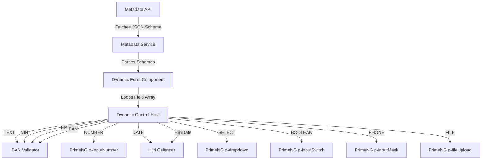
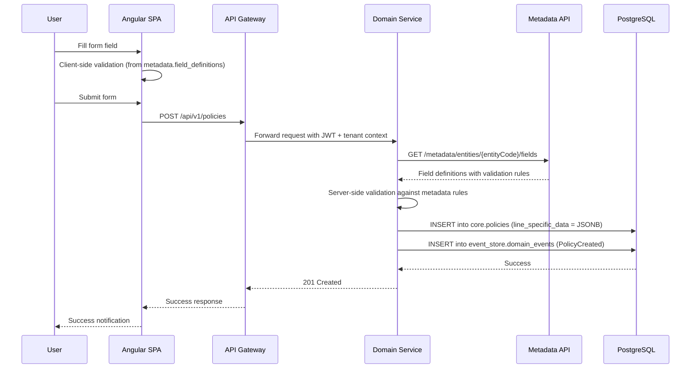

# UI Architecture & Dynamic Form Rendering Engine

This document outlines the frontend layout structure, module divisions, styling standards, localization architecture, and the technical implementation of the **Configuration-Driven Dynamic Form Rendering Engine** using Angular, PrimeNG, and TailwindCSS.

The UI architecture is tightly aligned with the [Data Architecture](data-architecture.md) — forms are rendered from `metadata.field_definitions`, validation uses `metadata.validation_rules`, and configuration changes are event-sourced via `event_store.metadata_events`.

---

## 1. Frontend Modular Architecture

The Angular application is organized around core features, routing modules, and a shared platform framework layer.

```text
/src/app
  ├── core                      # Cross-cutting platform framework
  │    ├── services             # API clients, authentication guards
  │    └── interceptors         # Trace ID injection, JWT headers
  ├── shared                    # Reusable components and layout shells
  │    └── components
  │         ├── dynamic-form    # The metadata-driven form engine
  │         ├── data-quality    # Data quality feedback indicators
  │         └── sensitivity     # Data classification badges
  └── modules                   # Portal feature slices
       ├── policy               # Policy lifecycle modules
       ├── claims               # Claims wizard modules
       └── admin                # Metadata and workflow configuration console
            ├── field-definitions    # CRUD for metadata.field_definitions
            ├── form-definitions     # Form layout designer
            ├── product-config       # Product configuration workbench
            ├── data-quality-rules   # Data quality rule management
            ├── reference-data       # Saudi reference data management
            └── event-history        # Event-sourced metadata change viewer
```

### Module Responsibilities

| Module | Purpose | Data Source |
|---|---|---|
| `core/services` | API clients, auth guards, tenant resolution | `core.*`, Keycloak |
| `shared/dynamic-form` | Metadata-driven form rendering engine | `metadata.field_definitions`, `metadata.form_definitions` |
| `shared/data-quality` | Visual indicators for data quality status | `metadata.data_quality_rules`, quality check results |
| `shared/sensitivity` | Badges and tooltips for data classification | `metadata.data_classification` |
| `modules/policy` | Policy lifecycle UI (quote, bind, endorse, renew) | `core.policies`, `motor.*` |
| `modules/claims` | Claims wizard UI (register, investigate, adjudicate) | `core.claims`, `motor.motor_claims_details` |
| `modules/admin` | Configuration workbench for metadata management | `metadata.*`, `event_store.metadata_events` |

---

## 2. PrimeNG + TailwindCSS Integration

To combine PrimeNG's rich pre-built component suite with Tailwind's rapid styling utilities, we utilize the **unstyled mode** with PrimeNG's **Tailwind Preset** or configure class overrides.

### 2.1 Configuration Checklist
1. Enable PrimeNG theme config inside `angular.json` and styles root.
2. In `tailwind.config.js`, configure Tailwind to scan both project files and PrimeNG source components to purge unused classes.

#### `tailwind.config.js` snippet:
```javascript
module.exports = {
  content: [
    "./src/**/*.{html,ts}",
    "./node_modules/primeng/**/*.{html,js,ts}" // Scan PrimeNG components
  ],
  theme: {
    extend: {
      colors: {
        brand: {
          light: '#34d399',  // Radiant emerald green
          DEFAULT: '#059669',// Corporate dark green (Saudi vibe)
          dark: '#064e3b'    // Deep forest green
        },
        slate: {
          850: '#1e293b',
          950: '#0f172a'     // Corporate dark slate for background
        },
        sensitivity: {
          public: '#6b7280',       // Gray
          internal: '#3b82f6',     // Blue
          confidential: '#f59e0b', // Amber
          pii: '#ef4444',          // Red
          restricted: '#dc2626'    // Dark red
        },
        quality: {
          pass: '#22c55e',         // Green
          warn: '#f59e0b',         // Amber
          fail: '#ef4444',         // Red
          unknown: '#6b7280'       // Gray
        }
      },
      boxShadow: {
        'glass': '0 8px 32px 0 rgba(0, 0, 0, 0.37)'
      }
    }
  },
  plugins: []
}
```

### 2.2 Component Styling Standard
- Avoid writing raw custom CSS rules inside components.
- Use PrimeNG components and style them dynamically using Tailwind classes through the `styleClass` property.

```html
<!-- Example of styled PrimeNG Button inside a Card wrapper -->
<p-card styleClass="shadow-glass bg-slate-900 border border-slate-800 rounded-2xl p-6">
  <h2 class="text-xl font-bold text-white mb-4">Motor Quote Review</h2>
  <p-button label="Approve Underwriting" 
            styleClass="w-full bg-brand hover:bg-brand-light text-white font-semibold py-3 rounded-lg transition duration-250 ease-in-out">
  </p-button>
</p-card>
```

---

## 3. Localization & RTL (Arabic/English)

The platform must support dual LTR (English) and RTL (Arabic) rendering dynamically.

### 3.1 Dynamic Layout Direction
- The application root must bind the HTML `dir` and `lang` attributes dynamically to the active language.
- Standard libraries: `@ngx-translate/core`.

```typescript
import { Component, OnInit, Renderer2 } from '@angular/core';
import { TranslateService } from '@ngx-translate/core';

@Component({
  selector: 'app-root',
  template: `<router-outlet></router-outlet>`
})
export class AppComponent implements OnInit {
  constructor(private translate: TranslateService, private renderer: Renderer2) {}

  ngOnInit() {
    this.translate.addLangs(['en', 'ar']);
    this.translate.setDefaultLang('ar'); // Default for Saudi Arabia operations

    this.translate.onLangChange.subscribe((event) => {
      const dir = event.lang === 'ar' ? 'rtl' : 'ltr';
      this.renderer.setAttribute(document.documentElement, 'dir', dir);
      this.renderer.setAttribute(document.documentElement, 'lang', event.lang);
    });
  }
}
```

### 3.2 RTL Layout Conventions
- **Spacings:** Use logical Tailwind spacing utilities (e.g. `ps-4` for padding-start, `pe-4` for padding-end) rather than `pl-4` / `pr-4` to handle directional shifts automatically.
- **Alignments:** Use `text-start` and `text-end` instead of `text-left` and `text-right`.

### 3.3 Arabic-Specific Field Types
The dynamic form engine supports Arabic-specific field types that map to Saudi data requirements:

| Field Type | Purpose | Validation |
|---|---|---|
| `NIN` | Saudi National ID (10 digits) | Regex: `^[12]\d{9}$` |
| `IQAMA` | Resident ID (10 digits) | Regex: `^2\d{9}$` |
| `HijriDate` | Islamic calendar date | Hijri date picker component |
| `SaudiMobile` | Saudi mobile number | Regex: `^05\d{8}$` |
| `SADAD` | SADAD payment code | Format validation |
| `IBAN` | Saudi IBAN | Mod-97 validation |

---

## 4. Premium Design System & Micro-Animations

To achieve a modern, premium aesthetic:
- **Glassmorphism**: Combine dark slate backgrounds (`bg-slate-950`), semi-transparent panels (`bg-slate-900/80 backdrop-blur-md`), and thin borders (`border border-slate-800`).
- **Typography**: Import **Outfit** (English) and **Cairo** (Arabic) from Google Fonts for a clean, premium typography curve.
- **Skeletons**: Use PrimeNG's `p-skeleton` component to maintain active layout shapes during dynamic API loads.
- **Micro-Animations**: Animate all interactive transitions (hover states, form step switches) using Tailwind's transition utilities:

```html
<!-- Interactive Form Field Wrapper -->
<div class="group relative rounded-xl border border-slate-850 bg-slate-900/50 p-4 transition-all duration-300 hover:border-brand">
  <label class="text-xs font-semibold text-slate-400 group-hover:text-brand transition-colors duration-300">
    Saudi National ID
  </label>
  <input type="text" 
         class="w-full bg-transparent text-white outline-none pt-1" 
         placeholder="1000000000">
</div>
```

### 4.1 Data Sensitivity Badges

Fields with sensitivity levels (from `metadata.field_definitions.sensitivity`) display badges:

```html
<!-- Sensitivity badge component -->
<span class="inline-flex items-center gap-1 px-2 py-0.5 rounded-full text-xs font-medium"
      [ngClass]="{
        'bg-gray-100 text-gray-700': sensitivity === 'PUBLIC',
        'bg-blue-100 text-blue-700': sensitivity === 'INTERNAL',
        'bg-amber-100 text-amber-700': sensitivity === 'CONFIDENTIAL',
        'bg-red-100 text-red-700': sensitivity === 'PII',
        'bg-red-200 text-red-800': sensitivity === 'RESTRICTED'
      }">
  <i class="pi" [ngClass]="{
    'pi-eye': sensitivity === 'PUBLIC',
    'pi-lock': sensitivity === 'CONFIDENTIAL' || sensitivity === 'PII',
    'pi-shield': sensitivity === 'RESTRICTED'
  }"></i>
  {{ sensitivityLabel }}
</span>
```

### 4.2 Data Quality Indicators

Fields with data quality rules display inline indicators:

```html
<!-- Data quality indicator -->
<div *ngIf="qualityStatus" class="flex items-center gap-1 mt-1">
  <i class="pi text-xs" [ngClass]="{
    'pi-check-circle text-quality-pass': qualityStatus === 'PASS',
    'pi-exclamation-triangle text-quality-warn': qualityStatus === 'WARN',
    'pi-times-circle text-quality-fail': qualityStatus === 'FAIL'
  }"></i>
  <span class="text-xs" [ngClass]="{
    'text-quality-pass': qualityStatus === 'PASS',
    'text-quality-warn': qualityStatus === 'WARN',
    'text-quality-fail': qualityStatus === 'FAIL'
  }">{{ qualityMessage }}</span>
</div>
```

---

## 5. Dynamic Form Rendering Engine

The dynamic form engine eliminates the need to hard-code forms for every line of business. When onboarding new lines (like Health or Travel), the form engine dynamically constructs UI controls from database configurations fetched via the metadata API:

`GET /metadata/entities/{entityCode}/fields` and `GET /metadata/forms`.



### 5.1 Schema Mapping: Database to PrimeNG

The dynamic control host maps `metadata.field_definition.field_type` values to standard PrimeNG components styled with Tailwind:

| Metadata Field Type | PrimeNG Target Component | Tailwind Custom Layout Styles |
| :--- | :--- | :--- |
| **TEXT** | `<input pInputText>` | `w-full bg-slate-900 border-slate-800 focus:border-brand` |
| **NUMBER** | `<p-inputNumber>` | `w-full text-white bg-transparent` |
| **DATE** | `<p-calendar>` | `w-full` (with Arabic/English locale configurations) |
| **BOOLEAN** | `<p-inputSwitch>` | `transition duration-200` |
| **SELECT** | `<p-dropdown>` | `w-full text-slate-100 bg-slate-900 border-slate-800` |
| **NIN** | `<input pInputText>` | With NIN validation + format mask |
| **HijriDate** | `<p-calendar>` | With Hijri calendar locale |
| **PHONE** | `<p-inputMask>` | With Saudi mobile format mask |
| **EMAIL** | `<input pInputText>` | With email validation |
| **IBAN** | `<input pInputText>` | With IBAN validation + format mask |
| **FILE** | `<p-fileUpload>` | With file type and size restrictions |

### 5.2 Field Definition API Contract

The form engine fetches field definitions from the metadata API. The response aligns with the `metadata.field_definitions` table:

```typescript
export interface FieldDefinition {
  fieldKey: string;
  fieldType: 'TEXT' | 'NUMBER' | 'DATE' | 'SELECT' | 'BOOLEAN' | 'NIN' | 'IQAMA' | 
            'HijriDate' | 'PHONE' | 'EMAIL' | 'IBAN' | 'FILE';
  labelAr: string;
  labelEn: string;
  placeholderAr?: string;
  placeholderEn?: string;
  isRequired: boolean;
  displayOrder: number;
  section?: string;
  sectionOrder?: number;
  validationRules: ValidationRule[];
  lookupKey?: string;           // For SELECT types — references metadata.lookup_values
  defaultValue?: string;
  sensitivity: 'PUBLIC' | 'INTERNAL' | 'CONFIDENTIAL' | 'PII' | 'RESTRICTED';
  isActive: boolean;
}

export interface ValidationRule {
  type: 'REQUIRED' | 'MIN_LENGTH' | 'MAX_LENGTH' | 'PATTERN' | 'MIN' | 'MAX' | 
        'RANGE' | 'EMAIL' | 'NIN' | 'IBAN' | 'SAUDI_MOBILE' | 'CUSTOM';
  value?: any;
  messageAr?: string;
  messageEn?: string;
}
```

---

## 6. Form Initialization & Reactive Binding

The renderer dynamically constructs an Angular `FormGroup` by iterating over the list of field definitions.

### Enhanced Reference Component Implementation:

```typescript
import { Component, Input, OnInit } from '@angular/core';
import { FormGroup, FormControl, Validators, ValidatorFn } from '@angular/forms';
import { TranslateService } from '@ngx-translate/core';

export interface FieldDefinition {
  fieldKey: string;
  fieldType: string;
  labelAr: string;
  labelEn: string;
  isRequired: boolean;
  validationRules?: ValidationRule[];
  lookupKey?: string;
  defaultValue?: any;
  sensitivity?: string;
}

export interface ValidationRule {
  type: string;
  value?: any;
  messageAr?: string;
  messageEn?: string;
}

@Component({
  selector: 'app-dynamic-form',
  templateUrl: './dynamic-form.component.html'
})
export class DynamicFormComponent implements OnInit {
  @Input() fields: FieldDefinition[] = [];
  @Input() showSensitivityBadges: boolean = true;
  @Input() showQualityIndicators: boolean = true;
  formGroup!: FormGroup;

  constructor(private translate: TranslateService) {}

  ngOnInit() {
    this.formGroup = this.createFormGroup(this.fields);
  }

  private createFormGroup(fields: FieldDefinition[]): FormGroup {
    const group: { [key: string]: FormControl } = {};

    fields.forEach(field => {
      const validations: ValidatorFn[] = [];

      if (field.isRequired) {
        validations.push(Validators.required);
      }

      // Apply metadata-driven validation rules
      if (field.validationRules) {
        field.validationRules.forEach(rule => {
          const validator = this.mapRuleToValidator(rule);
          if (validator) {
            validations.push(validator);
          }
        });
      }

      group[field.fieldKey] = new FormControl(
        field.defaultValue || '', 
        validations
      );
    });

    return new FormGroup(group);
  }

  private mapRuleToValidator(rule: ValidationRule): ValidatorFn | null {
    switch (rule.type) {
      case 'MIN_LENGTH':
        return Validators.minLength(rule.value);
      case 'MAX_LENGTH':
        return Validators.maxLength(rule.value);
      case 'PATTERN':
        return Validators.pattern(rule.value);
      case 'MIN':
        return Validators.min(rule.value);
      case 'MAX':
        return Validators.max(rule.value);
      case 'EMAIL':
        return Validators.email;
      case 'NIN':
        return Validators.pattern('^[12]\\d{9}$');
      case 'SAUDI_MOBILE':
        return Validators.pattern('^05\\d{8}$');
      case 'IBAN':
        return Validators.pattern('^SA\\d{22}$');
      default:
        return null;
    }
  }

  getFieldLabel(field: FieldDefinition): string {
    const lang = this.translate.currentLang;
    return lang === 'ar' ? field.labelAr : (field.labelEn || field.labelAr);
  }
}
```

### Template Layout Implementation:

```html
<form [formGroup]="formGroup" class="grid grid-cols-1 md:grid-cols-2 gap-6">
  <div *ngFor="let field of fields" class="flex flex-col gap-2">
    <div class="flex items-center gap-2">
      <label class="text-sm font-semibold text-slate-300">
        {{ getFieldLabel(field) }}
        <span *ngIf="field.isRequired" class="text-red-400">*</span>
      </label>
      
      <!-- Sensitivity Badge -->
      <app-sensitivity-badge *ngIf="showSensitivityBadges" 
                             [sensitivity]="field.sensitivity">
      </app-sensitivity-badge>
    </div>
    
    <!-- Render based on Type -->
    <ng-container [ngSwitch]="field.fieldType">
      
      <!-- 1. Text Inputs -->
      <input *ngSwitchCase="'TEXT'"
             pInputText
             [formControlName]="field.fieldKey"
             class="w-full bg-slate-900 border-slate-800 focus:border-brand rounded-lg p-3 text-white">

      <!-- 2. Number Inputs -->
      <p-inputNumber *ngSwitchCase="'NUMBER'"
                     [formControlName]="field.fieldKey"
                     styleClass="w-full"
                     inputStyleClass="w-full bg-slate-900 border-slate-800 rounded-lg p-3 text-white">
      </p-inputNumber>

      <!-- 3. Calendars (Gregorian) -->
      <p-calendar *ngSwitchCase="'DATE'"
                  [formControlName]="field.fieldKey"
                  styleClass="w-full"
                  inputStyleClass="w-full bg-slate-900 border-slate-800 rounded-lg p-3 text-white">
      </p-calendar>

      <!-- 4. Hijri Calendar -->
      <p-calendar *ngSwitchCase="'HijriDate'"
                  [formControlName]="field.fieldKey"
                  [locale]="hijriLocale"
                  styleClass="w-full"
                  inputStyleClass="w-full bg-slate-900 border-slate-800 rounded-lg p-3 text-white">
      </p-calendar>

      <!-- 5. Dropdowns -->
      <p-dropdown *ngSwitchCase="'SELECT'"
                  [formControlName]="field.fieldKey"
                  [options]="lookupValues[field.lookupKey] || []" 
                  optionLabel="label"
                  optionValue="value"
                  styleClass="w-full bg-slate-900 border-slate-800 rounded-lg text-white">
      </p-dropdown>

      <!-- 6. Switch (Boolean) -->
      <div *ngSwitchCase="'BOOLEAN'" class="flex items-center h-12">
        <p-inputSwitch [formControlName]="field.fieldKey"></p-inputSwitch>
      </div>

      <!-- 7. NIN / IQAMA -->
      <input *ngSwitchCase="'NIN'"
             pInputText
             [formControlName]="field.fieldKey"
             placeholder="1000000000"
             class="w-full bg-slate-900 border-slate-800 focus:border-brand rounded-lg p-3 text-white">

      <!-- 8. Phone (Masked) -->
      <p-inputMask *ngSwitchCase="'PHONE'"
                   [formControlName]="field.fieldKey"
                   mask="05 999 9999"
                   styleClass="w-full"
                   inputStyleClass="w-full bg-slate-900 border-slate-800 rounded-lg p-3 text-white">
      </p-inputMask>

      <!-- 9. File Upload -->
      <p-fileUpload *ngSwitchCase="'FILE'"
                    [formControlName]="field.fieldKey"
                    [multiple]="false"
                    accept=".pdf,.jpg,.png"
                    maxFileSize="10485760">
      </p-fileUpload>

    </ng-container>

    <!-- Validation Error Messages -->
    <div *ngIf="formGroup.get(field.fieldKey)?.invalid && formGroup.get(field.fieldKey)?.touched" 
         class="text-red-400 text-xs mt-1">
      <span *ngIf="formGroup.get(field.fieldKey)?.errors?.['required']">
        {{ 'validation.required' | translate }}
      </span>
      <span *ngIf="formGroup.get(field.fieldKey)?.errors?.['pattern']">
        {{ 'validation.invalidFormat' | translate }}
      </span>
    </div>

    <!-- Data Quality Indicator -->
    <app-quality-indicator *ngIf="showQualityIndicators"
                           [fieldKey]="field.fieldKey"
                           [value]="formGroup.get(field.fieldKey)?.value">
    </app-quality-indicator>
  </div>
</form>
```

---

## 7. Wizard Flow & Step Management

Multi-step onboarding journeys (such as policy registration) utilize the dynamic step mappings in the database (`metadata.form_definition`) and bind them to PrimeNG's **`p-steps`** wizard component.

### 7.1 Step Definition from Metadata

The wizard fetches step definitions from the metadata API:

```typescript
export interface FormStep {
  stepKey: string;
  titleAr: string;
  titleEn: string;
  descriptionAr?: string;
  descriptionEn?: string;
  order: number;
  fieldKeys: string[];       // References metadata.field_definitions
  validationRules?: ValidationRule[];
}
```

### 7.2 Step Navigation Policies:
- **Draft Persistence:** Every time a user clicks "Next", the form state is validated, saved locally (`localStorage`), and synced back asynchronously to the platform database (`core.policy.line_specific_data`) to prevent data loss.
- **RTL Transition Animations:** Sliding transitions between steps must animate horizontally based on direction:
  - LTR: Slide in from the right.
  - RTL: Slide in from the left.
- **Validation Blocks:** Users cannot navigate forward if the controls mapped to the current step contain any validation errors.
- **Conditional Steps:** Steps can be shown/hidden based on values from previous steps (e.g., "Show vehicle details step only if product is MOTOR").

### 7.3 Wizard Component

```typescript
@Component({
  selector: 'app-dynamic-wizard',
  template: `
    <p-steps [model]="steps" [(activeIndex)]="activeStepIndex" 
             [readonly]="false"></p-steps>
    
    <div class="mt-6">
      <app-dynamic-form [fields]="currentStepFields"
                        [showSensitivityBadges]="true"
                        [showQualityIndicators]="true">
      </app-dynamic-form>
    </div>
    
    <div class="flex justify-between mt-8">
      <p-button label="{{ 'wizard.back' | translate }}" 
                (onClick)="previousStep()"
                [disabled]="activeStepIndex === 0"
                styleClass="p-button-outlined">
      </p-button>
      <p-button label="{{ isLastStep ? ('wizard.submit' | translate) : ('wizard.next' | translate) }}"
                (onClick)="nextStep()"
                [disabled]="!isCurrentStepValid">
      </p-button>
    </div>
  `
})
export class DynamicWizardComponent implements OnInit {
  @Input() formCode!: string;
  steps: any[] = [];
  activeStepIndex = 0;
  currentStepFields: FieldDefinition[] = [];
  
  ngOnInit() {
    this.loadFormDefinition();
  }
  
  private loadFormDefinition() {
    // GET /metadata/forms/{formCode}
    // Returns FormDefinition with steps and field references
    this.metadataService.getFormDefinition(this.formCode).subscribe(form => {
      this.steps = form.steps.map((step, index) => ({
        label: this.translate.currentLang === 'ar' ? step.titleAr : step.titleEn,
        stepKey: step.stepKey
      }));
      this.loadStepFields(0);
    });
  }
}
```

---

## 8. Admin Configuration Workbench

The admin module provides a configuration workbench for managing metadata. All changes are event-sourced for full audit trail.

### 8.1 Field Definition Manager

```typescript
@Component({
  selector: 'app-field-definition-manager',
  template: `
    <p-table [value]="fieldDefinitions" [paginator]="true" [rows]="20">
      <ng-template pTemplate="header">
        <tr>
          <th>{{ 'admin.field.fieldKey' | translate }}</th>
          <th>{{ 'admin.field.labelAr' | translate }}</th>
          <th>{{ 'admin.field.labelEn' | translate }}</th>
          <th>{{ 'admin.field.type' | translate }}</th>
          <th>{{ 'admin.field.required' | translate }}</th>
          <th>{{ 'admin.field.sensitivity' | translate }}</th>
          <th>{{ 'admin.field.status' | translate }}</th>
          <th>{{ 'admin.actions' | translate }}</th>
        </tr>
      </ng-template>
      <ng-template pTemplate="body" let-field>
        <tr>
          <td>{{ field.fieldKey }}</td>
          <td>{{ field.labelAr }}</td>
          <td>{{ field.labelEn }}</td>
          <td>
            <p-tag [value]="field.fieldType" 
                   [severity]="getFieldTypeSeverity(field.fieldType)">
            </p-tag>
          </td>
          <td>
            <p-inputSwitch [(ngModel)]="field.isRequired" 
                           (onChange)="updateField(field)">
            </p-inputSwitch>
          </td>
          <td>
            <app-sensitivity-badge [sensitivity]="field.sensitivity">
            </app-sensitivity-badge>
          </td>
          <td>
            <p-tag [value]="field.isActive ? 'ACTIVE' : 'INACTIVE'"
                   [severity]="field.isActive ? 'success' : 'danger'">
            </p-tag>
          </td>
          <td>
            <p-button icon="pi pi-pencil" (onClick)="editField(field)"></p-button>
            <p-button icon="pi pi-history" (onClick)="viewHistory(field)"></p-button>
          </td>
        </tr>
      </ng-template>
    </p-table>
  `
})
export class FieldDefinitionManagerComponent {
  fieldDefinitions: FieldDefinition[] = [];
  
  constructor(private metadataService: MetadataService) {}
  
  updateField(field: FieldDefinition) {
    // POST /metadata/fields/{fieldKey}
    // This triggers an event in event_store.metadata_events
    this.metadataService.updateFieldDefinition(field).subscribe();
  }
  
  viewHistory(field: FieldDefinition) {
    // GET /event-store/metadata-events?aggregateType=FIELD&aggregateId={fieldKey}
    // Shows the immutable event history for this field definition
    this.router.navigate(['/admin/event-history'], {
      queryParams: { aggregateType: 'FIELD', aggregateId: field.fieldKey }
    });
  }
}
```

### 8.2 Event History Viewer

The event history viewer displays the immutable audit trail for any metadata entity:

```typescript
export interface MetadataEvent {
  eventId: string;
  eventType: string;
  aggregateType: string;
  aggregateId: string;
  version: number;
  data: any;
  metadata: {
    changedBy: string;
    changeReason?: string;
    ipAddress?: string;
  };
  occurredAt: string;
  recordedBy: string;
}
```

### 8.3 Reference Data Manager

The reference data manager allows administrators to manage Saudi-specific reference data:

```typescript
@Component({
  selector: 'app-reference-data-manager',
  template: `
    <p-dropdown [options]="referenceTypes" 
                [(ngModel)]="selectedType"
                (onChange)="loadReferenceData()">
    </p-dropdown>
    
    <p-table [value]="referenceData">
      <ng-template pTemplate="header">
        <tr>
          <th>{{ 'admin.reference.code' | translate }}</th>
          <th>{{ 'admin.reference.nameAr' | translate }}</th>
          <th>{{ 'admin.reference.nameEn' | translate }}</th>
          <th>{{ 'admin.reference.parent' | translate }}</th>
          <th>{{ 'admin.actions' | translate }}</th>
        </tr>
      </ng-template>
      <ng-template pTemplate="body" let-item>
        <tr>
          <td>{{ item.code }}</td>
          <td>{{ item.nameAr }}</td>
          <td>{{ item.nameEn }}</td>
          <td>{{ item.parentCode }}</td>
          <td>
            <p-button icon="pi pi-pencil" (onClick)="editItem(item)"></p-button>
          </td>
        </tr>
      </ng-template>
    </p-table>
  `
})
export class ReferenceDataManagerComponent {
  referenceTypes = [
    { label: 'Saudi Cities', value: 'SAUDI_CITY' },
    { label: 'SAMA Codes', value: 'SAMA_CODE' },
    { label: 'Occupations', value: 'OCCUPATION' },
    { label: 'Vehicle Plate Types', value: 'PLATE_TYPE' },
    { label: 'Nationalities', value: 'NATIONALITY' },
    { label: 'Insurance Classes', value: 'INSURANCE_CLASS' }
  ];
  selectedType: string = 'SAUDI_CITY';
  referenceData: any[] = [];
  
  loadReferenceData() {
    // GET /metadata/reference-data/{referenceType}
    this.metadataService.getReferenceData(this.selectedType).subscribe(data => {
      this.referenceData = data;
    });
  }
}
```

---

## 9. Data Flow: UI to Database



---

## 10. UI Architecture Alignment with Data Architecture

| Data Architecture Concept | UI Implementation |
|---|---|
| `metadata.field_definitions` | Dynamic form engine renders fields from metadata |
| `metadata.form_definitions` | Wizard steps and form layouts |
| `metadata.validation_rules` | Client + server-side validation |
| `metadata.lookup_values` | Dropdown options for SELECT fields |
| `metadata.data_classification` | Sensitivity badges on fields |
| `metadata.data_quality_rules` | Inline quality indicators |
| `metadata.reference_data` | Reference data management UI |
| `event_store.metadata_events` | Event history viewer in admin console |
| `core.policies.line_specific_data` | JSONB storage for dynamic form data |
| `core.policies.dynamic_attributes` | Extensible metadata-driven fields |
| `tenant_id` (RLS) | Tenant context from JWT claims |
| Saudi-specific field types | NIN, IQAMA, HijriDate, IBAN validators |

---

## Document Maintenance

| Aspect | Detail |
|---|---|
| Last Updated | 2026-07-06 |
| Owner | Frontend Architecture Team |
| Review Cycle | Quarterly, or after significant UI framework changes |
| Related Documents | [Data Architecture](data-architecture.md), [Domain Architecture](domain-architecture.md), [API Architecture](api-architecture.md) |
